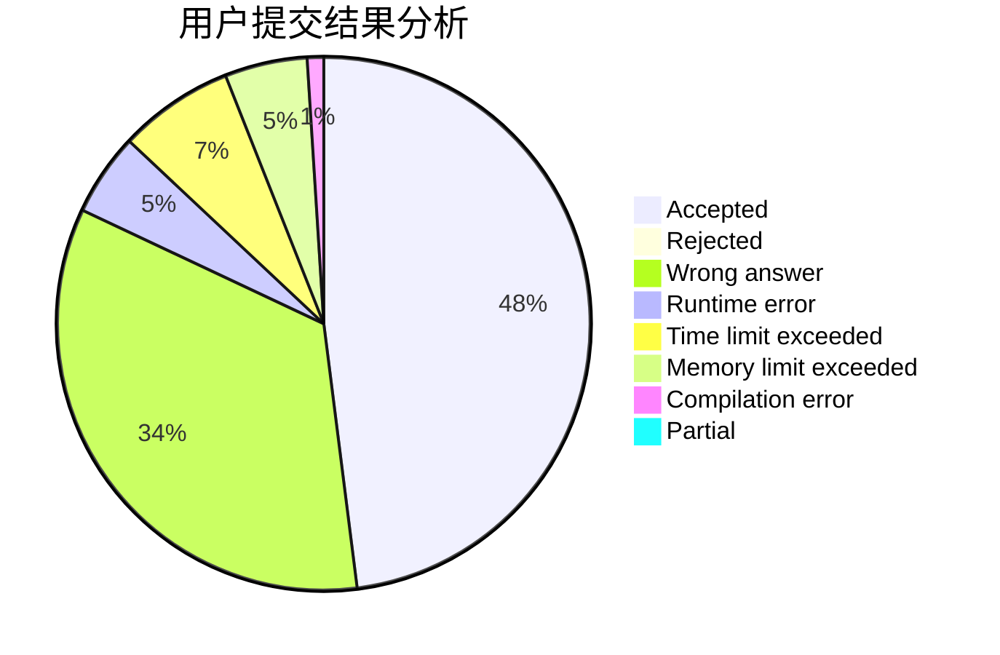
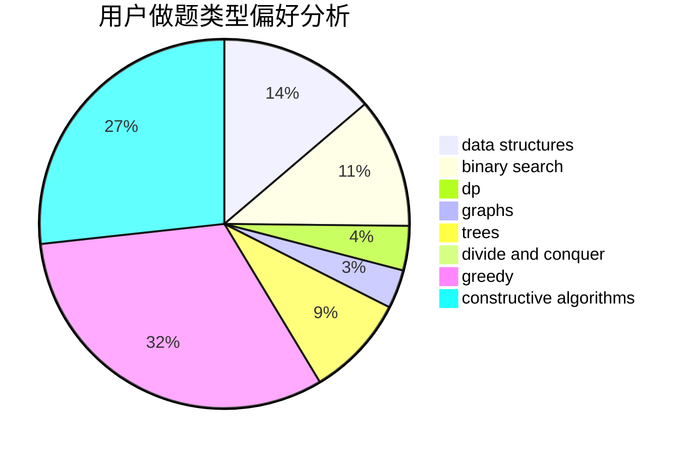

# Edwardnewgate

<!-- tabs:start -->

#### **用户提交结果分析**

#### **用户做题类型偏好分析**

#### **用户错题知识点分析**

<!-- tabs:end -->
# 推荐题目
[1488C](https://codeforces.com/contest/1488/problem/C)		*special problem,
                        binary search,
                        brute force,
                        math		  
[1435A](https://codeforces.com/contest/1435/problem/A)		dsu,graphs,sortings,trees		  
[1342A](https://codeforces.com/contest/1342/problem/A)		greedy,
                        math		  
[662D](https://codeforces.com/contest/662/problem/D)		constructive algorithms,
                        greedy,
                        implementation,
                        math		  
[1456B](https://codeforces.com/contest/1456/problem/B)		dsu,graphs,sortings,trees		  
[1479B1](https://codeforces.com/contest/1479B/problem/1)		constructive algorithms,
                        data structures,
                        dp,
                        greedy,
                        implementation		  
[812B](https://codeforces.com/contest/812/problem/B)		bitmasks,
                        brute force,
                        dp		  
[811D](https://codeforces.com/contest/811/problem/D)		constructive algorithms,
                        dfs and similar,
                        graphs,
                        interactive		  
[264E](https://codeforces.com/contest/264/problem/E)		data structures,
                        dp		  
[123E](https://codeforces.com/contest/123/problem/E)		dfs and similar,
                        dp,
                        probabilities,
                        trees		  
