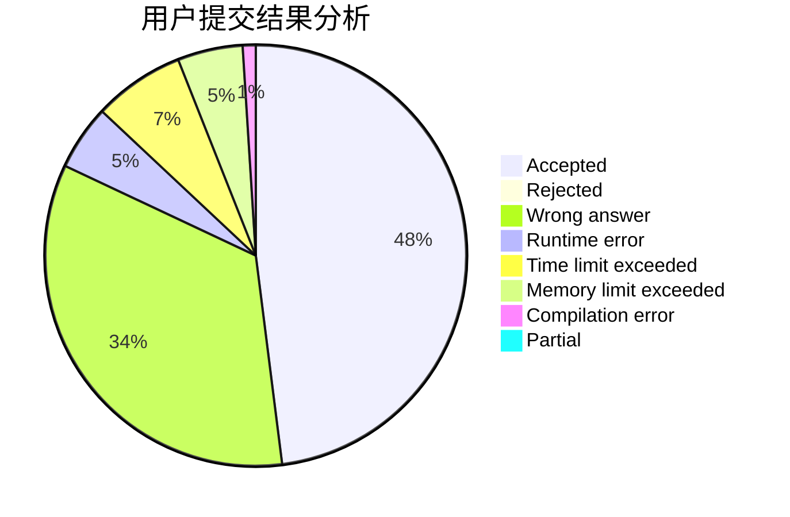
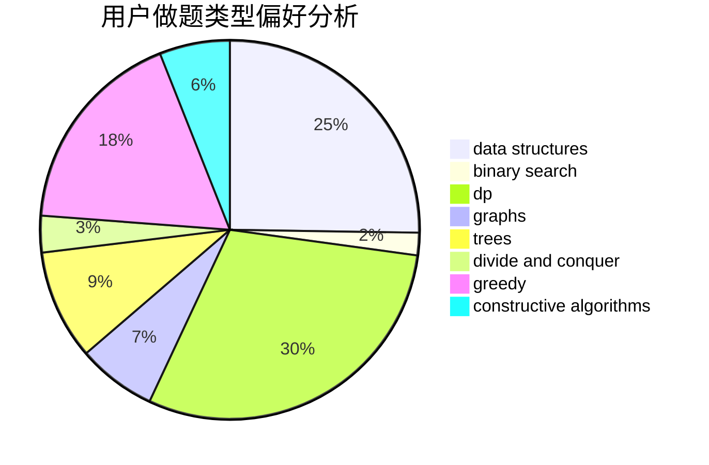

# Edwardnewgate

<!-- tabs:start -->

#### **用户提交结果分析**

#### **用户做题类型偏好分析**

#### **用户错题知识点分析**

<!-- tabs:end -->
# 推荐题目
[1496A](https://codeforces.com/contest/1496/problem/A)		brute force,
                        constructive algorithms,
                        greedy,
                        strings		  
[1445A](https://codeforces.com/contest/1445/problem/A)		greedy,
                        sortings		  
[13491](https://codeforces.com/contest/1349/problem/1)		dsu,graphs,sortings,trees		  
[682D](https://codeforces.com/contest/682/problem/D)		dp,
                        strings		  
[1465F](https://codeforces.com/contest/1465/problem/F)		dsu,graphs,sortings,trees		  
[1487F](https://codeforces.com/contest/1487/problem/F)		dp,
                        greedy,
                        shortest paths		  
[830E](https://codeforces.com/contest/830/problem/E)		constructive algorithms,
                        dp,
                        graphs,
                        implementation,
                        math,
                        trees		  
[830B](https://codeforces.com/contest/830/problem/B)		data structures,
                        implementation,
                        sortings		  
[280E](https://codeforces.com/contest/280/problem/E)		data structures,
                        dp,
                        implementation,
                        math		  
[1245C](https://codeforces.com/contest/1245/problem/C)		dp		  
