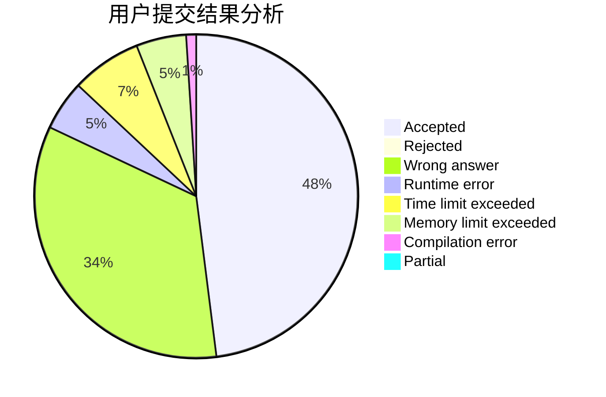
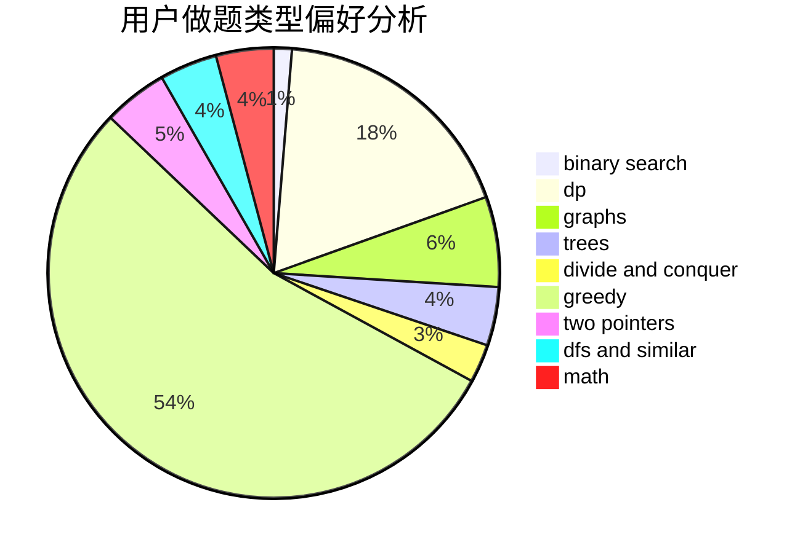

# Edwardnewgate

<!-- tabs:start -->

#### **用户提交结果分析**

#### **用户做题类型偏好分析**

<!-- tabs:end -->
# 推荐题目
[1496A](https://codeforces.com/contest/1496/problem/A)
[1445A](https://codeforces.com/contest/1445/problem/A)
[13491](https://codeforces.com/contest/1349/problem/1)
[682D](https://codeforces.com/contest/682/problem/D)
[1465F](https://codeforces.com/contest/1465/problem/F)
[1487F](https://codeforces.com/contest/1487/problem/F)
[830E](https://codeforces.com/contest/830/problem/E)
[830B](https://codeforces.com/contest/830/problem/B)
[280E](https://codeforces.com/contest/280/problem/E)
[1245C](https://codeforces.com/contest/1245/problem/C)
