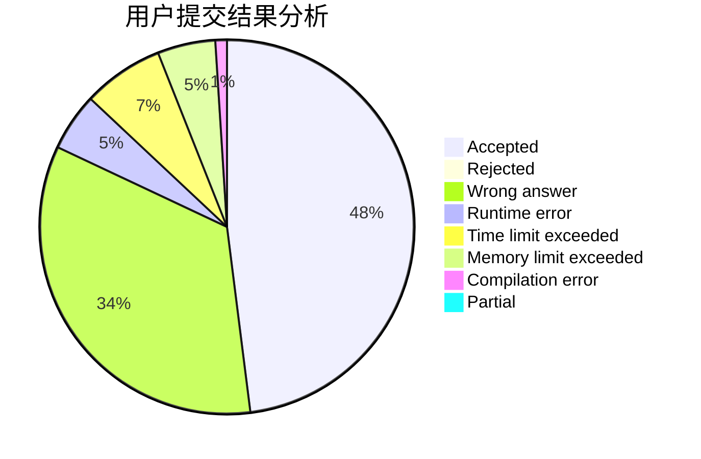
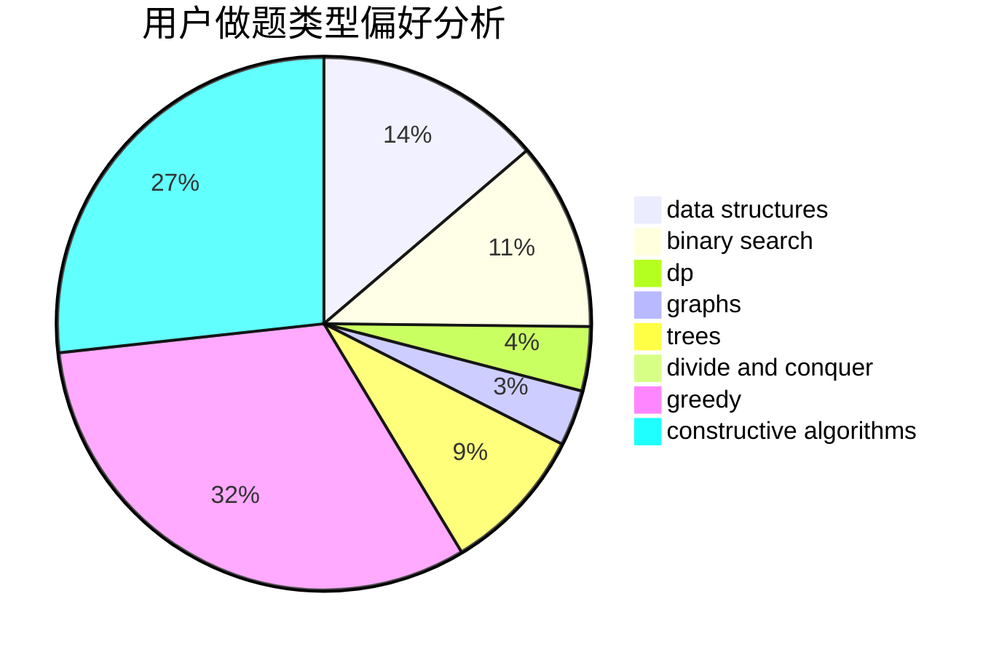

# Edwardnewgate
<!-- tabs:start -->
#### **用户提交结果分析**

#### **用户做题类型偏好分析**

#### **用户错题知识点分析**

<!-- tabs:end -->
# 推荐题目
[XOR-gun](https://codeforces.com/contest/1456/problem/B)		bitmasks,
                        brute force,
                        constructive algorithms		  
[Finding Sasuke](https://codeforces.com/contest/1435/problem/A)		constructive algorithms,
                        math		  
[Maze](http://codeforces.com/problemset/problem/123/E)		dfs and similar,
                        dp,
                        probabilities,
                        trees		  
[Maximal GCD](http://codeforces.com/problemset/problem/803/C)		constructive algorithms,
                        greedy,
                        math		  
[Roadside Trees](http://codeforces.com/problemset/problem/264/E)		data structures,
                        dp		  
[International Olympiad](http://codeforces.com/problemset/problem/662/D)		constructive algorithms,
                        greedy,
                        implementation,
                        math		  
[Anton and Polyhedrons](http://codeforces.com/problemset/problem/785/A)		implementation,
                        strings		  
[Mr. Kitayuta vs. Bamboos](https://codeforces.com/contest/506/problem/C)		binary search,
                        greedy		  
[Two Policemen](http://codeforces.com/problemset/problem/1488/C)		*special problem,
                        binary search,
                        brute force,
                        math		  
[Armistice Area Apportionment](http://codeforces.com/problemset/problem/645/G)		binary search,
                        geometry		  
<!-- tabs:start -->
#### **data structures**
[Roadside Trees](http://codeforces.com/problemset/problem/264/E)		data structures,
                        dp		  
[Function](http://codeforces.com/problemset/problem/455/E)		data structures		  
[Nastya and Strange Generator](http://codeforces.com/problemset/problem/1340/A)		brute force,
                        data structures,
                        greedy,
                        implementation		  
[Board Game](http://codeforces.com/problemset/problem/605/D)		data structures,
                        dfs and similar		  
[Painting the Array I](http://codeforces.com/problemset/problem/1479/B1)		constructive algorithms,
                        data structures,
                        dp,
                        greedy,
                        implementation		  
[Vladik and Entertaining Flags](http://codeforces.com/problemset/problem/811/E)		data structures,
                        dsu,
                        graphs		  
[Maximum width](http://codeforces.com/problemset/problem/1492/C)		binary search,
                        data structures,
                        dp,
                        greedy,
                        two pointers		  
[Old Floppy Drive](http://codeforces.com/problemset/problem/1490/G)		binary search,
                        data structures,
                        math		  
[Odd Mineral Resource](http://codeforces.com/problemset/problem/1479/D)		binary search,
                        bitmasks,
                        brute force,
                        data structures,
                        probabilities,
                        trees		  
[Meximization](http://codeforces.com/problemset/problem/1497/A)		brute force,
                        data structures,
                        greedy,
                        sortings		  
#### **binary search**
[Mr. Kitayuta vs. Bamboos](https://codeforces.com/contest/506/problem/C)		binary search,
                        greedy		  
[Two Policemen](http://codeforces.com/problemset/problem/1488/C)		*special problem,
                        binary search,
                        brute force,
                        math		  
[Armistice Area Apportionment](http://codeforces.com/problemset/problem/645/G)		binary search,
                        geometry		  
[Sagheer and Nubian Market](http://codeforces.com/problemset/problem/812/C)		binary search,
                        sortings		  
[Skills](https://codeforces.com/contest/614/problem/D)		binary search,
                        brute force,
                        dp,
                        greedy,
                        sortings,
                        two pointers		  
[Rock Is Push](https://codeforces.com/contest/1246/problem/C)		binary search,
                        dp		  
[Boxes Packing](http://codeforces.com/problemset/problem/1066/D)		binary search,
                        implementation		  
[Forward, march!](http://codeforces.com/problemset/problem/11/E)		binary search,
                        dp,
                        greedy		  
[Maximum width](http://codeforces.com/problemset/problem/1492/C)		binary search,
                        data structures,
                        dp,
                        greedy,
                        two pointers		  
[Pairs](http://codeforces.com/problemset/problem/1463/D)		binary search,
                        constructive algorithms,
                        greedy,
                        two pointers		  
#### **dp**
[Maze](http://codeforces.com/problemset/problem/123/E)		dfs and similar,
                        dp,
                        probabilities,
                        trees		  
[Roadside Trees](http://codeforces.com/problemset/problem/264/E)		data structures,
                        dp		  
[Sandy and Nuts](http://codeforces.com/problemset/problem/599/E)		bitmasks,
                        dp,
                        trees		  
[Quick Tortoise](http://codeforces.com/problemset/problem/232/E)		bitmasks,
                        divide and conquer,
                        dp		  
[Skills](https://codeforces.com/contest/614/problem/D)		binary search,
                        brute force,
                        dp,
                        greedy,
                        sortings,
                        two pointers		  
[Sagheer, the Hausmeister](http://codeforces.com/problemset/problem/812/B)		bitmasks,
                        brute force,
                        dp		  
[Increase Sequence](http://codeforces.com/problemset/problem/466/D)		combinatorics,
                        dp		  
[Vladik and Memorable Trip](http://codeforces.com/problemset/problem/811/C)		dp,
                        implementation		  
[Vacations](http://codeforces.com/problemset/problem/698/A)		dp		  
[Rock Is Push](https://codeforces.com/contest/1246/problem/C)		binary search,
                        dp		  
#### **graph**
[Restore Graph](http://codeforces.com/problemset/problem/404/C)		dfs and similar,
                        graphs,
                        sortings		  
[Edge Deletion](http://codeforces.com/problemset/problem/1076/D)		graphs,
                        greedy,
                        shortest paths		  
[Resort](http://codeforces.com/problemset/problem/350/B)		graphs		  
[Vladik and Favorite Game](http://codeforces.com/problemset/problem/811/D)		constructive algorithms,
                        dfs and similar,
                        graphs,
                        interactive		  
[Vladik and Entertaining Flags](http://codeforces.com/problemset/problem/811/E)		data structures,
                        dsu,
                        graphs		  
[Useful Edges](https://codeforces.com/contest/1483/problem/D)		graphs,
                        shortest paths		  
[Minimum Ties](http://codeforces.com/problemset/problem/1487/C)		brute force,
                        constructive algorithms,
                        dfs and similar,
                        graphs,
                        greedy,
                        implementation,
                        math		  
[Chef Monocarp](http://codeforces.com/problemset/problem/1437/C)		dp,
                        flows,
                        graph matchings,
                        greedy,
                        math,
                        sortings		  
[Strange Housing](http://codeforces.com/problemset/problem/1470/D)		constructive algorithms,
                        dfs and similar,
                        graph matchings,
                        graphs,
                        greedy		  
[Longest Simple Cycle](http://codeforces.com/problemset/problem/1476/C)		dp,
                        graphs,
                        greedy		  
#### **trees**
[Maze](http://codeforces.com/problemset/problem/123/E)		dfs and similar,
                        dp,
                        probabilities,
                        trees		  
[Sandy and Nuts](http://codeforces.com/problemset/problem/599/E)		bitmasks,
                        dp,
                        trees		  
[Sagheer and Apple Tree](http://codeforces.com/problemset/problem/812/E)		games,
                        trees		  
[Odd Mineral Resource](http://codeforces.com/problemset/problem/1479/D)		binary search,
                        bitmasks,
                        brute force,
                        data structures,
                        probabilities,
                        trees		  
[Yet Another Card Deck](http://codeforces.com/problemset/problem/1511/C)		brute force,
                        data structures,
                        implementation,
                        trees		  
[Diameter Cuts](http://codeforces.com/problemset/problem/1499/F)		combinatorics,
                        dfs and similar,
                        dp,
                        trees		  
[Fib-tree](http://codeforces.com/problemset/problem/1491/E)		brute force,
                        dfs and similar,
                        divide and conquer,
                        number theory,
                        trees		  
[13th Labour of Heracles](http://codeforces.com/problemset/problem/1466/D)		data structures,
                        greedy,
                        sortings,
                        trees		  
[BFS Trees](http://codeforces.com/problemset/problem/1495/D)		combinatorics,
                        dfs and similar,
                        graphs,
                        math,
                        shortest paths,
                        trees		  
[Sum of Prefix Sums](http://codeforces.com/problemset/problem/1303/G)		data structures,
                        divide and conquer,
                        geometry,
                        trees		  
#### **divide and conquer**
[Quick Tortoise](http://codeforces.com/problemset/problem/232/E)		bitmasks,
                        divide and conquer,
                        dp		  
[Divide and Summarize](http://codeforces.com/problemset/problem/1461/D)		binary search,
                        brute force,
                        data structures,
                        divide and conquer,
                        implementation,
                        sortings		  
[Song of the Sirens](http://codeforces.com/problemset/problem/1466/G)		combinatorics,
                        divide and conquer,
                        hashing,
                        math,
                        string suffix structures,
                        strings		  
[Permutation Transformation](http://codeforces.com/problemset/problem/1490/D)		dfs and similar,
                        divide and conquer,
                        implementation		  
[Skyline Photo](https://codeforces.com/contest/1483/problem/C)		data structures,
                        divide and conquer,
                        dp		  
[Fib-tree](http://codeforces.com/problemset/problem/1491/E)		brute force,
                        dfs and similar,
                        divide and conquer,
                        number theory,
                        trees		  
[Sum of Prefix Sums](http://codeforces.com/problemset/problem/1303/G)		data structures,
                        divide and conquer,
                        geometry,
                        trees		  
[Dogeforces](http://codeforces.com/problemset/problem/1494/D)		constructive algorithms,
                        data structures,
                        dfs and similar,
                        divide and conquer,
                        dsu,
                        greedy,
                        sortings,
                        trees		  
[Logistical Questions](http://codeforces.com/problemset/problem/566/C)		dfs and similar,
                        divide and conquer,
                        trees		  
[Fruit Sequences](http://codeforces.com/problemset/problem/1428/F)		binary search,
                        data structures,
                        divide and conquer,
                        dp,
                        two pointers		  
#### **greedy**
[Maximal GCD](http://codeforces.com/problemset/problem/803/C)		constructive algorithms,
                        greedy,
                        math		  
[International Olympiad](http://codeforces.com/problemset/problem/662/D)		constructive algorithms,
                        greedy,
                        implementation,
                        math		  
[Mr. Kitayuta vs. Bamboos](https://codeforces.com/contest/506/problem/C)		binary search,
                        greedy		  
[Anton and Ira](http://codeforces.com/problemset/problem/584/E)		constructive algorithms,
                        greedy,
                        math		  
[Skills](https://codeforces.com/contest/614/problem/D)		binary search,
                        brute force,
                        dp,
                        greedy,
                        sortings,
                        two pointers		  
[Edge Deletion](http://codeforces.com/problemset/problem/1076/D)		graphs,
                        greedy,
                        shortest paths		  
[Nastya and Strange Generator](http://codeforces.com/problemset/problem/1340/A)		brute force,
                        data structures,
                        greedy,
                        implementation		  
[Cards](http://codeforces.com/problemset/problem/701/A)		greedy,
                        implementation		  
[Perfect Keyboard](http://codeforces.com/problemset/problem/1303/C)		dfs and similar,
                        greedy,
                        implementation		  
[Forward, march!](http://codeforces.com/problemset/problem/11/E)		binary search,
                        dp,
                        greedy		  
#### **constructive algorithms**
[XOR-gun](https://codeforces.com/contest/1456/problem/B)		bitmasks,
                        brute force,
                        constructive algorithms		  
[Finding Sasuke](https://codeforces.com/contest/1435/problem/A)		constructive algorithms,
                        math		  
[Maximal GCD](http://codeforces.com/problemset/problem/803/C)		constructive algorithms,
                        greedy,
                        math		  
[International Olympiad](http://codeforces.com/problemset/problem/662/D)		constructive algorithms,
                        greedy,
                        implementation,
                        math		  
[Lucky Permutation Triple](https://codeforces.com/contest/304/problem/C)		constructive algorithms,
                        implementation,
                        math		  
[Anton and Ira](http://codeforces.com/problemset/problem/584/E)		constructive algorithms,
                        greedy,
                        math		  
[Vladik and Favorite Game](http://codeforces.com/problemset/problem/811/D)		constructive algorithms,
                        dfs and similar,
                        graphs,
                        interactive		  
[Painting the Array I](http://codeforces.com/problemset/problem/1479/B1)		constructive algorithms,
                        data structures,
                        dp,
                        greedy,
                        implementation		  
[Decryption](http://codeforces.com/problemset/problem/1419/E)		constructive algorithms,
                        implementation,
                        math,
                        number theory		  
[Sorted Adjacent Differences](http://codeforces.com/problemset/problem/1339/B)		constructive algorithms,
                        sortings		  
#### **sortings**
[Restore Graph](http://codeforces.com/problemset/problem/404/C)		dfs and similar,
                        graphs,
                        sortings		  
[Sagheer and Nubian Market](http://codeforces.com/problemset/problem/812/C)		binary search,
                        sortings		  
[Skills](https://codeforces.com/contest/614/problem/D)		binary search,
                        brute force,
                        dp,
                        greedy,
                        sortings,
                        two pointers		  
[Vladik and Complicated Book](http://codeforces.com/problemset/problem/811/B)		implementation,
                        sortings		  
[Sorted Adjacent Differences](http://codeforces.com/problemset/problem/1339/B)		constructive algorithms,
                        sortings		  
[Diamond Miner](https://codeforces.com/contest/1496/problem/C)		geometry,
                        greedy,
                        math,
                        sortings		  
[Meximization](http://codeforces.com/problemset/problem/1497/A)		brute force,
                        data structures,
                        greedy,
                        sortings		  
[Avoiding Zero](http://codeforces.com/problemset/problem/1427/A)		math,
                        sortings		  
[Divide and Summarize](http://codeforces.com/problemset/problem/1461/D)		binary search,
                        brute force,
                        data structures,
                        divide and conquer,
                        implementation,
                        sortings		  
[Chef Monocarp](http://codeforces.com/problemset/problem/1437/C)		dp,
                        flows,
                        graph matchings,
                        greedy,
                        math,
                        sortings		  
<!-- tabs:end -->
