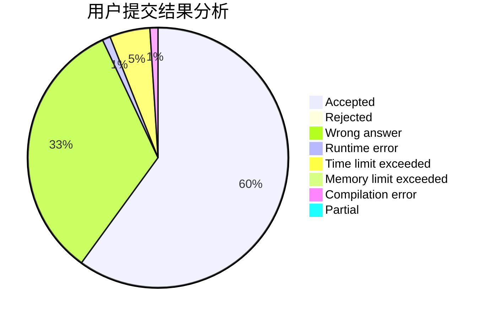
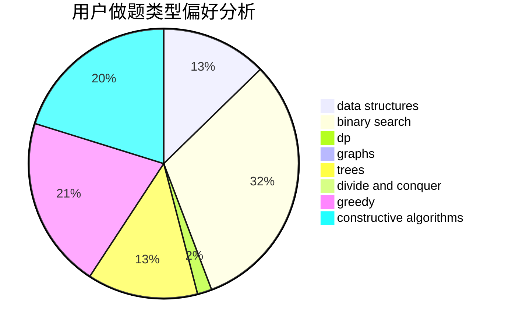
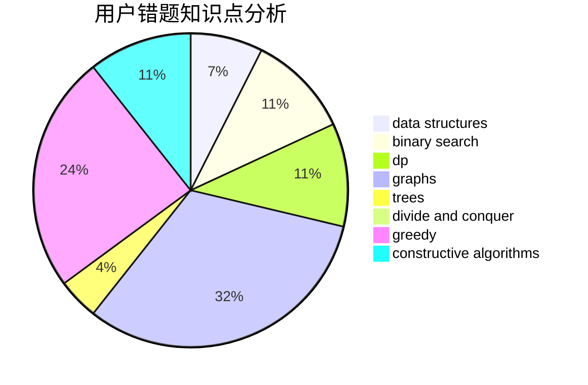

# Einstein1234

<!-- tabs:start -->

#### **用户提交结果分析**

#### **用户做题类型偏好分析**

#### **用户错题知识点分析**

<!-- tabs:end -->
# 推荐题目
[1305F](https://codeforces.com/contest/1305/problem/F)		math,
                        number theory,
                        probabilities		  
[498D](https://codeforces.com/contest/498/problem/D)		data structures,
                        dp,
                        number theory		  
[764B](https://codeforces.com/contest/764/problem/B)		constructive algorithms,
                        implementation		  
[813C](https://codeforces.com/contest/813/problem/C)		dfs and similar,
                        graphs		  
[1133A](https://codeforces.com/contest/1133/problem/A)		implementation		  
[339E](https://codeforces.com/contest/339/problem/E)		constructive algorithms,
                        dfs and similar,
                        greedy		  
[605E](https://codeforces.com/contest/605/problem/E)		probabilities,
                        shortest paths		  
[1330A](https://codeforces.com/contest/1330/problem/A)		implementation		  
[1070L](https://codeforces.com/contest/1070/problem/L)		constructive algorithms		  
[813B](https://codeforces.com/contest/813/problem/B)		brute force,
                        math		  
