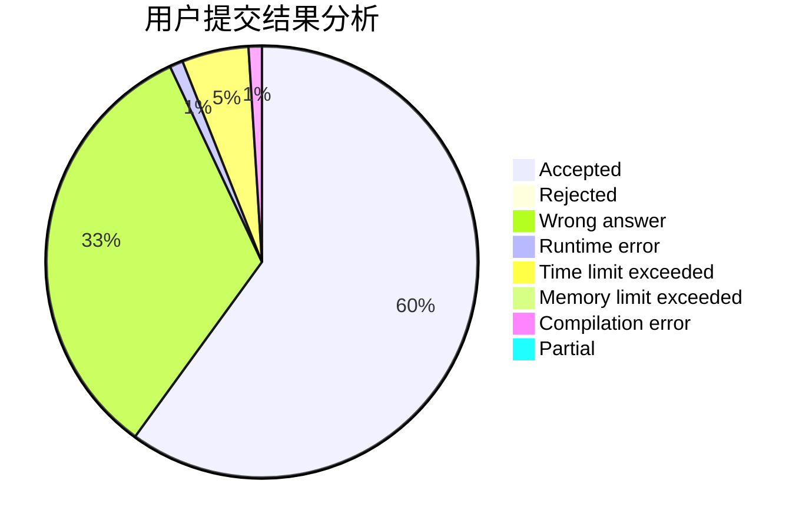
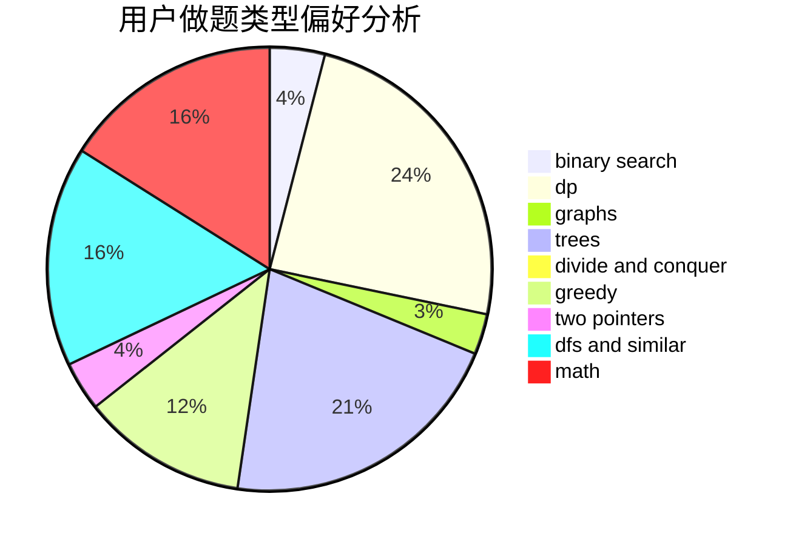

# Einstein1234

<!-- tabs:start -->

#### **用户提交结果分析**

#### **用户做题类型偏好分析**

<!-- tabs:end -->
# 推荐题目
[1314E](https://codeforces.com/contest/1314/problem/E)
[519D](https://codeforces.com/contest/519/problem/D)
[782E](https://codeforces.com/contest/782/problem/E)
[831E](https://codeforces.com/contest/831/problem/E)
[1137B](https://codeforces.com/contest/1137/problem/B)
[367A](https://codeforces.com/contest/367/problem/A)
[623E](https://codeforces.com/contest/623/problem/E)
[1336A](https://codeforces.com/contest/1336/problem/A)
[1071B](https://codeforces.com/contest/1071/problem/B)
[831D](https://codeforces.com/contest/831/problem/D)
