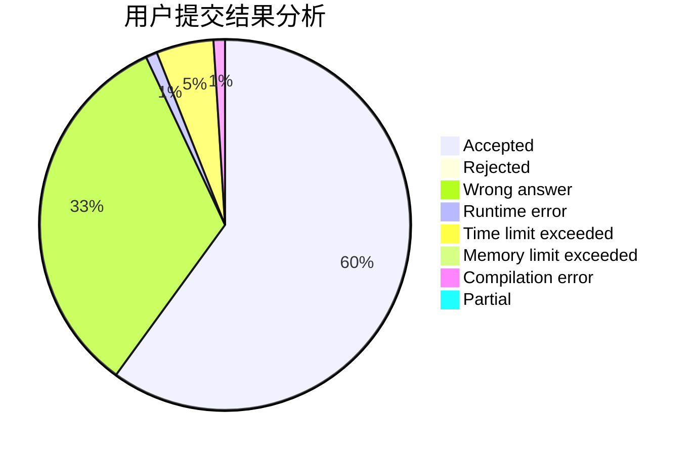
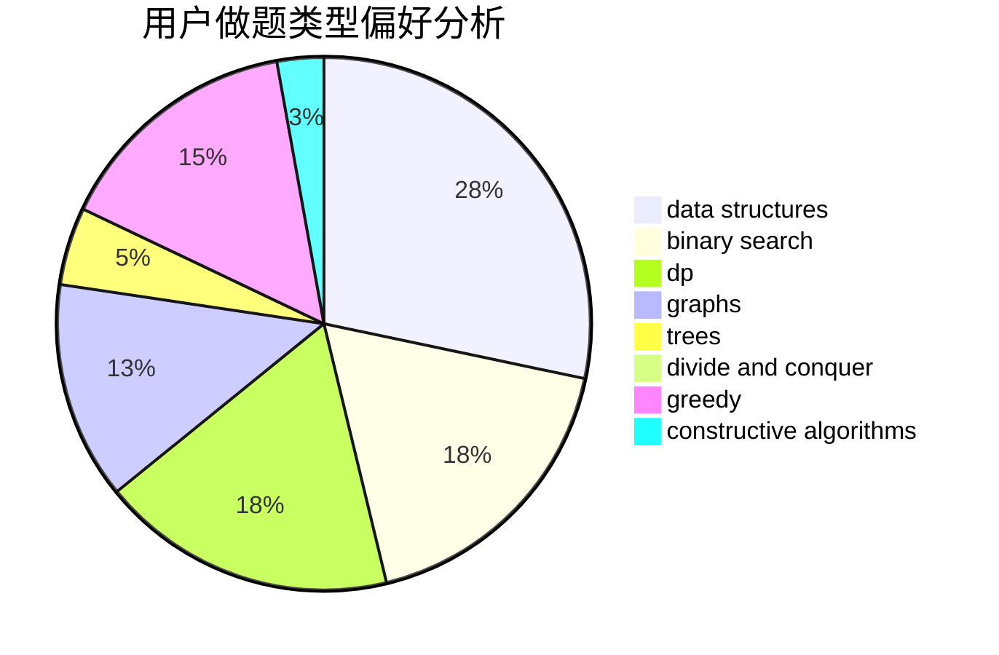
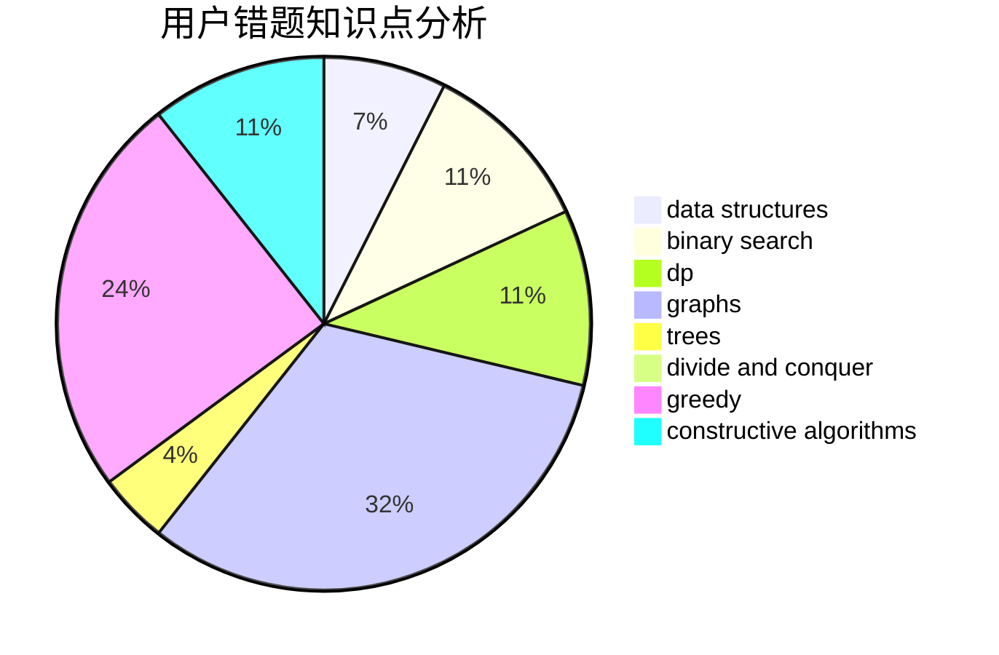

# Einstein1234

<!-- tabs:start -->

#### **用户提交结果分析**

#### **用户做题类型偏好分析**

#### **用户错题知识点分析**

<!-- tabs:end -->
# 推荐题目
[1314E](https://codeforces.com/contest/1314/problem/E)		dsu,graphs,sortings,trees		  
[519D](https://codeforces.com/contest/519/problem/D)		data structures,
                        dp,
                        two pointers		  
[782E](https://codeforces.com/contest/782/problem/E)		dsu,graphs,sortings,trees		  
[831E](https://codeforces.com/contest/831/problem/E)		dsu,graphs,sortings,trees		  
[1137B](https://codeforces.com/contest/1137/problem/B)		greedy,
                        hashing,
                        strings		  
[367A](https://codeforces.com/contest/367/problem/A)		data structures,
                        implementation		  
[623E](https://codeforces.com/contest/623/problem/E)		combinatorics,
                        dp,
                        fft,
                        math		  
[1336A](https://codeforces.com/contest/1336/problem/A)		dfs and similar,
                        dp,
                        greedy,
                        sortings,
                        trees		  
[1071B](https://codeforces.com/contest/1071/problem/B)		dsu,graphs,sortings,trees		  
[831D](https://codeforces.com/contest/831/problem/D)		dsu,graphs,sortings,trees		  
