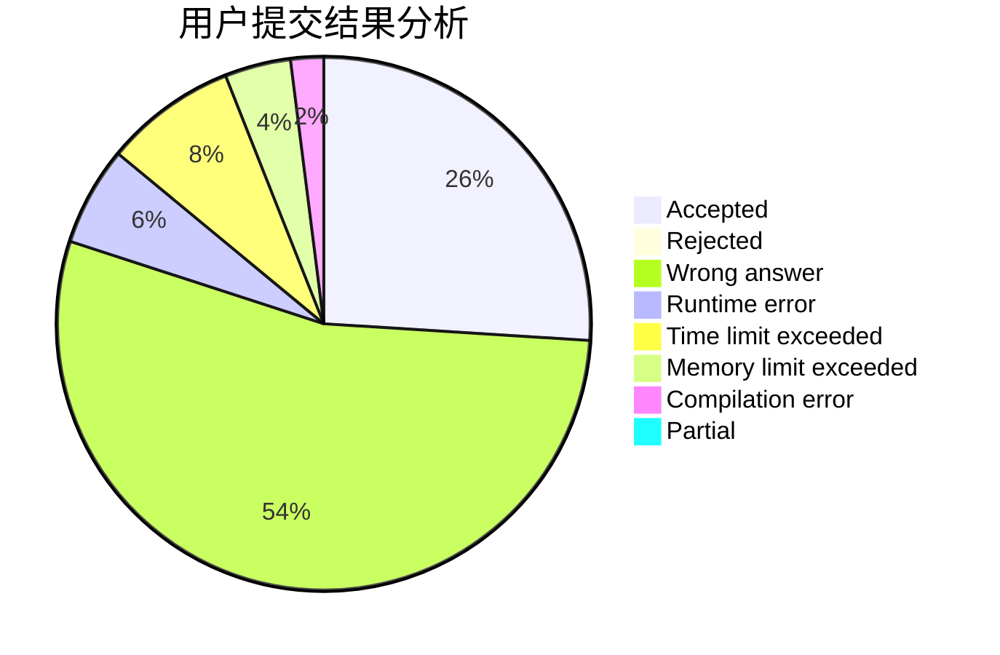
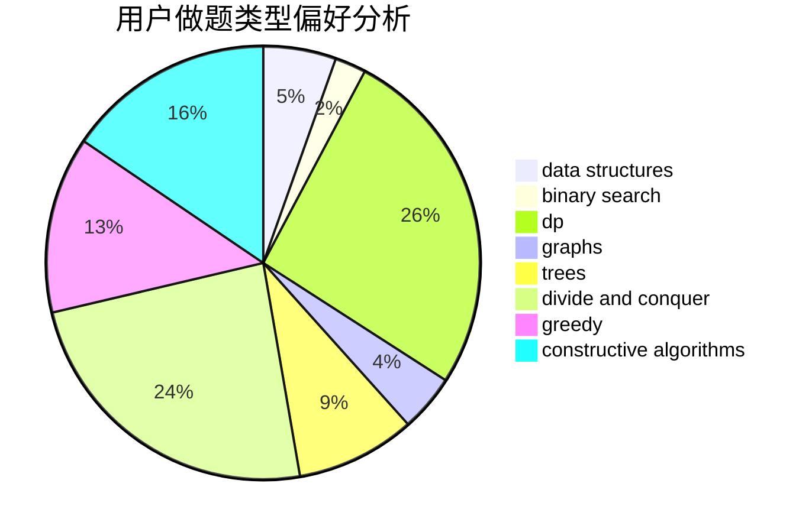
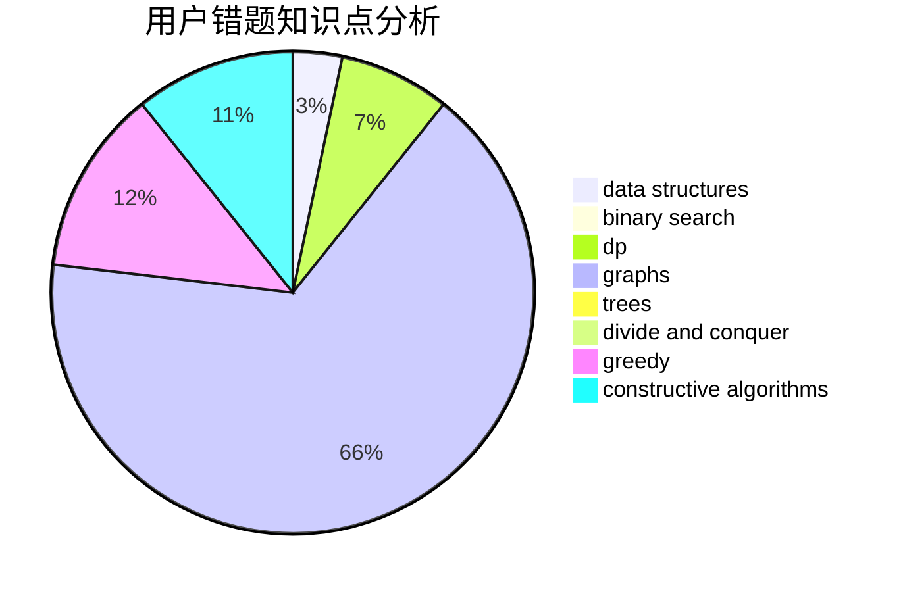

# Ekennis
<!-- tabs:start -->
#### **用户提交结果分析**

#### **用户做题类型偏好分析**

#### **用户错题知识点分析**

<!-- tabs:end -->
# 推荐题目
[Appleman and Toastman](http://codeforces.com/problemset/problem/461/A)		greedy,
                        sortings		  
[Present](https://codeforces.com/contest/1323/problem/D)		binary search,
                        bitmasks,
                        constructive algorithms,
                        data structures,
                        math,
                        sortings		  
[Painting Edges](http://codeforces.com/problemset/problem/576/E)		binary search,
                        data structures		  
[An impassioned circulation of affection](http://codeforces.com/problemset/problem/814/C)		brute force,
                        dp,
                        strings,
                        two pointers		  
[Two Melodies](http://codeforces.com/problemset/problem/813/D)		dp,
                        flows		  
[Array Splitting](http://codeforces.com/problemset/problem/1197/C)		greedy,
                        sortings		  
[International Olympiad](http://codeforces.com/problemset/problem/662/D)		constructive algorithms,
                        greedy,
                        implementation,
                        math		  
[Creative Snap](http://codeforces.com/problemset/problem/1111/C)		binary search,
                        brute force,
                        divide and conquer,
                        math		  
[Rectangle Puzzle II](https://codeforces.com/contest/304/problem/D)		implementation,
                        math		  
[Find String in a Grid](http://codeforces.com/problemset/problem/1252/D)		data structures,
                        dp,
                        strings,
                        trees		  
<!-- tabs:start -->
#### **data structures**
[Appleman and Toastman](https://codeforces.com/contest/1323/problem/D)		binary search,
                        bitmasks,
                        constructive algorithms,
                        data structures,
                        math,
                        sortings		  
[Present](http://codeforces.com/problemset/problem/576/E)		binary search,
                        data structures		  
[Painting Edges](http://codeforces.com/problemset/problem/1252/D)		data structures,
                        dp,
                        strings,
                        trees		  
[An impassioned circulation of affection](http://codeforces.com/problemset/problem/480/E)		data structures,
                        divide and conquer		  
[Two Melodies](http://codeforces.com/problemset/problem/414/D)		binary search,
                        data structures,
                        greedy,
                        trees,
                        two pointers		  
[Array Splitting](http://codeforces.com/problemset/problem/725/D)		data structures,
                        greedy		  
[International Olympiad](http://codeforces.com/problemset/problem/813/F)		data structures,
                        dsu,
                        graphs		  
[Creative Snap](http://codeforces.com/problemset/problem/316/E3)		data structures,
                        math		  
[Rectangle Puzzle II](http://codeforces.com/problemset/problem/813/E)		binary search,
                        data structures		  
[Find String in a Grid](http://codeforces.com/problemset/problem/1492/C)		binary search,
                        data structures,
                        dp,
                        greedy,
                        two pointers		  
#### **binary search**
[Appleman and Toastman](https://codeforces.com/contest/1323/problem/D)		binary search,
                        bitmasks,
                        constructive algorithms,
                        data structures,
                        math,
                        sortings		  
[Present](http://codeforces.com/problemset/problem/576/E)		binary search,
                        data structures		  
[Painting Edges](http://codeforces.com/problemset/problem/1111/C)		binary search,
                        brute force,
                        divide and conquer,
                        math		  
[An impassioned circulation of affection](https://codeforces.com/contest/1362/problem/F)		binary search,
                        bitmasks,
                        constructive algorithms,
                        dfs and similar,
                        dsu,
                        graphs		  
[Two Melodies](http://codeforces.com/problemset/problem/414/D)		binary search,
                        data structures,
                        greedy,
                        trees,
                        two pointers		  
[Array Splitting](http://codeforces.com/problemset/problem/813/E)		binary search,
                        data structures		  
[International Olympiad](http://codeforces.com/problemset/problem/1492/C)		binary search,
                        data structures,
                        dp,
                        greedy,
                        two pointers		  
[Creative Snap](http://codeforces.com/problemset/problem/1463/D)		binary search,
                        constructive algorithms,
                        greedy,
                        two pointers		  
[Rectangle Puzzle II](http://codeforces.com/problemset/problem/1490/G)		binary search,
                        data structures,
                        math		  
[Find String in a Grid](http://codeforces.com/problemset/problem/1479/D)		binary search,
                        bitmasks,
                        brute force,
                        data structures,
                        probabilities,
                        trees		  
#### **dp**
[Appleman and Toastman](http://codeforces.com/problemset/problem/814/C)		brute force,
                        dp,
                        strings,
                        two pointers		  
[Present](http://codeforces.com/problemset/problem/813/D)		dp,
                        flows		  
[Painting Edges](http://codeforces.com/problemset/problem/1252/D)		data structures,
                        dp,
                        strings,
                        trees		  
[An impassioned circulation of affection](https://codeforces.com/contest/1113/problem/C)		dp,
                        implementation		  
[Two Melodies](http://codeforces.com/problemset/problem/386/C)		dp,
                        strings,
                        two pointers		  
[Array Splitting](http://codeforces.com/problemset/problem/792/C)		dp,
                        greedy,
                        math,
                        number theory		  
[International Olympiad](https://codeforces.com/contest/1382/problem/D)		dp		  
[Creative Snap](http://codeforces.com/problemset/problem/248/E)		dp,
                        math,
                        probabilities		  
[Rectangle Puzzle II](http://codeforces.com/problemset/problem/1492/C)		binary search,
                        data structures,
                        dp,
                        greedy,
                        two pointers		  
[Find String in a Grid](https://codeforces.com/contest/1457/problem/C)		brute force,
                        dp,
                        implementation		  
#### **graph**
[Appleman and Toastman](http://codeforces.com/problemset/problem/1055/A)		graphs		  
[Present](https://codeforces.com/contest/1362/problem/F)		binary search,
                        bitmasks,
                        constructive algorithms,
                        dfs and similar,
                        dsu,
                        graphs		  
[Painting Edges](https://codeforces.com/contest/1230/problem/F)		graphs		  
[An impassioned circulation of affection](https://codeforces.com/contest/699/problem/D)		constructive algorithms,
                        dfs and similar,
                        dsu,
                        graphs,
                        trees		  
[Two Melodies](http://codeforces.com/problemset/problem/1320/B)		dfs and similar,
                        graphs,
                        shortest paths		  
[Array Splitting](http://codeforces.com/problemset/problem/1063/B)		graphs,
                        shortest paths		  
[International Olympiad](http://codeforces.com/problemset/problem/813/F)		data structures,
                        dsu,
                        graphs		  
[Creative Snap](http://codeforces.com/problemset/problem/1485/D)		constructive algorithms,
                        graphs,
                        math,
                        number theory		  
[Rectangle Puzzle II](http://codeforces.com/problemset/problem/1487/C)		brute force,
                        constructive algorithms,
                        dfs and similar,
                        graphs,
                        greedy,
                        implementation,
                        math		  
[Find String in a Grid](http://codeforces.com/problemset/problem/1437/C)		dp,
                        flows,
                        graph matchings,
                        greedy,
                        math,
                        sortings		  
#### **trees**
[Appleman and Toastman](http://codeforces.com/problemset/problem/1252/D)		data structures,
                        dp,
                        strings,
                        trees		  
[Present](http://codeforces.com/problemset/problem/414/D)		binary search,
                        data structures,
                        greedy,
                        trees,
                        two pointers		  
[Painting Edges](https://codeforces.com/contest/699/problem/D)		constructive algorithms,
                        dfs and similar,
                        dsu,
                        graphs,
                        trees		  
[An impassioned circulation of affection](http://codeforces.com/problemset/problem/1479/D)		binary search,
                        bitmasks,
                        brute force,
                        data structures,
                        probabilities,
                        trees		  
[Two Melodies](http://codeforces.com/problemset/problem/1511/C)		brute force,
                        data structures,
                        implementation,
                        trees		  
[Array Splitting](http://codeforces.com/problemset/problem/1499/F)		combinatorics,
                        dfs and similar,
                        dp,
                        trees		  
[International Olympiad](http://codeforces.com/problemset/problem/1491/E)		brute force,
                        dfs and similar,
                        divide and conquer,
                        number theory,
                        trees		  
[Creative Snap](http://codeforces.com/problemset/problem/1466/D)		data structures,
                        greedy,
                        sortings,
                        trees		  
[Rectangle Puzzle II](http://codeforces.com/problemset/problem/1495/D)		combinatorics,
                        dfs and similar,
                        graphs,
                        math,
                        shortest paths,
                        trees		  
[Find String in a Grid](http://codeforces.com/problemset/problem/1303/G)		data structures,
                        divide and conquer,
                        geometry,
                        trees		  
#### **divide and conquer**
[Appleman and Toastman](http://codeforces.com/problemset/problem/1111/C)		binary search,
                        brute force,
                        divide and conquer,
                        math		  
[Present](http://codeforces.com/problemset/problem/480/E)		data structures,
                        divide and conquer		  
[Painting Edges](http://codeforces.com/problemset/problem/1461/D)		binary search,
                        brute force,
                        data structures,
                        divide and conquer,
                        implementation,
                        sortings		  
[An impassioned circulation of affection](http://codeforces.com/problemset/problem/1466/G)		combinatorics,
                        divide and conquer,
                        hashing,
                        math,
                        string suffix structures,
                        strings		  
[Two Melodies](http://codeforces.com/problemset/problem/1490/D)		dfs and similar,
                        divide and conquer,
                        implementation		  
[Array Splitting](https://codeforces.com/contest/1483/problem/C)		data structures,
                        divide and conquer,
                        dp		  
[International Olympiad](http://codeforces.com/problemset/problem/1491/E)		brute force,
                        dfs and similar,
                        divide and conquer,
                        number theory,
                        trees		  
[Creative Snap](http://codeforces.com/problemset/problem/1303/G)		data structures,
                        divide and conquer,
                        geometry,
                        trees		  
[Rectangle Puzzle II](http://codeforces.com/problemset/problem/1494/D)		constructive algorithms,
                        data structures,
                        dfs and similar,
                        divide and conquer,
                        dsu,
                        greedy,
                        sortings,
                        trees		  
[Find String in a Grid](http://codeforces.com/problemset/problem/1482/E)		data structures,
                        divide and conquer,
                        dp		  
#### **greedy**
[Appleman and Toastman](http://codeforces.com/problemset/problem/461/A)		greedy,
                        sortings		  
[Present](http://codeforces.com/problemset/problem/1197/C)		greedy,
                        sortings		  
[Painting Edges](http://codeforces.com/problemset/problem/662/D)		constructive algorithms,
                        greedy,
                        implementation,
                        math		  
[An impassioned circulation of affection](http://codeforces.com/problemset/problem/414/D)		binary search,
                        data structures,
                        greedy,
                        trees,
                        two pointers		  
[Two Melodies](http://codeforces.com/problemset/problem/725/D)		data structures,
                        greedy		  
[Array Splitting](http://codeforces.com/problemset/problem/1372/B)		greedy,
                        math,
                        number theory		  
[International Olympiad](http://codeforces.com/problemset/problem/814/A)		constructive algorithms,
                        greedy,
                        implementation,
                        sortings		  
[Creative Snap](http://codeforces.com/problemset/problem/792/C)		dp,
                        greedy,
                        math,
                        number theory		  
[Rectangle Puzzle II](http://codeforces.com/problemset/problem/1415/B)		brute force,
                        brute force,
                        greedy		  
[Find String in a Grid](http://codeforces.com/problemset/problem/1408/B)		constructive algorithms,
                        greedy,
                        math		  
#### **constructive algorithms**
[Appleman and Toastman](https://codeforces.com/contest/1323/problem/D)		binary search,
                        bitmasks,
                        constructive algorithms,
                        data structures,
                        math,
                        sortings		  
[Present](http://codeforces.com/problemset/problem/662/D)		constructive algorithms,
                        greedy,
                        implementation,
                        math		  
[Painting Edges](http://codeforces.com/problemset/problem/814/B)		constructive algorithms		  
[An impassioned circulation of affection](https://codeforces.com/contest/1362/problem/F)		binary search,
                        bitmasks,
                        constructive algorithms,
                        dfs and similar,
                        dsu,
                        graphs		  
[Two Melodies](https://codeforces.com/contest/699/problem/D)		constructive algorithms,
                        dfs and similar,
                        dsu,
                        graphs,
                        trees		  
[Array Splitting](http://codeforces.com/problemset/problem/814/A)		constructive algorithms,
                        greedy,
                        implementation,
                        sortings		  
[International Olympiad](http://codeforces.com/problemset/problem/1408/B)		constructive algorithms,
                        greedy,
                        math		  
[Creative Snap](http://codeforces.com/problemset/problem/1513/B)		bitmasks,
                        combinatorics,
                        constructive algorithms,
                        math		  
[Rectangle Puzzle II](http://codeforces.com/problemset/problem/1485/D)		constructive algorithms,
                        graphs,
                        math,
                        number theory		  
[Find String in a Grid](http://codeforces.com/problemset/problem/1493/A)		constructive algorithms,
                        greedy		  
#### **sortings**
[Appleman and Toastman](http://codeforces.com/problemset/problem/461/A)		greedy,
                        sortings		  
[Present](https://codeforces.com/contest/1323/problem/D)		binary search,
                        bitmasks,
                        constructive algorithms,
                        data structures,
                        math,
                        sortings		  
[Painting Edges](http://codeforces.com/problemset/problem/1197/C)		greedy,
                        sortings		  
[An impassioned circulation of affection](http://codeforces.com/problemset/problem/814/A)		constructive algorithms,
                        greedy,
                        implementation,
                        sortings		  
[Two Melodies](https://codeforces.com/contest/1496/problem/C)		geometry,
                        greedy,
                        math,
                        sortings		  
[Array Splitting](http://codeforces.com/problemset/problem/1495/A)		geometry,
                        greedy,
                        math,
                        sortings		  
[International Olympiad](http://codeforces.com/problemset/problem/1497/A)		brute force,
                        data structures,
                        greedy,
                        sortings		  
[Creative Snap](http://codeforces.com/problemset/problem/1427/A)		math,
                        sortings		  
[Rectangle Puzzle II](http://codeforces.com/problemset/problem/1461/D)		binary search,
                        brute force,
                        data structures,
                        divide and conquer,
                        implementation,
                        sortings		  
[Find String in a Grid](http://codeforces.com/problemset/problem/1437/C)		dp,
                        flows,
                        graph matchings,
                        greedy,
                        math,
                        sortings		  
<!-- tabs:end -->
