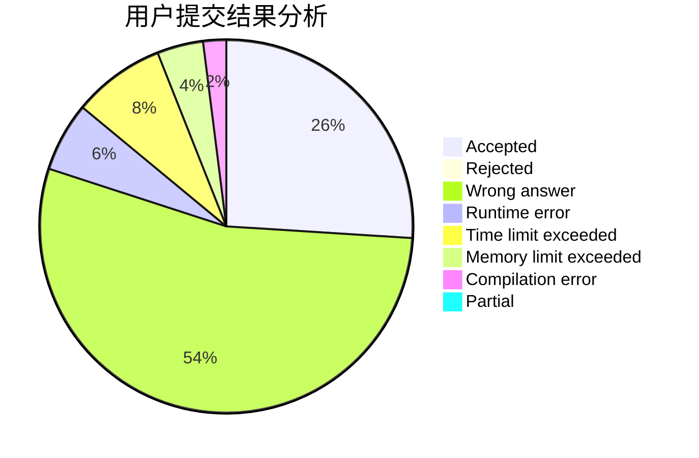
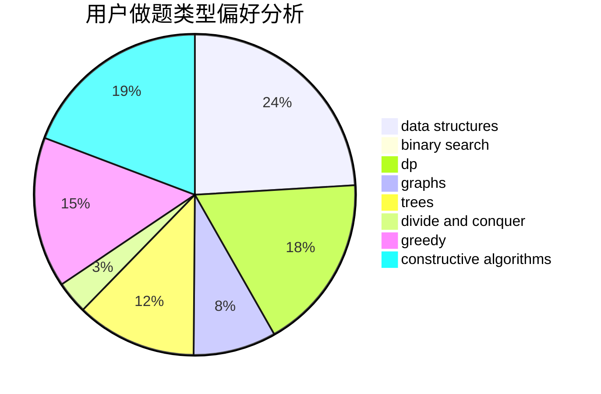
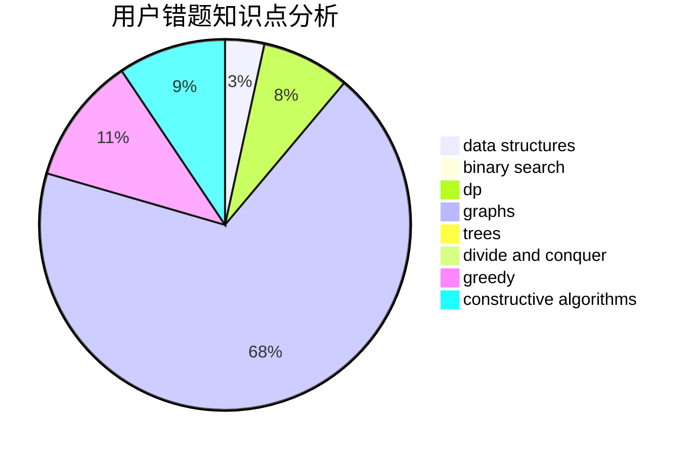

# Ekennis

<!-- tabs:start -->

#### **用户提交结果分析**

#### **用户做题类型偏好分析**

#### **用户错题知识点分析**

<!-- tabs:end -->
# 推荐题目
[1157A](https://codeforces.com/contest/1157/problem/A)		implementation		  
[1200E](https://codeforces.com/contest/1200/problem/E)		brute force,
                        hashing,
                        implementation,
                        string suffix structures,
                        strings		  
[831F](https://codeforces.com/contest/831/problem/F)		dsu,graphs,sortings,trees		  
[833A](https://codeforces.com/contest/833/problem/A)		math,
                        number theory		  
[832D](https://codeforces.com/contest/832/problem/D)		dfs and similar,
                        graphs,
                        trees		  
[682D](https://codeforces.com/contest/682/problem/D)		dp,
                        strings		  
[1113B](https://codeforces.com/contest/1113/problem/B)		greedy,
                        number theory		  
[1423F](https://codeforces.com/contest/1423/problem/F)		math		  
[1418F](https://codeforces.com/contest/1418/problem/F)		data structures,
                        math,
                        number theory,
                        two pointers		  
[1380G](https://codeforces.com/contest/1380/problem/G)		greedy,
                        math,
                        probabilities		  
