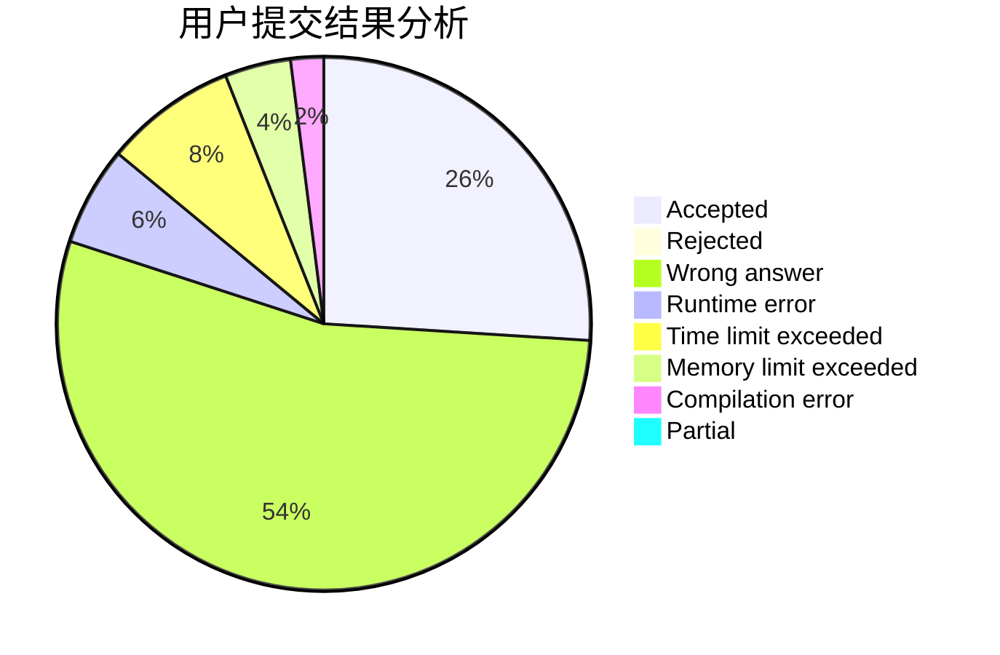
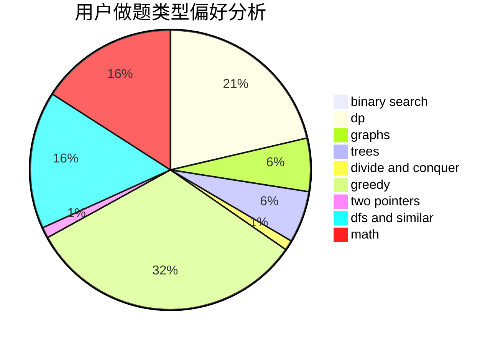

# Ekennis

<!-- tabs:start -->

#### **用户提交结果分析**

#### **用户做题类型偏好分析**

<!-- tabs:end -->
# 推荐题目
[1157A](https://codeforces.com/contest/1157/problem/A)
[1200E](https://codeforces.com/contest/1200/problem/E)
[831F](https://codeforces.com/contest/831/problem/F)
[833A](https://codeforces.com/contest/833/problem/A)
[832D](https://codeforces.com/contest/832/problem/D)
[682D](https://codeforces.com/contest/682/problem/D)
[1113B](https://codeforces.com/contest/1113/problem/B)
[1423F](https://codeforces.com/contest/1423/problem/F)
[1418F](https://codeforces.com/contest/1418/problem/F)
[1380G](https://codeforces.com/contest/1380/problem/G)
