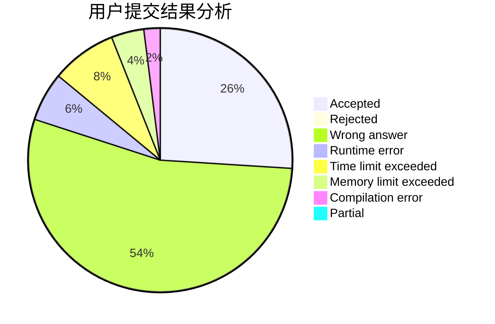
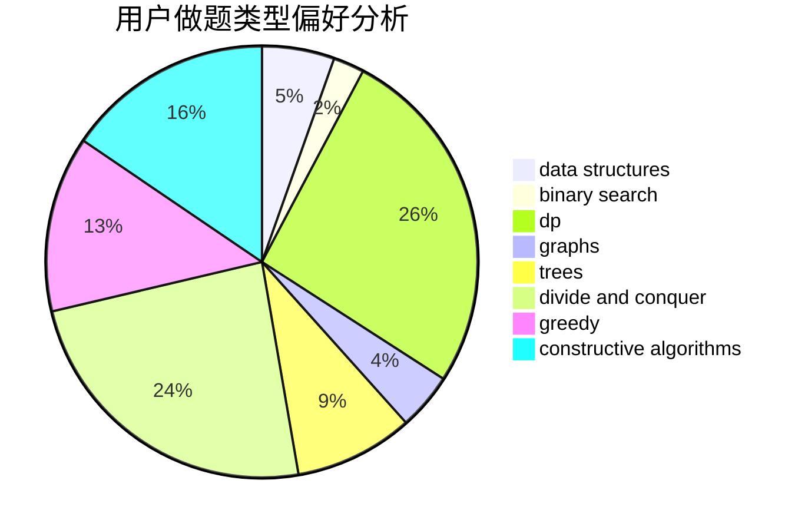
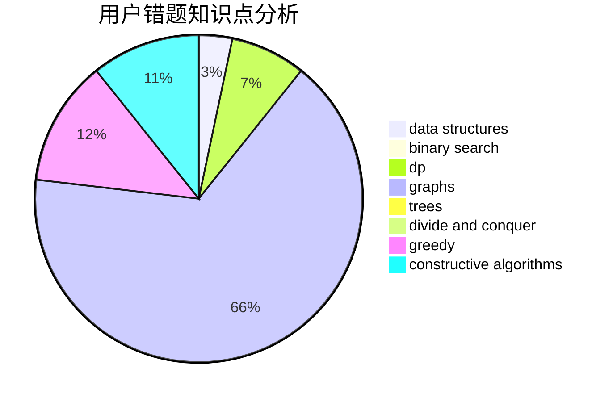

# Ekennis

<!-- tabs:start -->

#### **用户提交结果分析**

#### **用户做题类型偏好分析**

#### **用户错题知识点分析**

<!-- tabs:end -->
# 推荐题目
[1155C](https://codeforces.com/contest/1155/problem/C)		math,
                        number theory		  
[1197C](https://codeforces.com/contest/1197/problem/C)		greedy,
                        sortings		  
[813D](https://codeforces.com/contest/813/problem/D)		dp,
                        flows		  
[814C](https://codeforces.com/contest/814/problem/C)		brute force,
                        dp,
                        strings,
                        two pointers		  
[814B](https://codeforces.com/contest/814/problem/B)		constructive algorithms		  
[662D](https://codeforces.com/contest/662/problem/D)		constructive algorithms,
                        greedy,
                        implementation,
                        math		  
[1111C](https://codeforces.com/contest/1111/problem/C)		binary search,
                        brute force,
                        divide and conquer,
                        math		  
[1415B](https://codeforces.com/contest/1415/problem/B)		brute force,
                        brute force,
                        greedy		  
[1408B](https://codeforces.com/contest/1408/problem/B)		constructive algorithms,
                        greedy,
                        math		  
[1372B](https://codeforces.com/contest/1372/problem/B)		greedy,
                        math,
                        number theory		  
