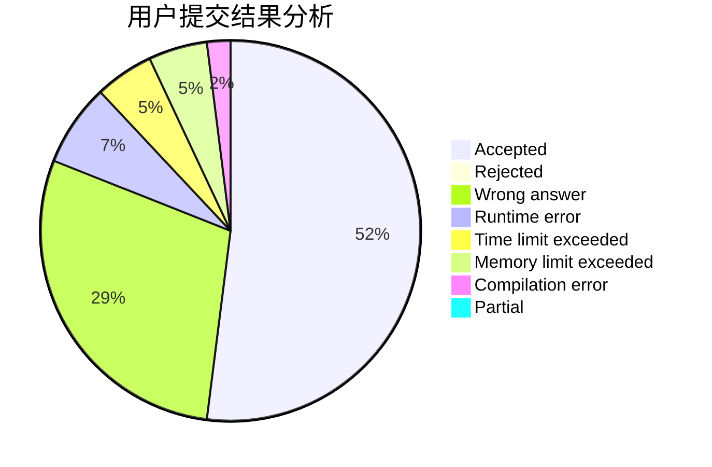
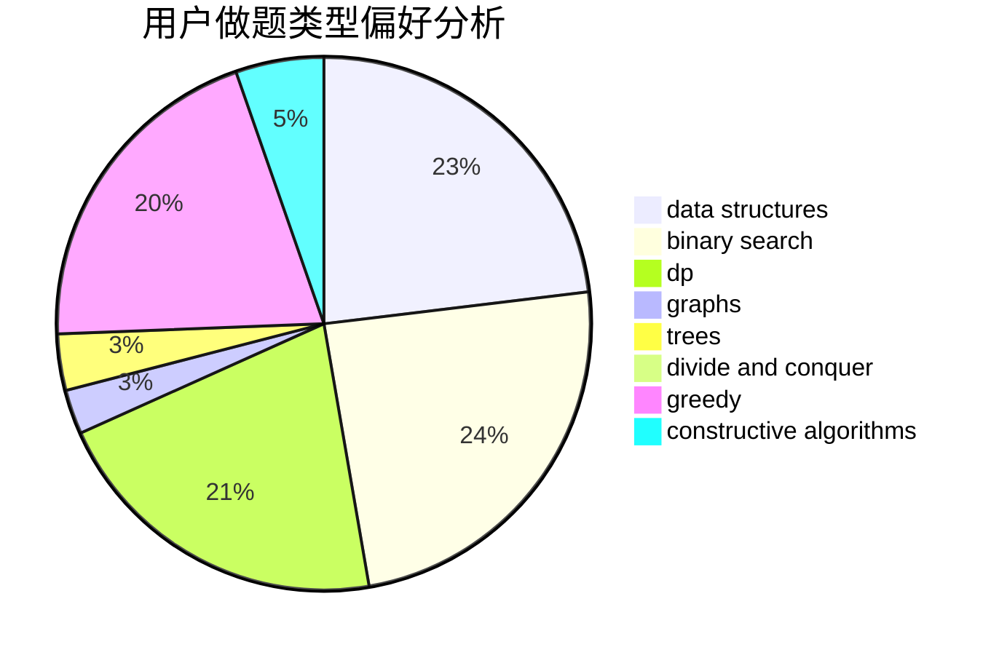
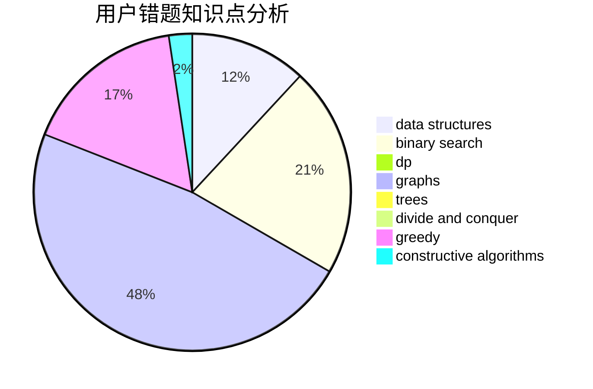

# Elegia
<!-- tabs:start -->
#### **用户提交结果分析**

#### **用户做题类型偏好分析**

#### **用户错题知识点分析**

<!-- tabs:end -->
# 推荐题目
[Display Size](http://codeforces.com/problemset/problem/747/A)		brute force,
                        math		  
[Geometric Progression](http://codeforces.com/problemset/problem/567/C)		binary search,
                        data structures,
                        dp		  
[A Serial Killer](http://codeforces.com/problemset/problem/776/A)		brute force,
                        implementation,
                        strings		  
[An unavoidable detour for home](http://codeforces.com/problemset/problem/814/E)		combinatorics,
                        dp,
                        graphs,
                        shortest paths		  
[Arrangement](http://codeforces.com/problemset/problem/107/C)		bitmasks,
                        dp		  
[Short Colorful Strip](http://codeforces.com/problemset/problem/1178/F1)		combinatorics,
                        dfs and similar,
                        dp		  
[Ping-Pong (Easy Version)](http://codeforces.com/problemset/problem/320/B)		dfs and similar,
                        graphs		  
[Tourism](http://codeforces.com/problemset/problem/1310/D)		dp,
                        graphs,
                        probabilities		  
[Karen and Neighborhood](http://codeforces.com/problemset/problem/815/E)		binary search,
                        constructive algorithms,
                        implementation		  
[Road Repairs](http://codeforces.com/problemset/problem/240/E)		dfs and similar,
                        graphs,
                        greedy		  
<!-- tabs:start -->
#### **data structures**
[Display Size](http://codeforces.com/problemset/problem/567/C)		binary search,
                        data structures,
                        dp		  
[Geometric Progression](http://codeforces.com/problemset/problem/1334/F)		binary search,
                        data structures,
                        dp,
                        greedy		  
[A Serial Killer](http://codeforces.com/problemset/problem/1073/D)		binary search,
                        brute force,
                        data structures,
                        greedy		  
[An unavoidable detour for home](http://codeforces.com/problemset/problem/786/D)		data structures,
                        dfs and similar,
                        hashing,
                        strings,
                        trees		  
[Arrangement](http://codeforces.com/problemset/problem/815/D)		binary search,
                        combinatorics,
                        data structures,
                        geometry		  
[Short Colorful Strip](https://codeforces.com/contest/1483/problem/C)		data structures,
                        divide and conquer,
                        dp		  
[Ping-Pong (Easy Version)](http://codeforces.com/problemset/problem/1428/E)		binary search,
                        data structures,
                        greedy,
                        math,
                        sortings		  
[Tourism](https://codeforces.com/contest/1341/problem/C)		brute force,
                        data structures,
                        greedy,
                        implementation		  
[Karen and Neighborhood](http://codeforces.com/problemset/problem/1257/E)		data structures,
                        dp,
                        greedy		  
[Road Repairs](http://codeforces.com/problemset/problem/1492/C)		binary search,
                        data structures,
                        dp,
                        greedy,
                        two pointers		  
#### **binary search**
[Display Size](http://codeforces.com/problemset/problem/567/C)		binary search,
                        data structures,
                        dp		  
[Geometric Progression](http://codeforces.com/problemset/problem/815/E)		binary search,
                        constructive algorithms,
                        implementation		  
[A Serial Killer](http://codeforces.com/problemset/problem/360/B)		binary search,
                        dp		  
[An unavoidable detour for home](http://codeforces.com/problemset/problem/1334/F)		binary search,
                        data structures,
                        dp,
                        greedy		  
[Arrangement](http://codeforces.com/problemset/problem/1073/D)		binary search,
                        brute force,
                        data structures,
                        greedy		  
[Short Colorful Strip](http://codeforces.com/problemset/problem/815/D)		binary search,
                        combinatorics,
                        data structures,
                        geometry		  
[Ping-Pong (Easy Version)](http://codeforces.com/problemset/problem/1428/E)		binary search,
                        data structures,
                        greedy,
                        math,
                        sortings		  
[Tourism](http://codeforces.com/problemset/problem/1492/C)		binary search,
                        data structures,
                        dp,
                        greedy,
                        two pointers		  
[Karen and Neighborhood](http://codeforces.com/problemset/problem/1463/D)		binary search,
                        constructive algorithms,
                        greedy,
                        two pointers		  
[Road Repairs](http://codeforces.com/problemset/problem/1490/G)		binary search,
                        data structures,
                        math		  
#### **dp**
[Display Size](http://codeforces.com/problemset/problem/567/C)		binary search,
                        data structures,
                        dp		  
[Geometric Progression](http://codeforces.com/problemset/problem/814/E)		combinatorics,
                        dp,
                        graphs,
                        shortest paths		  
[A Serial Killer](http://codeforces.com/problemset/problem/107/C)		bitmasks,
                        dp		  
[An unavoidable detour for home](http://codeforces.com/problemset/problem/1178/F1)		combinatorics,
                        dfs and similar,
                        dp		  
[Arrangement](http://codeforces.com/problemset/problem/1310/D)		dp,
                        graphs,
                        probabilities		  
[Short Colorful Strip](http://codeforces.com/problemset/problem/360/B)		binary search,
                        dp		  
[Ping-Pong (Easy Version)](http://codeforces.com/problemset/problem/1398/D)		dp,
                        greedy,
                        sortings		  
[Tourism](http://codeforces.com/problemset/problem/814/D)		dfs and similar,
                        dp,
                        geometry,
                        greedy,
                        trees		  
[Karen and Neighborhood](http://codeforces.com/problemset/problem/1391/C)		combinatorics,
                        dp,
                        graphs,
                        math		  
[Road Repairs](http://codeforces.com/problemset/problem/1334/F)		binary search,
                        data structures,
                        dp,
                        greedy		  
#### **graph**
[Display Size](http://codeforces.com/problemset/problem/814/E)		combinatorics,
                        dp,
                        graphs,
                        shortest paths		  
[Geometric Progression](http://codeforces.com/problemset/problem/320/B)		dfs and similar,
                        graphs		  
[A Serial Killer](http://codeforces.com/problemset/problem/1310/D)		dp,
                        graphs,
                        probabilities		  
[An unavoidable detour for home](http://codeforces.com/problemset/problem/240/E)		dfs and similar,
                        graphs,
                        greedy		  
[Arrangement](http://codeforces.com/problemset/problem/780/D)		2-sat,
                        graphs,
                        greedy,
                        implementation,
                        shortest paths,
                        strings		  
[Short Colorful Strip](http://codeforces.com/problemset/problem/1391/C)		combinatorics,
                        dp,
                        graphs,
                        math		  
[Ping-Pong (Easy Version)](http://codeforces.com/problemset/problem/755/C)		dfs and similar,
                        dsu,
                        graphs,
                        interactive,
                        trees		  
[Tourism](http://codeforces.com/problemset/problem/1272/E)		dfs and similar,
                        graphs,
                        shortest paths		  
[Karen and Neighborhood](http://codeforces.com/problemset/problem/1037/E)		graphs		  
[Road Repairs](http://codeforces.com/problemset/problem/1487/C)		brute force,
                        constructive algorithms,
                        dfs and similar,
                        graphs,
                        greedy,
                        implementation,
                        math		  
#### **trees**
[Display Size](http://codeforces.com/problemset/problem/814/D)		dfs and similar,
                        dp,
                        geometry,
                        greedy,
                        trees		  
[Geometric Progression](http://codeforces.com/problemset/problem/815/C)		brute force,
                        dp,
                        trees		  
[A Serial Killer](http://codeforces.com/problemset/problem/755/C)		dfs and similar,
                        dsu,
                        graphs,
                        interactive,
                        trees		  
[An unavoidable detour for home](http://codeforces.com/problemset/problem/786/D)		data structures,
                        dfs and similar,
                        hashing,
                        strings,
                        trees		  
[Arrangement](http://codeforces.com/problemset/problem/1092/F)		dfs and similar,
                        dp,
                        trees		  
[Short Colorful Strip](http://codeforces.com/problemset/problem/1479/D)		binary search,
                        bitmasks,
                        brute force,
                        data structures,
                        probabilities,
                        trees		  
[Ping-Pong (Easy Version)](http://codeforces.com/problemset/problem/1511/C)		brute force,
                        data structures,
                        implementation,
                        trees		  
[Tourism](http://codeforces.com/problemset/problem/1499/F)		combinatorics,
                        dfs and similar,
                        dp,
                        trees		  
[Karen and Neighborhood](http://codeforces.com/problemset/problem/1491/E)		brute force,
                        dfs and similar,
                        divide and conquer,
                        number theory,
                        trees		  
[Road Repairs](http://codeforces.com/problemset/problem/1466/D)		data structures,
                        greedy,
                        sortings,
                        trees		  
#### **divide and conquer**
[Display Size](https://codeforces.com/contest/1483/problem/C)		data structures,
                        divide and conquer,
                        dp		  
[Geometric Progression](http://codeforces.com/problemset/problem/1461/D)		binary search,
                        brute force,
                        data structures,
                        divide and conquer,
                        implementation,
                        sortings		  
[A Serial Killer](http://codeforces.com/problemset/problem/1466/G)		combinatorics,
                        divide and conquer,
                        hashing,
                        math,
                        string suffix structures,
                        strings		  
[An unavoidable detour for home](http://codeforces.com/problemset/problem/1490/D)		dfs and similar,
                        divide and conquer,
                        implementation		  
[Arrangement](https://codeforces.com/contest/1483/problem/C)		data structures,
                        divide and conquer,
                        dp		  
[Short Colorful Strip](http://codeforces.com/problemset/problem/1491/E)		brute force,
                        dfs and similar,
                        divide and conquer,
                        number theory,
                        trees		  
[Ping-Pong (Easy Version)](http://codeforces.com/problemset/problem/1303/G)		data structures,
                        divide and conquer,
                        geometry,
                        trees		  
[Tourism](http://codeforces.com/problemset/problem/1494/D)		constructive algorithms,
                        data structures,
                        dfs and similar,
                        divide and conquer,
                        dsu,
                        greedy,
                        sortings,
                        trees		  
[Karen and Neighborhood](http://codeforces.com/problemset/problem/1482/E)		data structures,
                        divide and conquer,
                        dp		  
[Road Repairs](http://codeforces.com/problemset/problem/566/C)		dfs and similar,
                        divide and conquer,
                        trees		  
#### **greedy**
[Display Size](http://codeforces.com/problemset/problem/240/E)		dfs and similar,
                        graphs,
                        greedy		  
[Geometric Progression](http://codeforces.com/problemset/problem/1398/D)		dp,
                        greedy,
                        sortings		  
[A Serial Killer](http://codeforces.com/problemset/problem/780/D)		2-sat,
                        graphs,
                        greedy,
                        implementation,
                        shortest paths,
                        strings		  
[An unavoidable detour for home](http://codeforces.com/problemset/problem/1165/C)		greedy		  
[Arrangement](http://codeforces.com/problemset/problem/814/D)		dfs and similar,
                        dp,
                        geometry,
                        greedy,
                        trees		  
[Short Colorful Strip](http://codeforces.com/problemset/problem/540/B)		greedy,
                        implementation		  
[Ping-Pong (Easy Version)](http://codeforces.com/problemset/problem/1334/F)		binary search,
                        data structures,
                        dp,
                        greedy		  
[Tourism](http://codeforces.com/problemset/problem/1398/B)		games,
                        greedy,
                        sortings		  
[Karen and Neighborhood](http://codeforces.com/problemset/problem/1073/D)		binary search,
                        brute force,
                        data structures,
                        greedy		  
[Road Repairs](http://codeforces.com/problemset/problem/1485/A)		brute force,
                        greedy,
                        math,
                        number theory		  
#### **constructive algorithms**
[Display Size](http://codeforces.com/problemset/problem/815/E)		binary search,
                        constructive algorithms,
                        implementation		  
[Geometric Progression](http://codeforces.com/problemset/problem/815/B)		brute force,
                        combinatorics,
                        constructive algorithms,
                        math		  
[A Serial Killer](http://codeforces.com/problemset/problem/715/A)		constructive algorithms,
                        math		  
[An unavoidable detour for home](http://codeforces.com/problemset/problem/1227/B)		constructive algorithms		  
[Arrangement](http://codeforces.com/problemset/problem/1366/D)		constructive algorithms,
                        math,
                        number theory		  
[Short Colorful Strip](http://codeforces.com/problemset/problem/1496/A)		brute force,
                        constructive algorithms,
                        greedy,
                        strings		  
[Ping-Pong (Easy Version)](http://codeforces.com/problemset/problem/1493/A)		constructive algorithms,
                        greedy		  
[Tourism](http://codeforces.com/problemset/problem/1463/D)		binary search,
                        constructive algorithms,
                        greedy,
                        two pointers		  
[Karen and Neighborhood](https://codeforces.com/contest/1456/problem/B)		bitmasks,
                        brute force,
                        constructive algorithms		  
[Road Repairs](http://codeforces.com/problemset/problem/1492/D)		bitmasks,
                        constructive algorithms,
                        greedy,
                        math		  
#### **sortings**
[Display Size](http://codeforces.com/problemset/problem/1398/D)		dp,
                        greedy,
                        sortings		  
[Geometric Progression](http://codeforces.com/problemset/problem/1398/B)		games,
                        greedy,
                        sortings		  
[A Serial Killer](http://codeforces.com/problemset/problem/1428/E)		binary search,
                        data structures,
                        greedy,
                        math,
                        sortings		  
[An unavoidable detour for home](https://codeforces.com/contest/1496/problem/C)		geometry,
                        greedy,
                        math,
                        sortings		  
[Arrangement](http://codeforces.com/problemset/problem/1495/A)		geometry,
                        greedy,
                        math,
                        sortings		  
[Short Colorful Strip](http://codeforces.com/problemset/problem/1497/A)		brute force,
                        data structures,
                        greedy,
                        sortings		  
[Ping-Pong (Easy Version)](http://codeforces.com/problemset/problem/1427/A)		math,
                        sortings		  
[Tourism](http://codeforces.com/problemset/problem/1461/D)		binary search,
                        brute force,
                        data structures,
                        divide and conquer,
                        implementation,
                        sortings		  
[Karen and Neighborhood](http://codeforces.com/problemset/problem/1437/C)		dp,
                        flows,
                        graph matchings,
                        greedy,
                        math,
                        sortings		  
[Road Repairs](http://codeforces.com/problemset/problem/1473/A)		greedy,
                        implementation,
                        math,
                        sortings		  
<!-- tabs:end -->
