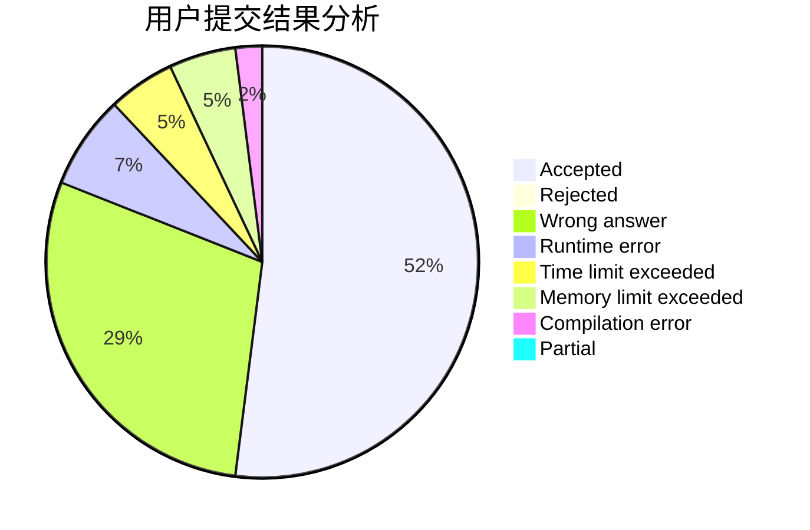
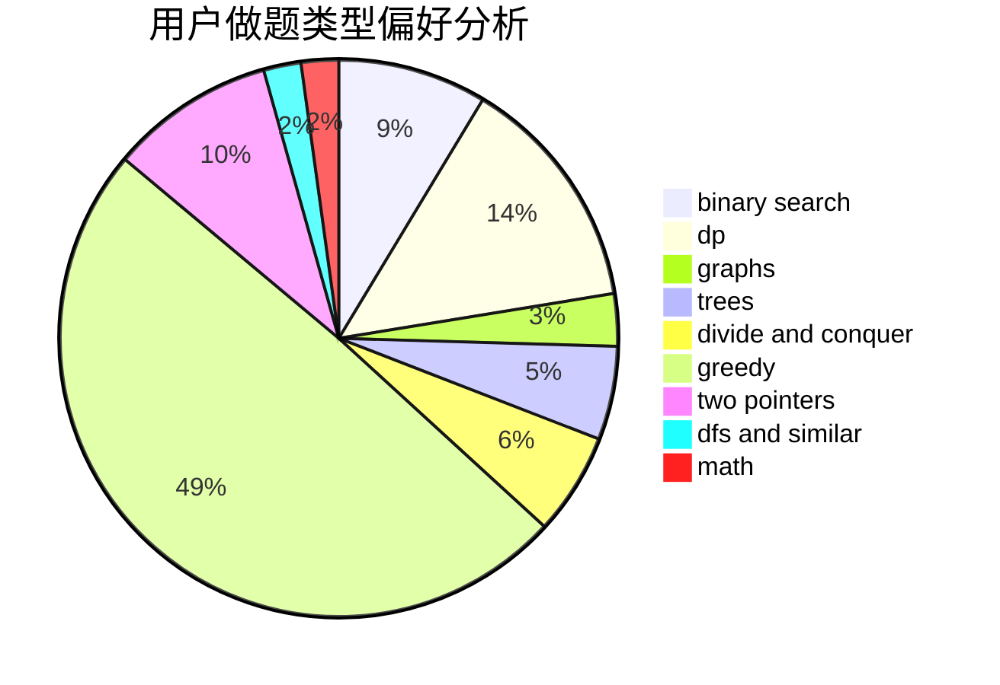

# Elegia

<!-- tabs:start -->

#### **用户提交结果分析**

#### **用户做题类型偏好分析**

<!-- tabs:end -->
# 推荐题目
[834C](https://codeforces.com/contest/834/problem/C)
[793G](https://codeforces.com/contest/793/problem/G)
[766D](https://codeforces.com/contest/766/problem/D)
[139A](https://codeforces.com/contest/139/problem/A)
[351C](https://codeforces.com/contest/351/problem/C)
[1341E](https://codeforces.com/contest/1341/problem/E)
[833C](https://codeforces.com/contest/833/problem/C)
[834B](https://codeforces.com/contest/834/problem/B)
[1167E](https://codeforces.com/contest/1167/problem/E)
[388C](https://codeforces.com/contest/388/problem/C)
