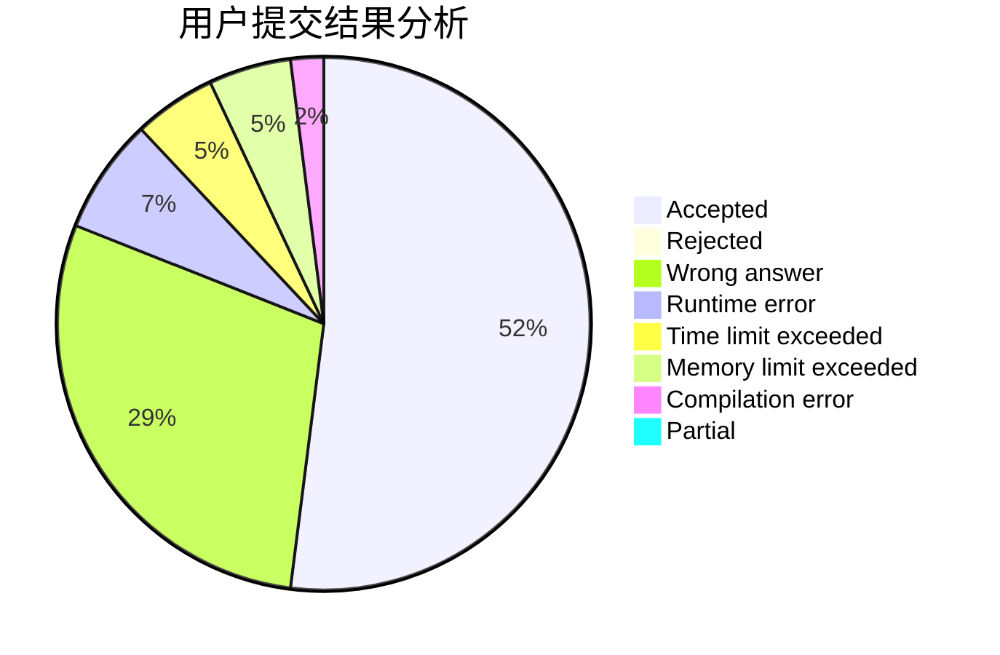
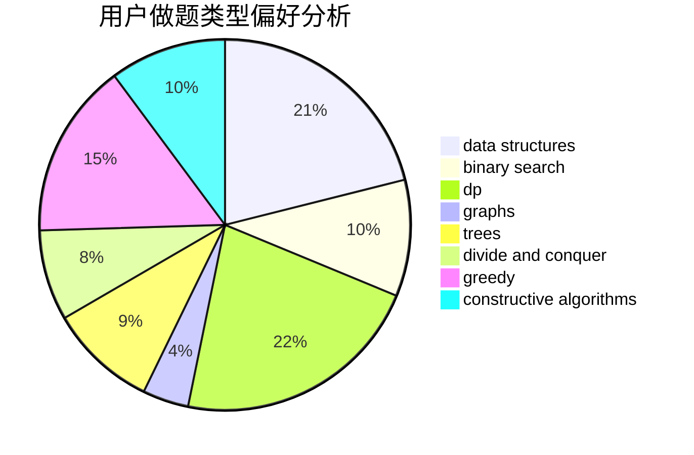
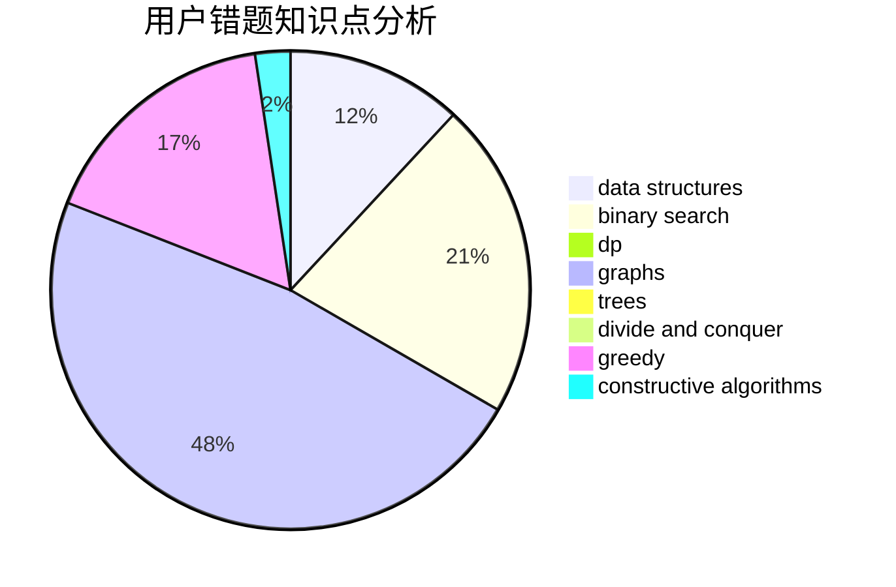

# Elegia

<!-- tabs:start -->

#### **用户提交结果分析**

#### **用户做题类型偏好分析**

#### **用户错题知识点分析**

<!-- tabs:end -->
# 推荐题目
[834C](https://codeforces.com/contest/834/problem/C)		dsu,graphs,sortings,trees		  
[793G](https://codeforces.com/contest/793/problem/G)		data structures,
                        divide and conquer,
                        flows,
                        graph matchings		  
[766D](https://codeforces.com/contest/766/problem/D)		data structures,
                        dfs and similar,
                        dp,
                        dsu,
                        graphs		  
[139A](https://codeforces.com/contest/139/problem/A)		implementation		  
[351C](https://codeforces.com/contest/351/problem/C)		dp,
                        matrices		  
[1341E](https://codeforces.com/contest/1341/problem/E)		dsu,graphs,sortings,trees		  
[833C](https://codeforces.com/contest/833/problem/C)		brute force,
                        combinatorics,
                        greedy,
                        math		  
[834B](https://codeforces.com/contest/834/problem/B)		data structures,
                        implementation		  
[1167E](https://codeforces.com/contest/1167/problem/E)		binary search,
                        combinatorics,
                        data structures,
                        two pointers		  
[388C](https://codeforces.com/contest/388/problem/C)		games,
                        greedy,
                        sortings		  
