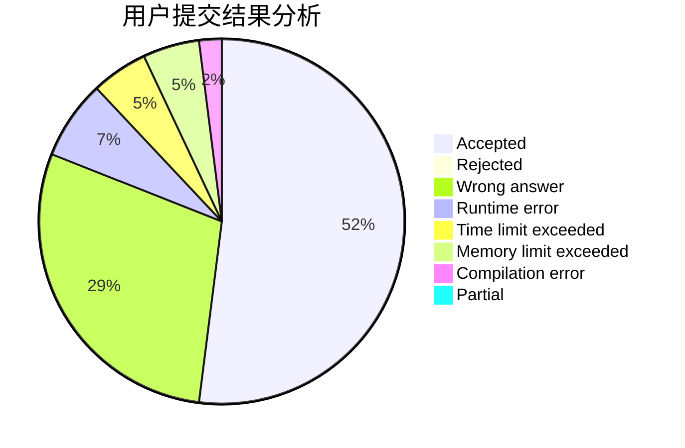
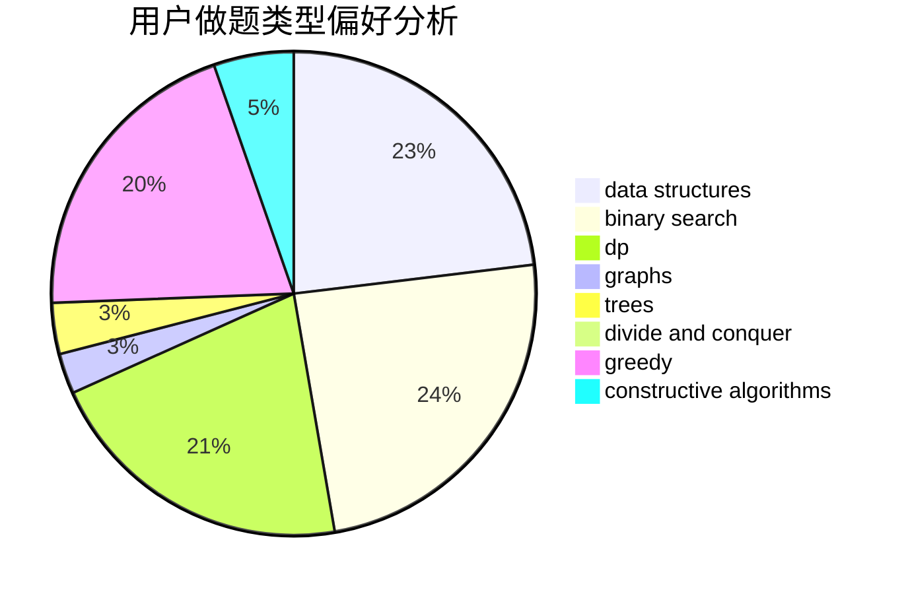
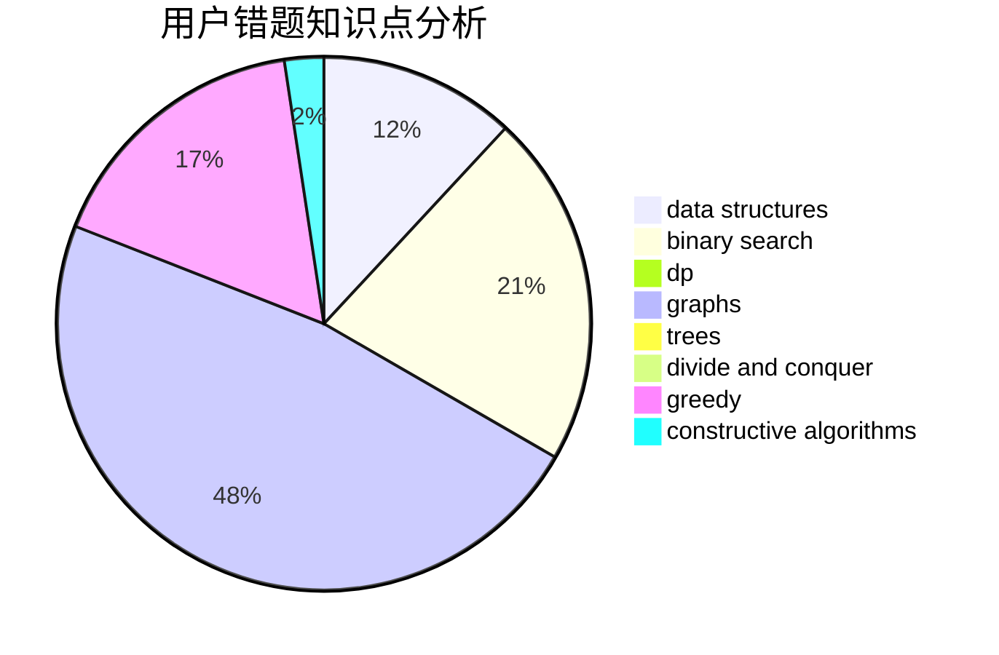

# Elegia

<!-- tabs:start -->

#### **用户提交结果分析**

#### **用户做题类型偏好分析**

#### **用户错题知识点分析**

<!-- tabs:end -->
# 推荐题目
[815C](https://codeforces.com/contest/815/problem/C)		brute force,
                        dp,
                        trees		  
[776A](https://codeforces.com/contest/776/problem/A)		brute force,
                        implementation,
                        strings		  
[747A](https://codeforces.com/contest/747/problem/A)		brute force,
                        math		  
[1391C](https://codeforces.com/contest/1391/problem/C)		combinatorics,
                        dp,
                        graphs,
                        math		  
[320B](https://codeforces.com/contest/320/problem/B)		dfs and similar,
                        graphs		  
[1334F](https://codeforces.com/contest/1334/problem/F)		binary search,
                        data structures,
                        dp,
                        greedy		  
[814E](https://codeforces.com/contest/814/problem/E)		combinatorics,
                        dp,
                        graphs,
                        shortest paths		  
[815B](https://codeforces.com/contest/815/problem/B)		brute force,
                        combinatorics,
                        constructive algorithms,
                        math		  
[1165C](https://codeforces.com/contest/1165/problem/C)		greedy		  
[360B](https://codeforces.com/contest/360/problem/B)		binary search,
                        dp		  
