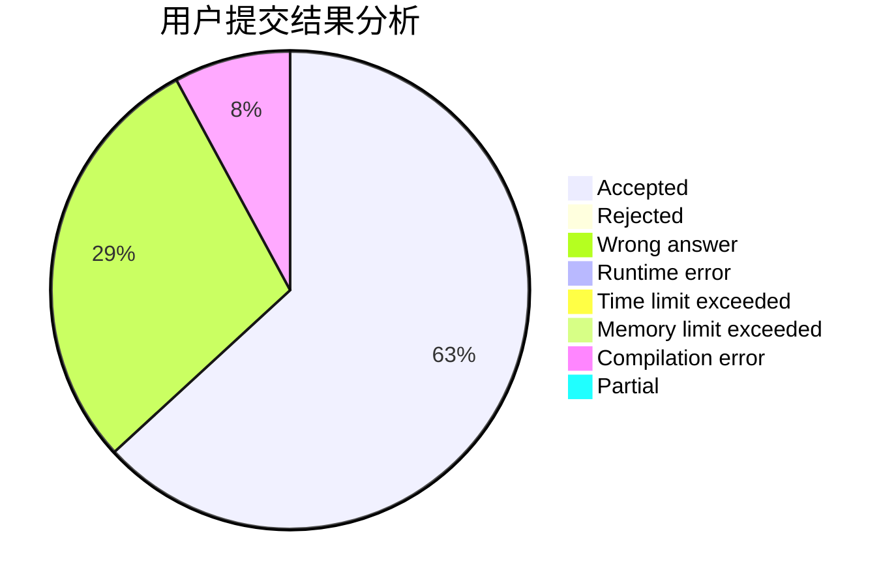
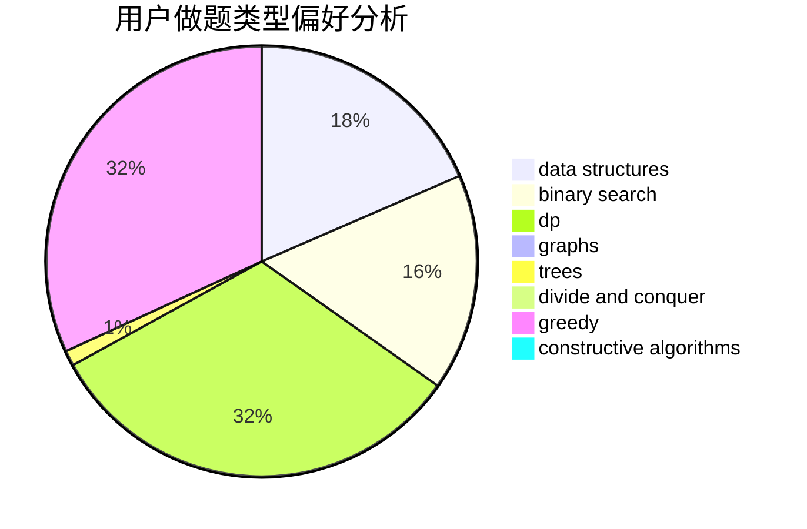

# Elooh

<!-- tabs:start -->

#### **用户提交结果分析**

#### **用户做题类型偏好分析**

#### **用户错题知识点分析**

<!-- tabs:end -->
# 推荐题目
[1322F](https://codeforces.com/contest/1322/problem/F)		dp,
                        trees		  
[1454D](https://codeforces.com/contest/1454/problem/D)		constructive algorithms,
                        math,
                        number theory		  
[366D](https://codeforces.com/contest/366/problem/D)		binary search,
                        data structures,
                        dfs and similar,
                        dsu,
                        shortest paths,
                        two pointers		  
[581B](https://codeforces.com/contest/581/problem/B)		implementation,
                        math		  
[513B2](https://codeforces.com/contest/513B/problem/2)		bitmasks,
                        divide and conquer,
                        math		  
[816B](https://codeforces.com/contest/816/problem/B)		binary search,
                        data structures,
                        implementation		  
[1313D](https://codeforces.com/contest/1313/problem/D)		bitmasks,
                        dp,
                        implementation		  
[816C](https://codeforces.com/contest/816/problem/C)		dsu,graphs,sortings,trees		  
[816D](https://codeforces.com/contest/816/problem/D)		dsu,graphs,sortings,trees		  
[1109A](https://codeforces.com/contest/1109/problem/A)		dp,
                        implementation		  
