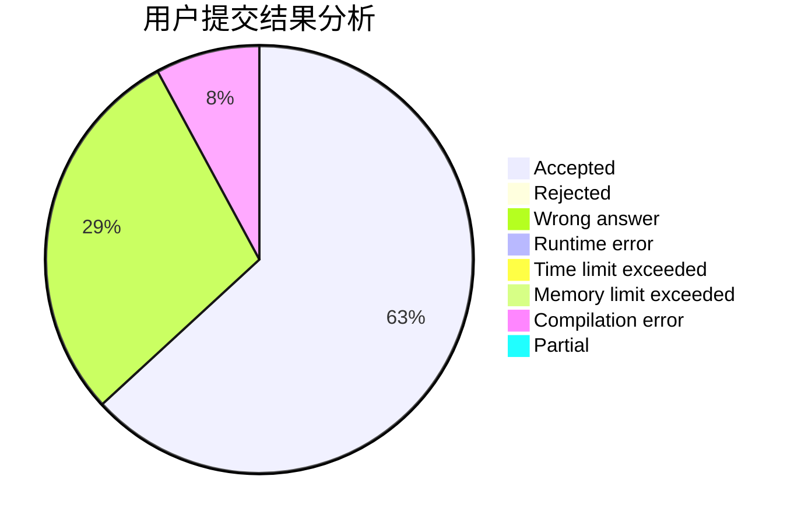
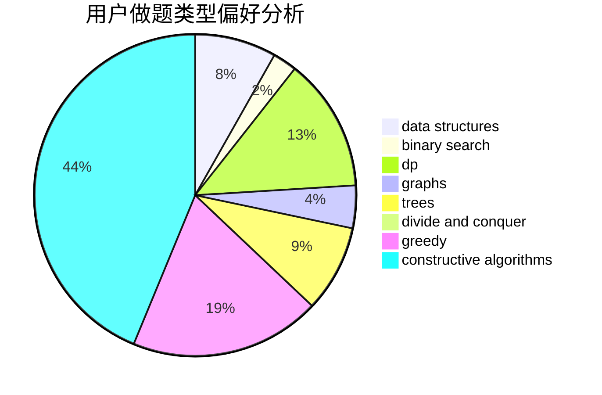

# Elooh

<!-- tabs:start -->

#### **用户提交结果分析**

#### **用户做题类型偏好分析**

#### **用户错题知识点分析**

<!-- tabs:end -->
# 推荐题目
[1329E](https://codeforces.com/contest/1329/problem/E)		binary search,
                        greedy		  
[1464A](https://codeforces.com/contest/1464/problem/A)		dsu,graphs,sortings,trees		  
[396C](https://codeforces.com/contest/396/problem/C)		data structures,
                        graphs,
                        trees		  
[601C](https://codeforces.com/contest/601/problem/C)		dp,
                        math,
                        probabilities		  
[538B](https://codeforces.com/contest/538/problem/B)		constructive algorithms,
                        dp,
                        greedy,
                        implementation		  
[835C](https://codeforces.com/contest/835/problem/C)		dp,
                        implementation		  
[1323B](https://codeforces.com/contest/1323/problem/B)		binary search,
                        greedy,
                        implementation		  
[835D](https://codeforces.com/contest/835/problem/D)		brute force,
                        dp,
                        hashing,
                        strings		  
[835E](https://codeforces.com/contest/835/problem/E)		binary search,
                        constructive algorithms,
                        interactive		  
[1109E](https://codeforces.com/contest/1109/problem/E)		data structures,
                        number theory		  
