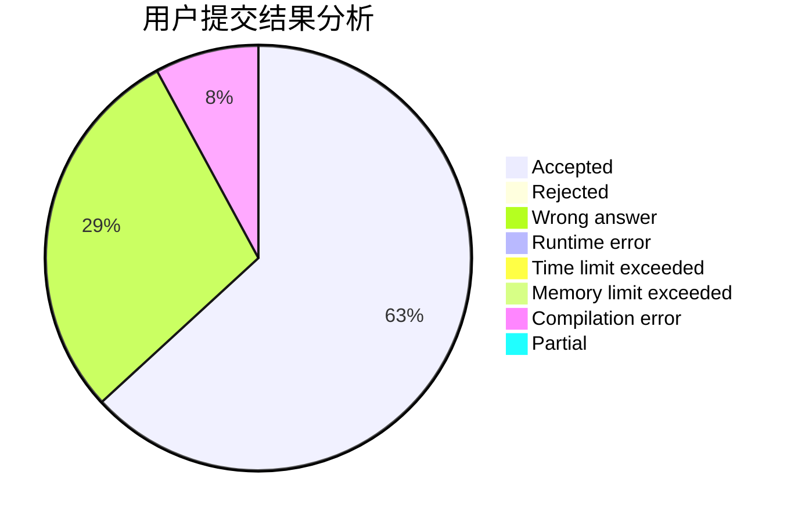
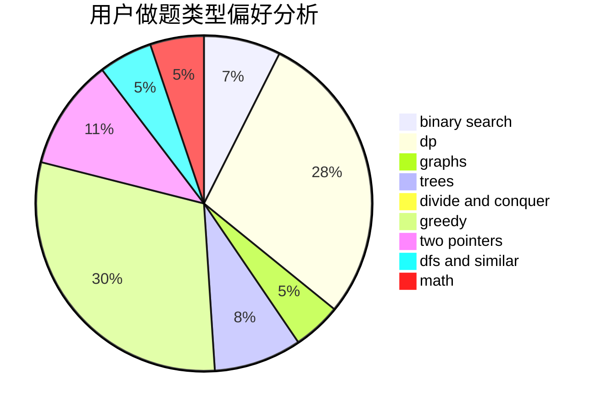

# Elooh

<!-- tabs:start -->

#### **用户提交结果分析**

#### **用户做题类型偏好分析**

<!-- tabs:end -->
# 推荐题目
[1329E](https://codeforces.com/contest/1329/problem/E)
[1464A](https://codeforces.com/contest/1464/problem/A)
[396C](https://codeforces.com/contest/396/problem/C)
[601C](https://codeforces.com/contest/601/problem/C)
[538B](https://codeforces.com/contest/538/problem/B)
[835C](https://codeforces.com/contest/835/problem/C)
[1323B](https://codeforces.com/contest/1323/problem/B)
[835D](https://codeforces.com/contest/835/problem/D)
[835E](https://codeforces.com/contest/835/problem/E)
[1109E](https://codeforces.com/contest/1109/problem/E)
