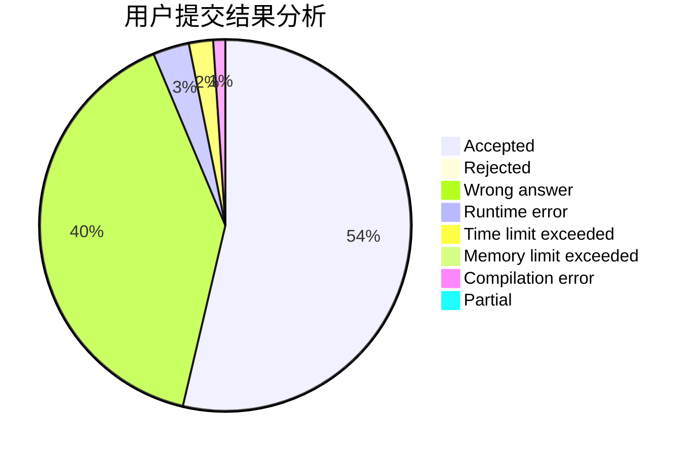
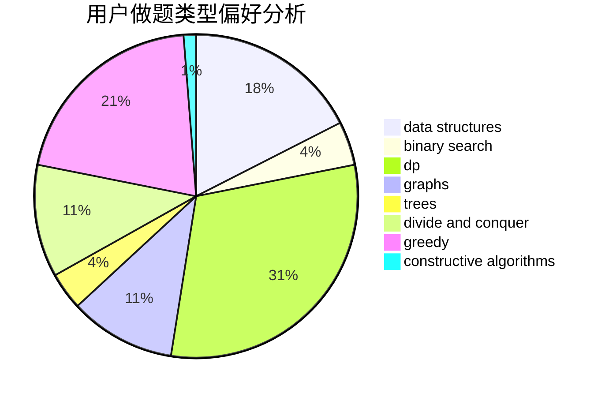
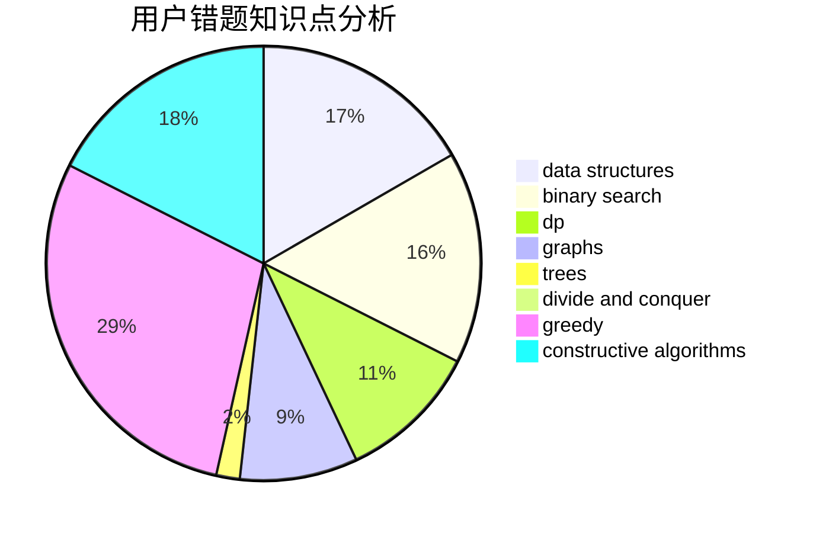

# 2018030402055

<!-- tabs:start -->

#### **用户提交结果分析**

#### **用户做题类型偏好分析**

#### **用户错题知识点分析**

<!-- tabs:end -->
# 推荐题目
[1244G](https://codeforces.com/contest/1244/problem/G)		constructive algorithms,
                        greedy,
                        math		  
[1246A](https://codeforces.com/contest/1246/problem/A)		dsu,graphs,sortings,trees		  
[1208B](https://codeforces.com/contest/1208/problem/B)		binary search,
                        brute force,
                        implementation,
                        two pointers		  
[1245D](https://codeforces.com/contest/1245/problem/D)		dsu,
                        graphs,
                        greedy,
                        shortest paths,
                        trees		  
[1246F](https://codeforces.com/contest/1246/problem/F)		nan		  
[1247D](https://codeforces.com/contest/1247/problem/D)		dsu,graphs,sortings,trees		  
[1155A](https://codeforces.com/contest/1155/problem/A)		implementation,
                        sortings,
                        strings		  
[1054H](https://codeforces.com/contest/1054/problem/H)		chinese remainder theorem,
                        fft,
                        math,
                        number theory		  
[1161A](https://codeforces.com/contest/1161/problem/A)		dsu,graphs,sortings,trees		  
[1246B](https://codeforces.com/contest/1246/problem/B)		dsu,graphs,sortings,trees		  
