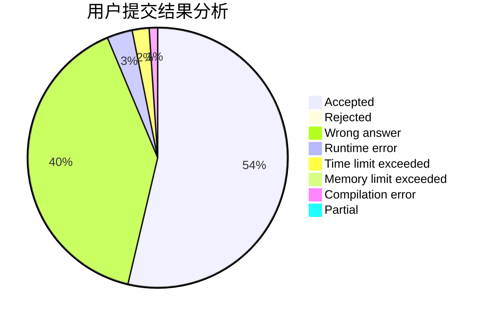
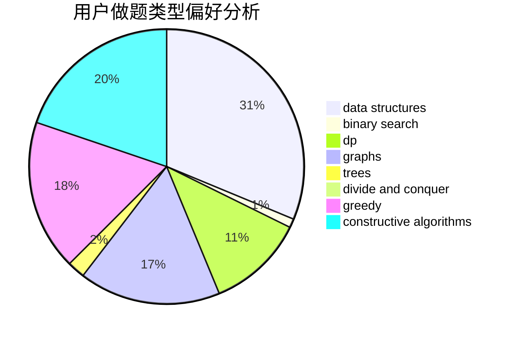

# 2018030402055

<!-- tabs:start -->

#### **用户提交结果分析**

#### **用户做题类型偏好分析**

#### **用户错题知识点分析**

<!-- tabs:end -->
# 推荐题目
[1250B](https://codeforces.com/contest/1250/problem/B)		brute force,
                        constructive algorithms,
                        greedy,
                        math		  
[1250I](https://codeforces.com/contest/1250/problem/I)		binary search,
                        brute force,
                        greedy,
                        shortest paths		  
[1213F](https://codeforces.com/contest/1213/problem/F)		data structures,
                        dfs and similar,
                        dsu,
                        graphs,
                        greedy,
                        implementation,
                        strings		  
[1250F](https://codeforces.com/contest/1250/problem/F)		brute force,
                        implementation		  
[1250N](https://codeforces.com/contest/1250/problem/N)		dfs and similar,
                        graphs,
                        greedy		  
[1251C](https://codeforces.com/contest/1251/problem/C)		greedy,
                        two pointers		  
[11571](https://codeforces.com/contest/1157/problem/1)		dsu,graphs,sortings,trees		  
[1055C](https://codeforces.com/contest/1055/problem/C)		math,
                        number theory		  
[1163D](https://codeforces.com/contest/1163/problem/D)		dp,
                        strings		  
[1250J](https://codeforces.com/contest/1250/problem/J)		binary search,
                        greedy		  
