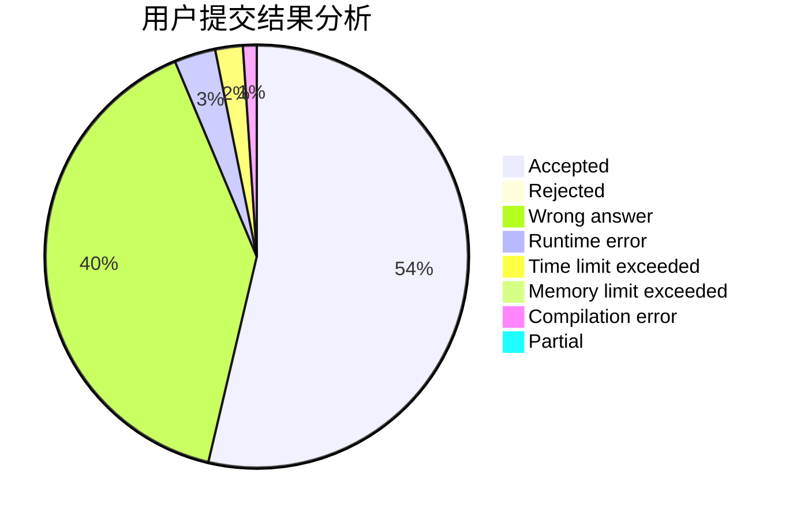
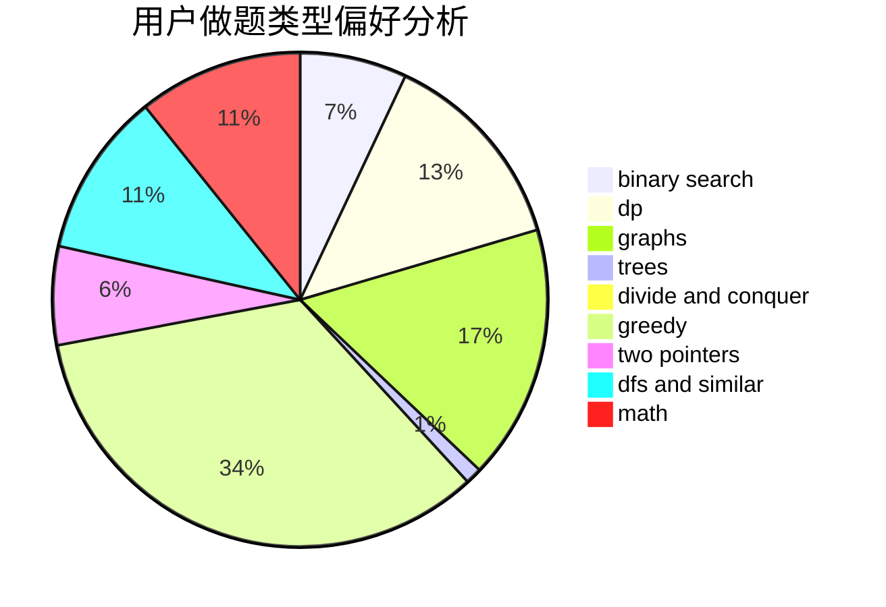

# 2018030402055

<!-- tabs:start -->

#### **用户提交结果分析**

#### **用户做题类型偏好分析**

<!-- tabs:end -->
# 推荐题目
[1250B](https://codeforces.com/contest/1250/problem/B)
[1250I](https://codeforces.com/contest/1250/problem/I)
[1213F](https://codeforces.com/contest/1213/problem/F)
[1250F](https://codeforces.com/contest/1250/problem/F)
[1250N](https://codeforces.com/contest/1250/problem/N)
[1251C](https://codeforces.com/contest/1251/problem/C)
[11571](https://codeforces.com/contest/1157/problem/1)
[1055C](https://codeforces.com/contest/1055/problem/C)
[1163D](https://codeforces.com/contest/1163/problem/D)
[1250J](https://codeforces.com/contest/1250/problem/J)
