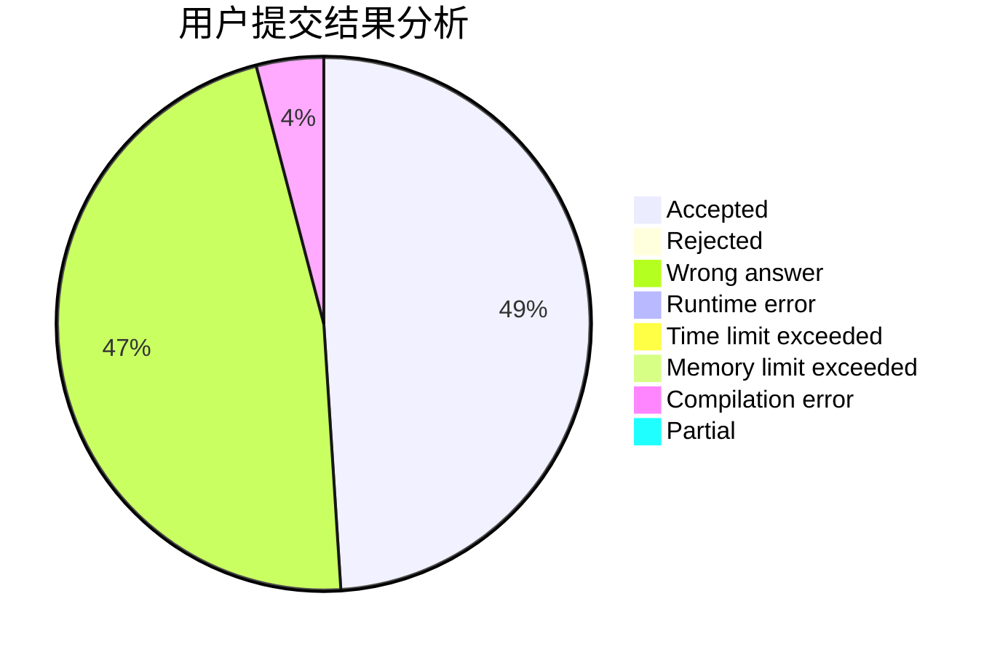
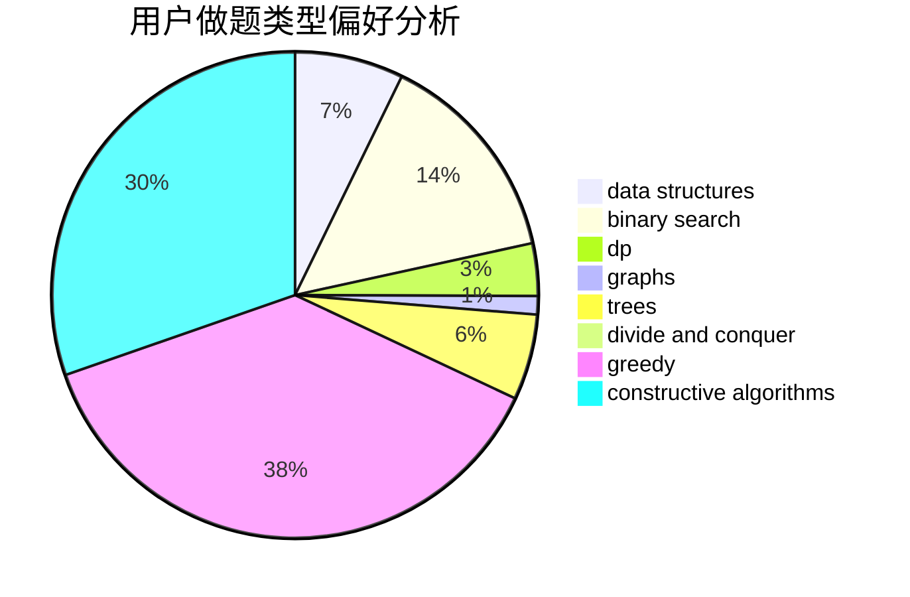
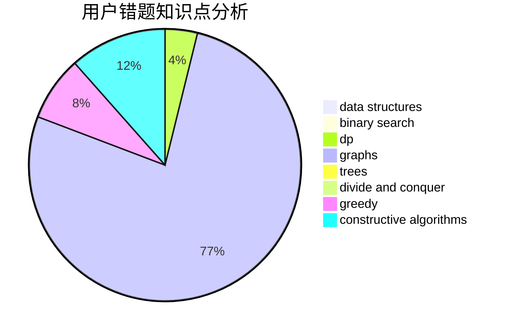

# Emma.Y

<!-- tabs:start -->

#### **用户提交结果分析**

#### **用户做题类型偏好分析**

#### **用户错题知识点分析**

<!-- tabs:end -->
# 推荐题目
[553E](https://codeforces.com/contest/553/problem/E)		dp,
                        fft,
                        graphs,
                        math,
                        probabilities		  
[409H](https://codeforces.com/contest/409/problem/H)		*special problem,
                        brute force,
                        constructive algorithms,
                        dsu,
                        implementation		  
[345A](https://codeforces.com/contest/345/problem/A)		*special problem,
                        probabilities		  
[1473E](https://codeforces.com/contest/1473/problem/E)		graphs,
                        shortest paths		  
[551A](https://codeforces.com/contest/551/problem/A)		brute force,
                        implementation,
                        sortings		  
[1207B](https://codeforces.com/contest/1207/problem/B)		constructive algorithms,
                        greedy,
                        implementation		  
[535C](https://codeforces.com/contest/535/problem/C)		binary search,
                        greedy,
                        math		  
[1270F](https://codeforces.com/contest/1270/problem/F)		math,
                        strings		  
[580E](https://codeforces.com/contest/580/problem/E)		data structures,
                        hashing,
                        strings		  
[1060D](https://codeforces.com/contest/1060/problem/D)		greedy,
                        math		  
