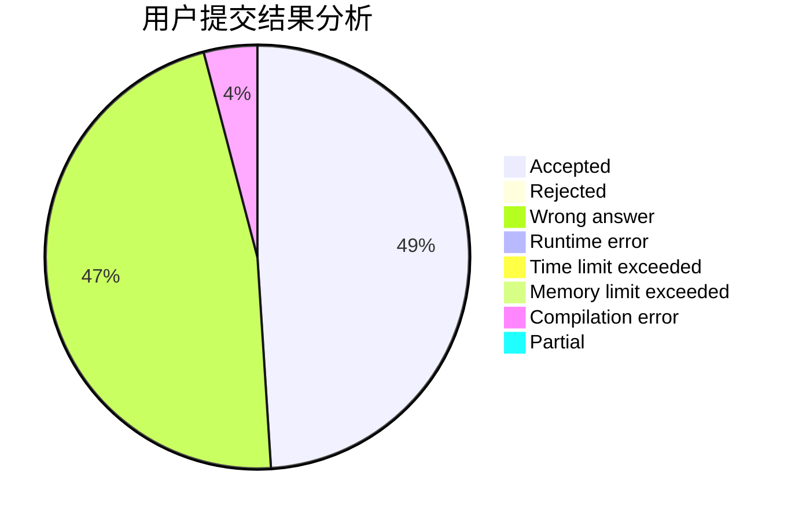
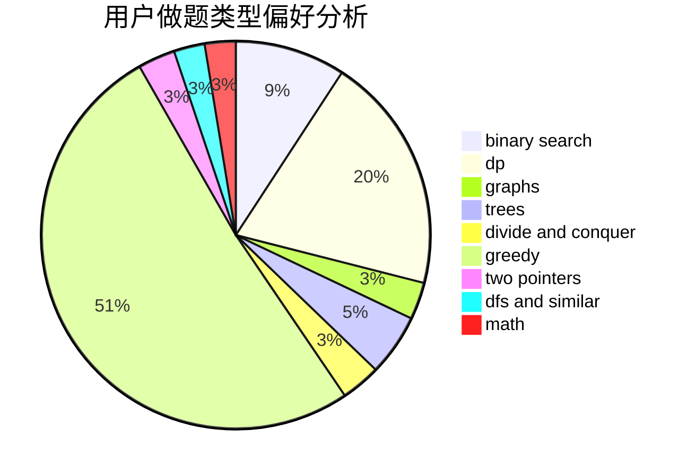

# Emma.Y

<!-- tabs:start -->

#### **用户提交结果分析**

#### **用户做题类型偏好分析**

<!-- tabs:end -->
# 推荐题目
[579A](https://codeforces.com/contest/579/problem/A)
[437B](https://codeforces.com/contest/437/problem/B)
[371C](https://codeforces.com/contest/371/problem/C)
[1482B](https://codeforces.com/contest/1482/problem/B)
[576A](https://codeforces.com/contest/576/problem/A)
[1211B](https://codeforces.com/contest/1211/problem/B)
[558A](https://codeforces.com/contest/558/problem/A)
[1279F](https://codeforces.com/contest/1279/problem/F)
[601A](https://codeforces.com/contest/601/problem/A)
[1060G](https://codeforces.com/contest/1060/problem/G)
