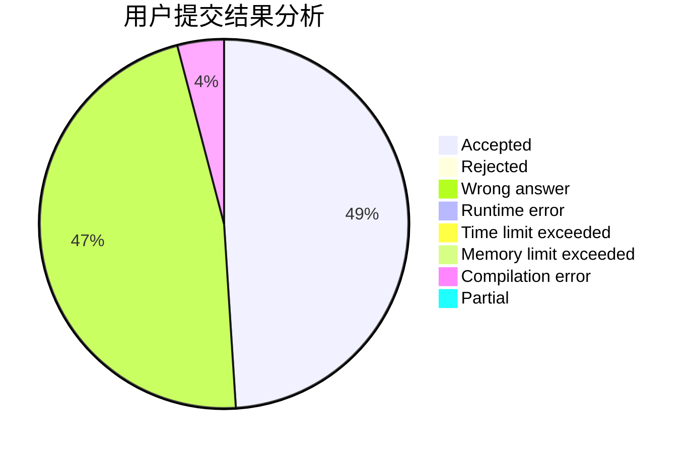
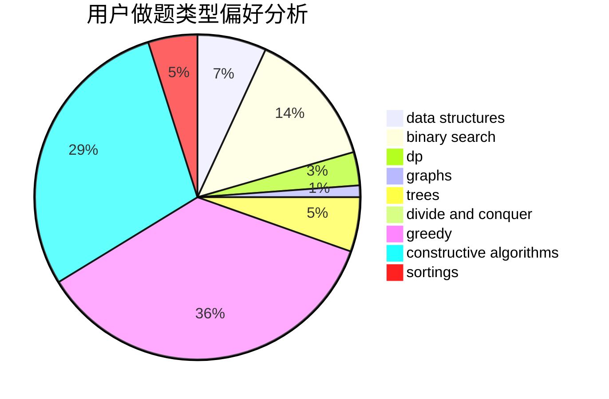
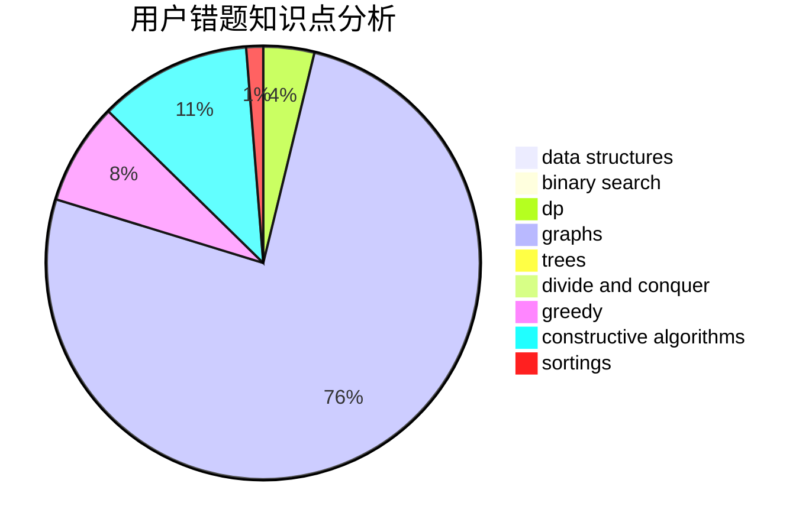

# Emma.Y
<!-- tabs:start -->
#### **用户提交结果分析**

#### **用户做题类型偏好分析**

#### **用户错题知识点分析**

<!-- tabs:end -->
# 推荐题目
[535C](http://codeforces.com/problemset/problem/535/C)		binary search,
                        greedy,
                        math		  
[812A](http://codeforces.com/problemset/problem/812/A)		implementation		  
[553E](http://codeforces.com/problemset/problem/553/E)		dp,
                        fft,
                        graphs,
                        math,
                        probabilities		  
[345A](http://codeforces.com/problemset/problem/345/A)		*special problem,
                        probabilities		  
[305C](http://codeforces.com/problemset/problem/305/C)		greedy,
                        implementation		  
[1418F](http://codeforces.com/problemset/problem/1418/F)		data structures,
                        math,
                        number theory,
                        two pointers		  
[321B](http://codeforces.com/problemset/problem/321/B)		dp,
                        flows,
                        greedy		  
[281D](https://codeforces.com/contest/281/problem/D)		data structures,
                        implementation,
                        two pointers		  
[505C](http://codeforces.com/problemset/problem/505/C)		dfs and similar,
                        dp,
                        two pointers		  
[319D](http://codeforces.com/problemset/problem/319/D)		greedy,
                        hashing,
                        string suffix structures,
                        strings		  
<!-- tabs:start -->
#### **data structures**
[1418F](http://codeforces.com/problemset/problem/1418/F)		data structures,
                        math,
                        number theory,
                        two pointers		  
[281D](https://codeforces.com/contest/281/problem/D)		data structures,
                        implementation,
                        two pointers		  
[580E](http://codeforces.com/problemset/problem/580/E)		data structures,
                        hashing,
                        strings		  
[1076E](http://codeforces.com/problemset/problem/1076/E)		data structures,
                        trees		  
[1290B](http://codeforces.com/problemset/problem/1290/B)		binary search,
                        constructive algorithms,
                        data structures,
                        strings,
                        two pointers		  
[817D](http://codeforces.com/problemset/problem/817/D)		data structures,
                        divide and conquer,
                        dsu,
                        sortings		  
[817F](http://codeforces.com/problemset/problem/817/F)		binary search,
                        data structures,
                        trees		  
[1467E](http://codeforces.com/problemset/problem/1467/E)		data structures,
                        dfs and similar,
                        dp,
                        trees		  
[1455G](http://codeforces.com/problemset/problem/1455/G)		data structures,
                        dp		  
[1479B1](http://codeforces.com/problemset/problem/1479/B1)		constructive algorithms,
                        data structures,
                        dp,
                        greedy,
                        implementation		  
#### **binary search**
[535C](http://codeforces.com/problemset/problem/535/C)		binary search,
                        greedy,
                        math		  
[1190E](http://codeforces.com/problemset/problem/1190/E)		binary search,
                        greedy		  
[1290B](http://codeforces.com/problemset/problem/1290/B)		binary search,
                        constructive algorithms,
                        data structures,
                        strings,
                        two pointers		  
[817C](http://codeforces.com/problemset/problem/817/C)		binary search,
                        brute force,
                        dp,
                        math		  
[817F](http://codeforces.com/problemset/problem/817/F)		binary search,
                        data structures,
                        trees		  
[1487D](http://codeforces.com/problemset/problem/1487/D)		binary search,
                        brute force,
                        math,
                        number theory		  
[1492C](http://codeforces.com/problemset/problem/1492/C)		binary search,
                        data structures,
                        dp,
                        greedy,
                        two pointers		  
[1463D](http://codeforces.com/problemset/problem/1463/D)		binary search,
                        constructive algorithms,
                        greedy,
                        two pointers		  
[1490G](http://codeforces.com/problemset/problem/1490/G)		binary search,
                        data structures,
                        math		  
[1479D](http://codeforces.com/problemset/problem/1479/D)		binary search,
                        bitmasks,
                        brute force,
                        data structures,
                        probabilities,
                        trees		  
#### **dp**
[553E](http://codeforces.com/problemset/problem/553/E)		dp,
                        fft,
                        graphs,
                        math,
                        probabilities		  
[321B](http://codeforces.com/problemset/problem/321/B)		dp,
                        flows,
                        greedy		  
[505C](http://codeforces.com/problemset/problem/505/C)		dfs and similar,
                        dp,
                        two pointers		  
[816E](https://codeforces.com/contest/816/problem/E)		brute force,
                        dp,
                        trees		  
[1173E2](https://codeforces.com/contest/1173/problem/E2)		dp,
                        probabilities		  
[1036C](http://codeforces.com/problemset/problem/1036/C)		combinatorics,
                        dp		  
[817C](http://codeforces.com/problemset/problem/817/C)		binary search,
                        brute force,
                        dp,
                        math		  
[581F](http://codeforces.com/problemset/problem/581/F)		dp,
                        trees,
                        two pointers		  
[1312E](http://codeforces.com/problemset/problem/1312/E)		dp,
                        greedy		  
[1467E](http://codeforces.com/problemset/problem/1467/E)		data structures,
                        dfs and similar,
                        dp,
                        trees		  
#### **graph**
[553E](http://codeforces.com/problemset/problem/553/E)		dp,
                        fft,
                        graphs,
                        math,
                        probabilities		  
[601A](http://codeforces.com/problemset/problem/601/A)		graphs,
                        shortest paths		  
[1473E](http://codeforces.com/problemset/problem/1473/E)		graphs,
                        shortest paths		  
[1450E](http://codeforces.com/problemset/problem/1450/E)		constructive algorithms,
                        dfs and similar,
                        graphs,
                        shortest paths		  
[730I](http://codeforces.com/problemset/problem/730/I)		dp,
                        flows,
                        graphs,
                        greedy		  
[1487C](http://codeforces.com/problemset/problem/1487/C)		brute force,
                        constructive algorithms,
                        dfs and similar,
                        graphs,
                        greedy,
                        implementation,
                        math		  
[1437C](http://codeforces.com/problemset/problem/1437/C)		dp,
                        flows,
                        graph matchings,
                        greedy,
                        math,
                        sortings		  
[1470D](http://codeforces.com/problemset/problem/1470/D)		constructive algorithms,
                        dfs and similar,
                        graph matchings,
                        graphs,
                        greedy		  
[1476C](http://codeforces.com/problemset/problem/1476/C)		dp,
                        graphs,
                        greedy		  
[1304D](http://codeforces.com/problemset/problem/1304/D)		constructive algorithms,
                        graphs,
                        greedy,
                        two pointers		  
#### **trees**
[816E](https://codeforces.com/contest/816/problem/E)		brute force,
                        dp,
                        trees		  
[1076E](http://codeforces.com/problemset/problem/1076/E)		data structures,
                        trees		  
[581F](http://codeforces.com/problemset/problem/581/F)		dp,
                        trees,
                        two pointers		  
[817F](http://codeforces.com/problemset/problem/817/F)		binary search,
                        data structures,
                        trees		  
[1467E](http://codeforces.com/problemset/problem/1467/E)		data structures,
                        dfs and similar,
                        dp,
                        trees		  
[817E](http://codeforces.com/problemset/problem/817/E)		bitmasks,
                        data structures,
                        trees		  
[1479D](http://codeforces.com/problemset/problem/1479/D)		binary search,
                        bitmasks,
                        brute force,
                        data structures,
                        probabilities,
                        trees		  
[1511C](http://codeforces.com/problemset/problem/1511/C)		brute force,
                        data structures,
                        implementation,
                        trees		  
[1499F](http://codeforces.com/problemset/problem/1499/F)		combinatorics,
                        dfs and similar,
                        dp,
                        trees		  
[1491E](http://codeforces.com/problemset/problem/1491/E)		brute force,
                        dfs and similar,
                        divide and conquer,
                        number theory,
                        trees		  
#### **divide and conquer**
[817D](http://codeforces.com/problemset/problem/817/D)		data structures,
                        divide and conquer,
                        dsu,
                        sortings		  
[1461D](http://codeforces.com/problemset/problem/1461/D)		binary search,
                        brute force,
                        data structures,
                        divide and conquer,
                        implementation,
                        sortings		  
[1466G](http://codeforces.com/problemset/problem/1466/G)		combinatorics,
                        divide and conquer,
                        hashing,
                        math,
                        string suffix structures,
                        strings		  
[1490D](http://codeforces.com/problemset/problem/1490/D)		dfs and similar,
                        divide and conquer,
                        implementation		  
[1483C](https://codeforces.com/contest/1483/problem/C)		data structures,
                        divide and conquer,
                        dp		  
[1491E](http://codeforces.com/problemset/problem/1491/E)		brute force,
                        dfs and similar,
                        divide and conquer,
                        number theory,
                        trees		  
[1303G](http://codeforces.com/problemset/problem/1303/G)		data structures,
                        divide and conquer,
                        geometry,
                        trees		  
[1494D](http://codeforces.com/problemset/problem/1494/D)		constructive algorithms,
                        data structures,
                        dfs and similar,
                        divide and conquer,
                        dsu,
                        greedy,
                        sortings,
                        trees		  
[1482E](http://codeforces.com/problemset/problem/1482/E)		data structures,
                        divide and conquer,
                        dp		  
[566C](http://codeforces.com/problemset/problem/566/C)		dfs and similar,
                        divide and conquer,
                        trees		  
#### **greedy**
[535C](http://codeforces.com/problemset/problem/535/C)		binary search,
                        greedy,
                        math		  
[305C](http://codeforces.com/problemset/problem/305/C)		greedy,
                        implementation		  
[321B](http://codeforces.com/problemset/problem/321/B)		dp,
                        flows,
                        greedy		  
[319D](http://codeforces.com/problemset/problem/319/D)		greedy,
                        hashing,
                        string suffix structures,
                        strings		  
[1060D](http://codeforces.com/problemset/problem/1060/D)		greedy,
                        math		  
[1066B](http://codeforces.com/problemset/problem/1066/B)		greedy,
                        two pointers		  
[1190E](http://codeforces.com/problemset/problem/1190/E)		binary search,
                        greedy		  
[1432F](https://codeforces.com/contest/1432/problem/F)		greedy		  
[1312E](http://codeforces.com/problemset/problem/1312/E)		dp,
                        greedy		  
[1207B](http://codeforces.com/problemset/problem/1207/B)		constructive algorithms,
                        greedy,
                        implementation		  
#### **constructive algorithms**
[409H](http://codeforces.com/problemset/problem/409/H)		*special problem,
                        brute force,
                        constructive algorithms,
                        dsu,
                        implementation		  
[1290B](http://codeforces.com/problemset/problem/1290/B)		binary search,
                        constructive algorithms,
                        data structures,
                        strings,
                        two pointers		  
[443A](http://codeforces.com/problemset/problem/443/A)		constructive algorithms,
                        implementation		  
[1207B](http://codeforces.com/problemset/problem/1207/B)		constructive algorithms,
                        greedy,
                        implementation		  
[1450E](http://codeforces.com/problemset/problem/1450/E)		constructive algorithms,
                        dfs and similar,
                        graphs,
                        shortest paths		  
[1479B1](http://codeforces.com/problemset/problem/1479/B1)		constructive algorithms,
                        data structures,
                        dp,
                        greedy,
                        implementation		  
[1493A](http://codeforces.com/problemset/problem/1493/A)		constructive algorithms,
                        greedy		  
[1463D](http://codeforces.com/problemset/problem/1463/D)		binary search,
                        constructive algorithms,
                        greedy,
                        two pointers		  
[1456B](https://codeforces.com/contest/1456/problem/B)		bitmasks,
                        brute force,
                        constructive algorithms		  
[1492D](http://codeforces.com/problemset/problem/1492/D)		bitmasks,
                        constructive algorithms,
                        greedy,
                        math		  
#### **sortings**
[53D](http://codeforces.com/problemset/problem/53/D)		sortings		  
[551A](http://codeforces.com/problemset/problem/551/A)		brute force,
                        implementation,
                        sortings		  
[817D](http://codeforces.com/problemset/problem/817/D)		data structures,
                        divide and conquer,
                        dsu,
                        sortings		  
[817B](http://codeforces.com/problemset/problem/817/B)		combinatorics,
                        implementation,
                        math,
                        sortings		  
[1496C](https://codeforces.com/contest/1496/problem/C)		geometry,
                        greedy,
                        math,
                        sortings		  
[1495A](http://codeforces.com/problemset/problem/1495/A)		geometry,
                        greedy,
                        math,
                        sortings		  
[1497A](http://codeforces.com/problemset/problem/1497/A)		brute force,
                        data structures,
                        greedy,
                        sortings		  
[1427A](http://codeforces.com/problemset/problem/1427/A)		math,
                        sortings		  
[1461D](http://codeforces.com/problemset/problem/1461/D)		binary search,
                        brute force,
                        data structures,
                        divide and conquer,
                        implementation,
                        sortings		  
[1437C](http://codeforces.com/problemset/problem/1437/C)		dp,
                        flows,
                        graph matchings,
                        greedy,
                        math,
                        sortings		  
<!-- tabs:end -->
