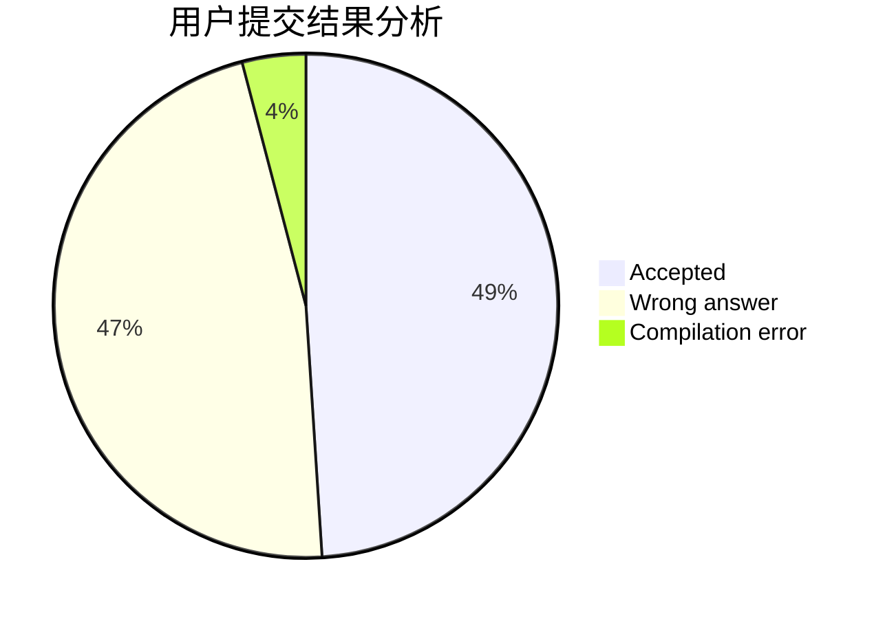
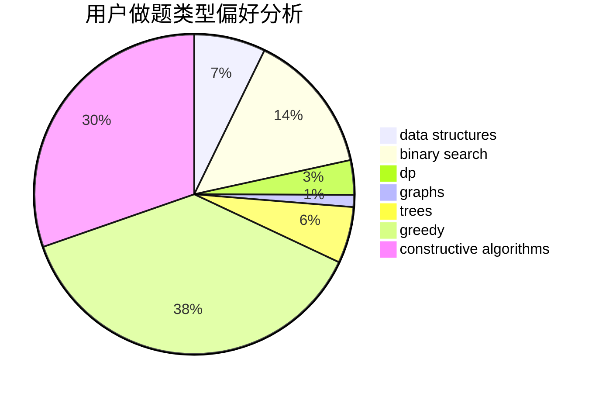
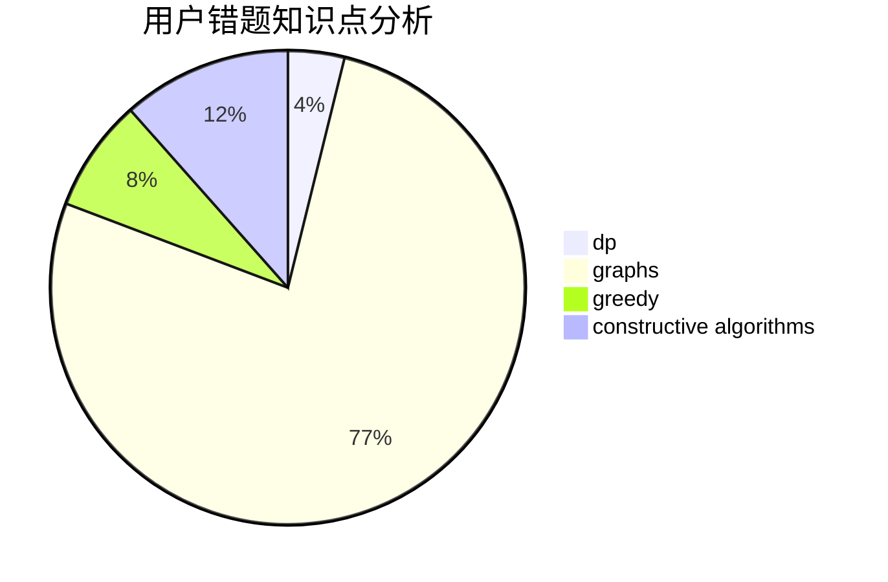

# Emma.Y
<!-- tabs:start -->
#### **用户提交结果分析**

#### **用户做题类型偏好分析**

#### **用户错题知识点分析**

<!-- tabs:end -->
# 推荐题目
[Tavas and Karafs](http://codeforces.com/problemset/problem/535/C)		binary search,
                        greedy,
                        math		  
[Sagheer and Crossroads](http://codeforces.com/problemset/problem/812/A)		implementation		  
[Kyoya and Train](http://codeforces.com/problemset/problem/553/E)		dp,
                        fft,
                        graphs,
                        math,
                        probabilities		  
[Expecting Trouble](http://codeforces.com/problemset/problem/345/A)		*special problem,
                        probabilities		  
[Ivan and Powers of Two](http://codeforces.com/problemset/problem/305/C)		greedy,
                        implementation		  
[Equal Product](http://codeforces.com/problemset/problem/1418/F)		data structures,
                        math,
                        number theory,
                        two pointers		  
[Ciel and Duel](http://codeforces.com/problemset/problem/321/B)		dp,
                        flows,
                        greedy		  
[Maximum Xor Secondary](https://codeforces.com/contest/281/problem/D)		data structures,
                        implementation,
                        two pointers		  
[Mr. Kitayuta, the Treasure Hunter](http://codeforces.com/problemset/problem/505/C)		dfs and similar,
                        dp,
                        two pointers		  
[Have You Ever Heard About the Word?](http://codeforces.com/problemset/problem/319/D)		greedy,
                        hashing,
                        string suffix structures,
                        strings		  
<!-- tabs:start -->
#### **data structures**
[Equal Product](http://codeforces.com/problemset/problem/1418/F)		data structures,
                        math,
                        number theory,
                        two pointers		  
[Maximum Xor Secondary](https://codeforces.com/contest/281/problem/D)		data structures,
                        implementation,
                        two pointers		  
[Kefa and Watch](http://codeforces.com/problemset/problem/580/E)		data structures,
                        hashing,
                        strings		  
[Vasya and a Tree](http://codeforces.com/problemset/problem/1076/E)		data structures,
                        trees		  
[Irreducible Anagrams](http://codeforces.com/problemset/problem/1290/B)		binary search,
                        constructive algorithms,
                        data structures,
                        strings,
                        two pointers		  
[Imbalanced Array](http://codeforces.com/problemset/problem/817/D)		data structures,
                        divide and conquer,
                        dsu,
                        sortings		  
[MEX Queries](http://codeforces.com/problemset/problem/817/F)		binary search,
                        data structures,
                        trees		  
[Distinctive Roots in a Tree](http://codeforces.com/problemset/problem/1467/E)		data structures,
                        dfs and similar,
                        dp,
                        trees		  
[Forbidden Value](http://codeforces.com/problemset/problem/1455/G)		data structures,
                        dp		  
[Painting the Array I](http://codeforces.com/problemset/problem/1479/B1)		constructive algorithms,
                        data structures,
                        dp,
                        greedy,
                        implementation		  
#### **binary search**
[Tavas and Karafs](http://codeforces.com/problemset/problem/535/C)		binary search,
                        greedy,
                        math		  
[Tokitsukaze and Explosion](http://codeforces.com/problemset/problem/1190/E)		binary search,
                        greedy		  
[Irreducible Anagrams](http://codeforces.com/problemset/problem/1290/B)		binary search,
                        constructive algorithms,
                        data structures,
                        strings,
                        two pointers		  
[Really Big Numbers](http://codeforces.com/problemset/problem/817/C)		binary search,
                        brute force,
                        dp,
                        math		  
[MEX Queries](http://codeforces.com/problemset/problem/817/F)		binary search,
                        data structures,
                        trees		  
[Pythagorean Triples](http://codeforces.com/problemset/problem/1487/D)		binary search,
                        brute force,
                        math,
                        number theory		  
[Maximum width](http://codeforces.com/problemset/problem/1492/C)		binary search,
                        data structures,
                        dp,
                        greedy,
                        two pointers		  
[Pairs](http://codeforces.com/problemset/problem/1463/D)		binary search,
                        constructive algorithms,
                        greedy,
                        two pointers		  
[Old Floppy Drive](http://codeforces.com/problemset/problem/1490/G)		binary search,
                        data structures,
                        math		  
[Odd Mineral Resource](http://codeforces.com/problemset/problem/1479/D)		binary search,
                        bitmasks,
                        brute force,
                        data structures,
                        probabilities,
                        trees		  
#### **dp**
[Kyoya and Train](http://codeforces.com/problemset/problem/553/E)		dp,
                        fft,
                        graphs,
                        math,
                        probabilities		  
[Ciel and Duel](http://codeforces.com/problemset/problem/321/B)		dp,
                        flows,
                        greedy		  
[Mr. Kitayuta, the Treasure Hunter](http://codeforces.com/problemset/problem/505/C)		dfs and similar,
                        dp,
                        two pointers		  
[Karen and Supermarket](https://codeforces.com/contest/816/problem/E)		brute force,
                        dp,
                        trees		  
[Nauuo and Pictures (hard version)](https://codeforces.com/contest/1173/problem/E2)		dp,
                        probabilities		  
[Classy Numbers](http://codeforces.com/problemset/problem/1036/C)		combinatorics,
                        dp		  
[Really Big Numbers](http://codeforces.com/problemset/problem/817/C)		binary search,
                        brute force,
                        dp,
                        math		  
[Zublicanes and Mumocrates](http://codeforces.com/problemset/problem/581/F)		dp,
                        trees,
                        two pointers		  
[Array Shrinking](http://codeforces.com/problemset/problem/1312/E)		dp,
                        greedy		  
[Distinctive Roots in a Tree](http://codeforces.com/problemset/problem/1467/E)		data structures,
                        dfs and similar,
                        dp,
                        trees		  
#### **graph**
[Kyoya and Train](http://codeforces.com/problemset/problem/553/E)		dp,
                        fft,
                        graphs,
                        math,
                        probabilities		  
[The Two Routes](http://codeforces.com/problemset/problem/601/A)		graphs,
                        shortest paths		  
[Minimum Path](http://codeforces.com/problemset/problem/1473/E)		graphs,
                        shortest paths		  
[Capitalism](http://codeforces.com/problemset/problem/1450/E)		constructive algorithms,
                        dfs and similar,
                        graphs,
                        shortest paths		  
[Olympiad in Programming and Sports](http://codeforces.com/problemset/problem/730/I)		dp,
                        flows,
                        graphs,
                        greedy		  
[Minimum Ties](http://codeforces.com/problemset/problem/1487/C)		brute force,
                        constructive algorithms,
                        dfs and similar,
                        graphs,
                        greedy,
                        implementation,
                        math		  
[Chef Monocarp](http://codeforces.com/problemset/problem/1437/C)		dp,
                        flows,
                        graph matchings,
                        greedy,
                        math,
                        sortings		  
[Strange Housing](http://codeforces.com/problemset/problem/1470/D)		constructive algorithms,
                        dfs and similar,
                        graph matchings,
                        graphs,
                        greedy		  
[Longest Simple Cycle](http://codeforces.com/problemset/problem/1476/C)		dp,
                        graphs,
                        greedy		  
[Shortest and Longest LIS](http://codeforces.com/problemset/problem/1304/D)		constructive algorithms,
                        graphs,
                        greedy,
                        two pointers		  
#### **trees**
[Karen and Supermarket](https://codeforces.com/contest/816/problem/E)		brute force,
                        dp,
                        trees		  
[Vasya and a Tree](http://codeforces.com/problemset/problem/1076/E)		data structures,
                        trees		  
[Zublicanes and Mumocrates](http://codeforces.com/problemset/problem/581/F)		dp,
                        trees,
                        two pointers		  
[MEX Queries](http://codeforces.com/problemset/problem/817/F)		binary search,
                        data structures,
                        trees		  
[Distinctive Roots in a Tree](http://codeforces.com/problemset/problem/1467/E)		data structures,
                        dfs and similar,
                        dp,
                        trees		  
[Choosing The Commander](http://codeforces.com/problemset/problem/817/E)		bitmasks,
                        data structures,
                        trees		  
[Odd Mineral Resource](http://codeforces.com/problemset/problem/1479/D)		binary search,
                        bitmasks,
                        brute force,
                        data structures,
                        probabilities,
                        trees		  
[Yet Another Card Deck](http://codeforces.com/problemset/problem/1511/C)		brute force,
                        data structures,
                        implementation,
                        trees		  
[Diameter Cuts](http://codeforces.com/problemset/problem/1499/F)		combinatorics,
                        dfs and similar,
                        dp,
                        trees		  
[Fib-tree](http://codeforces.com/problemset/problem/1491/E)		brute force,
                        dfs and similar,
                        divide and conquer,
                        number theory,
                        trees		  
#### **divide and conquer**
[Imbalanced Array](http://codeforces.com/problemset/problem/817/D)		data structures,
                        divide and conquer,
                        dsu,
                        sortings		  
[Divide and Summarize](http://codeforces.com/problemset/problem/1461/D)		binary search,
                        brute force,
                        data structures,
                        divide and conquer,
                        implementation,
                        sortings		  
[Song of the Sirens](http://codeforces.com/problemset/problem/1466/G)		combinatorics,
                        divide and conquer,
                        hashing,
                        math,
                        string suffix structures,
                        strings		  
[Permutation Transformation](http://codeforces.com/problemset/problem/1490/D)		dfs and similar,
                        divide and conquer,
                        implementation		  
[Skyline Photo](https://codeforces.com/contest/1483/problem/C)		data structures,
                        divide and conquer,
                        dp		  
[Fib-tree](http://codeforces.com/problemset/problem/1491/E)		brute force,
                        dfs and similar,
                        divide and conquer,
                        number theory,
                        trees		  
[Sum of Prefix Sums](http://codeforces.com/problemset/problem/1303/G)		data structures,
                        divide and conquer,
                        geometry,
                        trees		  
[Dogeforces](http://codeforces.com/problemset/problem/1494/D)		constructive algorithms,
                        data structures,
                        dfs and similar,
                        divide and conquer,
                        dsu,
                        greedy,
                        sortings,
                        trees		  
[Logistical Questions](http://codeforces.com/problemset/problem/566/C)		dfs and similar,
                        divide and conquer,
                        trees		  
[Fruit Sequences](http://codeforces.com/problemset/problem/1428/F)		binary search,
                        data structures,
                        divide and conquer,
                        dp,
                        two pointers		  
#### **greedy**
[Tavas and Karafs](http://codeforces.com/problemset/problem/535/C)		binary search,
                        greedy,
                        math		  
[Ivan and Powers of Two](http://codeforces.com/problemset/problem/305/C)		greedy,
                        implementation		  
[Ciel and Duel](http://codeforces.com/problemset/problem/321/B)		dp,
                        flows,
                        greedy		  
[Have You Ever Heard About the Word?](http://codeforces.com/problemset/problem/319/D)		greedy,
                        hashing,
                        string suffix structures,
                        strings		  
[Social Circles](http://codeforces.com/problemset/problem/1060/D)		greedy,
                        math		  
[Heaters](http://codeforces.com/problemset/problem/1066/B)		greedy,
                        two pointers		  
[Tokitsukaze and Explosion](http://codeforces.com/problemset/problem/1190/E)		binary search,
                        greedy		  
[Platforms Jumping](https://codeforces.com/contest/1432/problem/F)		greedy		  
[Array Shrinking](http://codeforces.com/problemset/problem/1312/E)		dp,
                        greedy		  
[Square Filling](http://codeforces.com/problemset/problem/1207/B)		constructive algorithms,
                        greedy,
                        implementation		  
#### **constructive algorithms**
[A + B Strikes Back](http://codeforces.com/problemset/problem/409/H)		*special problem,
                        brute force,
                        constructive algorithms,
                        dsu,
                        implementation		  
[Irreducible Anagrams](http://codeforces.com/problemset/problem/1290/B)		binary search,
                        constructive algorithms,
                        data structures,
                        strings,
                        two pointers		  
[Anton and Letters](http://codeforces.com/problemset/problem/443/A)		constructive algorithms,
                        implementation		  
[Square Filling](http://codeforces.com/problemset/problem/1207/B)		constructive algorithms,
                        greedy,
                        implementation		  
[Capitalism](http://codeforces.com/problemset/problem/1450/E)		constructive algorithms,
                        dfs and similar,
                        graphs,
                        shortest paths		  
[Painting the Array I](http://codeforces.com/problemset/problem/1479/B1)		constructive algorithms,
                        data structures,
                        dp,
                        greedy,
                        implementation		  
[Anti-knapsack](http://codeforces.com/problemset/problem/1493/A)		constructive algorithms,
                        greedy		  
[Pairs](http://codeforces.com/problemset/problem/1463/D)		binary search,
                        constructive algorithms,
                        greedy,
                        two pointers		  
[XOR-gun](https://codeforces.com/contest/1456/problem/B)		bitmasks,
                        brute force,
                        constructive algorithms		  
[Genius's Gambit](http://codeforces.com/problemset/problem/1492/D)		bitmasks,
                        constructive algorithms,
                        greedy,
                        math		  
#### **sortings**
[Physical Education](http://codeforces.com/problemset/problem/53/D)		sortings		  
[GukiZ and Contest](http://codeforces.com/problemset/problem/551/A)		brute force,
                        implementation,
                        sortings		  
[Imbalanced Array](http://codeforces.com/problemset/problem/817/D)		data structures,
                        divide and conquer,
                        dsu,
                        sortings		  
[Makes And The Product](http://codeforces.com/problemset/problem/817/B)		combinatorics,
                        implementation,
                        math,
                        sortings		  
[Diamond Miner](https://codeforces.com/contest/1496/problem/C)		geometry,
                        greedy,
                        math,
                        sortings		  
[Meximization](http://codeforces.com/problemset/problem/1497/A)		brute force,
                        data structures,
                        greedy,
                        sortings		  
[Avoiding Zero](http://codeforces.com/problemset/problem/1427/A)		math,
                        sortings		  
[Divide and Summarize](http://codeforces.com/problemset/problem/1461/D)		binary search,
                        brute force,
                        data structures,
                        divide and conquer,
                        implementation,
                        sortings		  
[Chef Monocarp](http://codeforces.com/problemset/problem/1437/C)		dp,
                        flows,
                        graph matchings,
                        greedy,
                        math,
                        sortings		  
[Replacing Elements](http://codeforces.com/problemset/problem/1473/A)		greedy,
                        implementation,
                        math,
                        sortings		  
<!-- tabs:end -->
