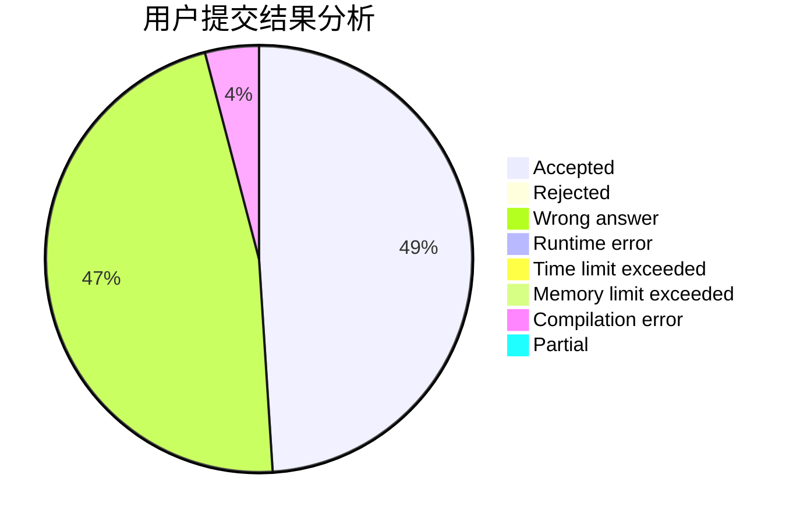
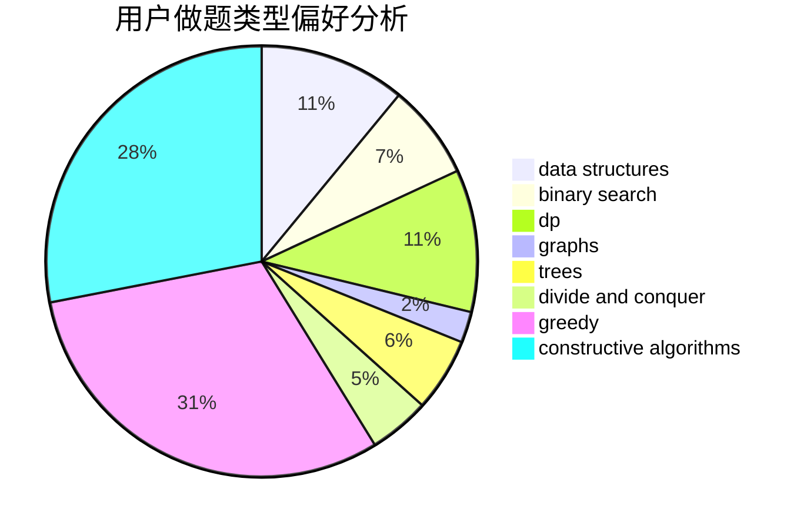
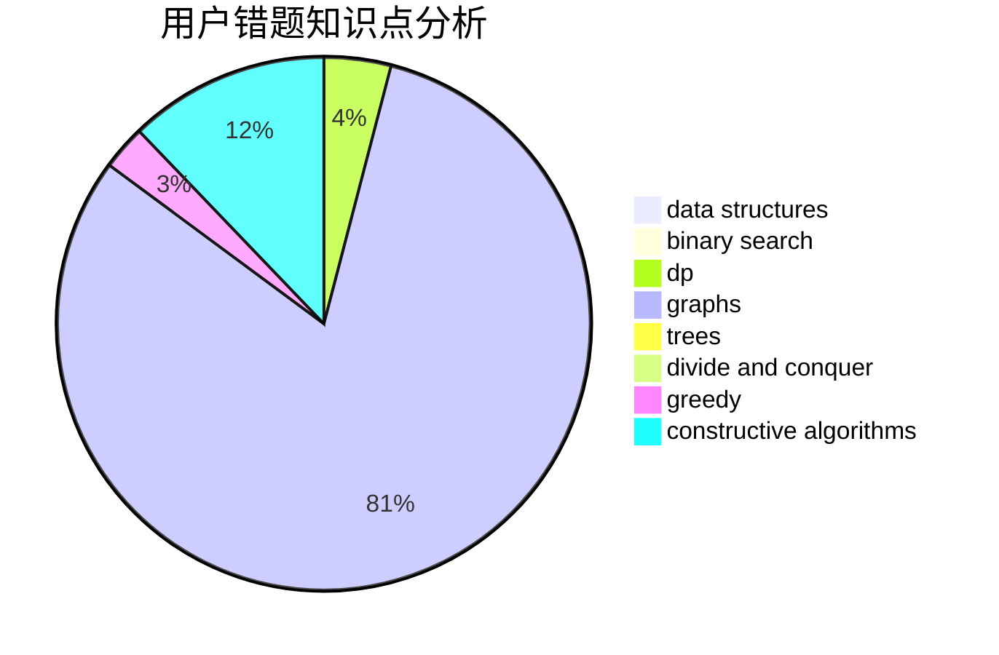

# Emma.Y

<!-- tabs:start -->

#### **用户提交结果分析**

#### **用户做题类型偏好分析**

#### **用户错题知识点分析**

<!-- tabs:end -->
# 推荐题目
[579A](https://codeforces.com/contest/579/problem/A)		bitmasks		  
[437B](https://codeforces.com/contest/437/problem/B)		bitmasks,
                        greedy,
                        implementation,
                        sortings		  
[371C](https://codeforces.com/contest/371/problem/C)		binary search,
                        brute force		  
[1482B](https://codeforces.com/contest/1482/problem/B)		implementation,
                        math		  
[576A](https://codeforces.com/contest/576/problem/A)		math,
                        number theory		  
[1211B](https://codeforces.com/contest/1211/problem/B)		*special problem,
                        implementation		  
[558A](https://codeforces.com/contest/558/problem/A)		brute force,
                        implementation,
                        sortings		  
[1279F](https://codeforces.com/contest/1279/problem/F)		binary search,
                        dp		  
[601A](https://codeforces.com/contest/601/problem/A)		graphs,
                        shortest paths		  
[1060G](https://codeforces.com/contest/1060/problem/G)		data structures		  
