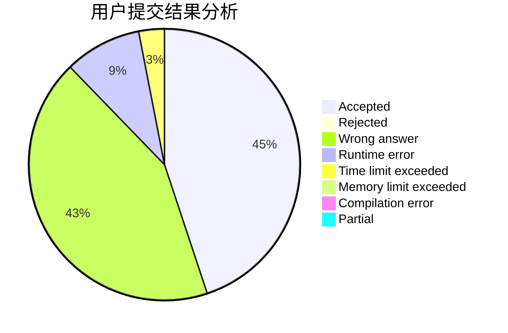
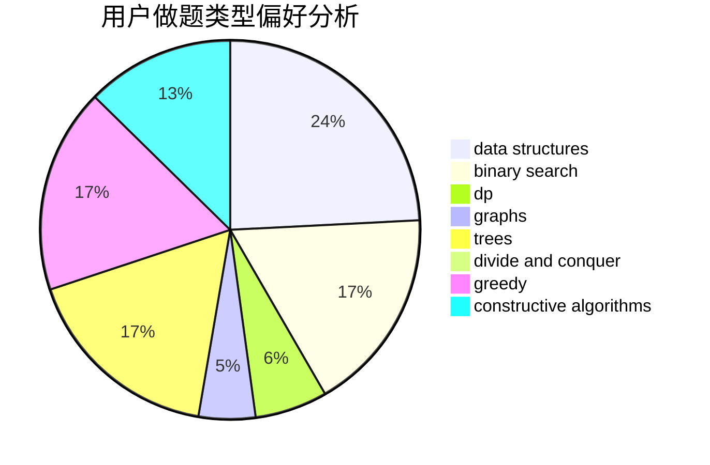

# EmmaWatson

<!-- tabs:start -->

#### **用户提交结果分析**

#### **用户做题类型偏好分析**

#### **用户错题知识点分析**

<!-- tabs:end -->
# 推荐题目
[665C](https://codeforces.com/contest/665/problem/C)		dp,
                        greedy,
                        strings		  
[838E](https://codeforces.com/contest/838/problem/E)		dp		  
[1342C](https://codeforces.com/contest/1342/problem/C)		math,
                        number theory		  
[780B](https://codeforces.com/contest/780/problem/B)		binary search		  
[1150D](https://codeforces.com/contest/1150/problem/D)		dsu,graphs,sortings,trees		  
[740D](https://codeforces.com/contest/740/problem/D)		dsu,graphs,sortings,trees		  
[838C](https://codeforces.com/contest/838/problem/C)		dp,
                        games		  
[1089D](https://codeforces.com/contest/1089/problem/D)		graphs		  
[445C](https://codeforces.com/contest/445/problem/C)		dsu,graphs,sortings,trees		  
[634D](https://codeforces.com/contest/634/problem/D)		dsu,graphs,sortings,trees		  
