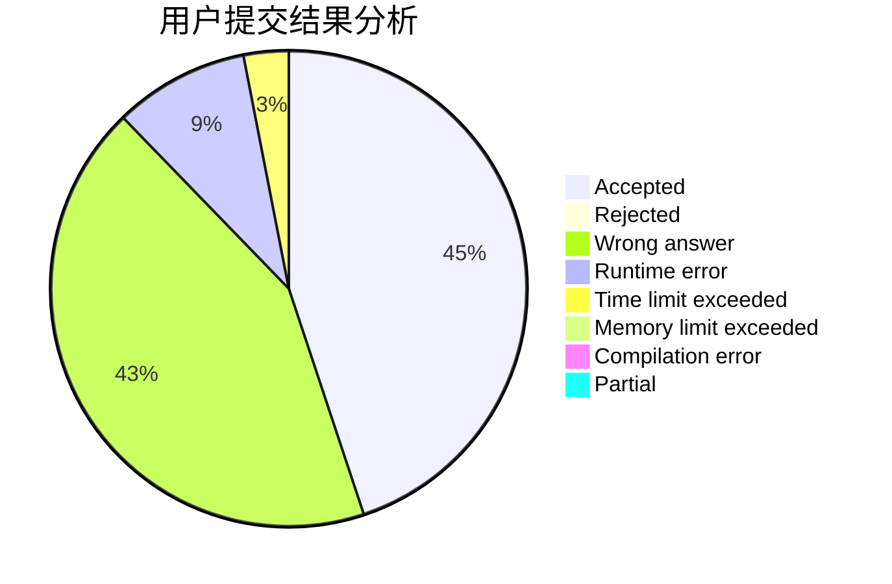
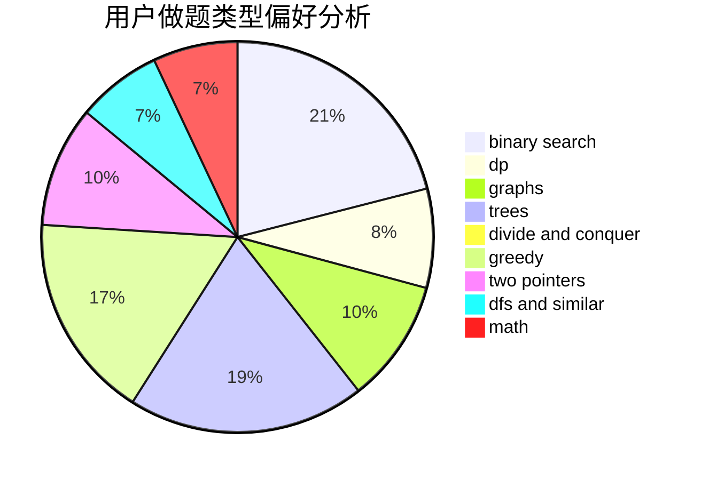

# EmmaWatson

<!-- tabs:start -->

#### **用户提交结果分析**

#### **用户做题类型偏好分析**

<!-- tabs:end -->
# 推荐题目
[665C](https://codeforces.com/contest/665/problem/C)
[838E](https://codeforces.com/contest/838/problem/E)
[1342C](https://codeforces.com/contest/1342/problem/C)
[780B](https://codeforces.com/contest/780/problem/B)
[1150D](https://codeforces.com/contest/1150/problem/D)
[740D](https://codeforces.com/contest/740/problem/D)
[838C](https://codeforces.com/contest/838/problem/C)
[1089D](https://codeforces.com/contest/1089/problem/D)
[445C](https://codeforces.com/contest/445/problem/C)
[634D](https://codeforces.com/contest/634/problem/D)
