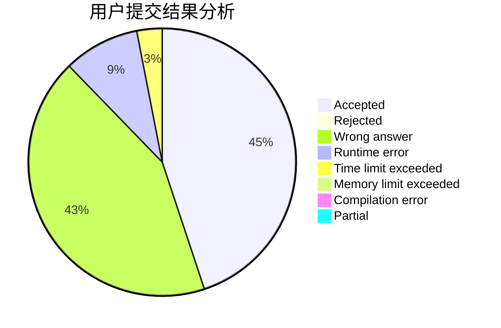
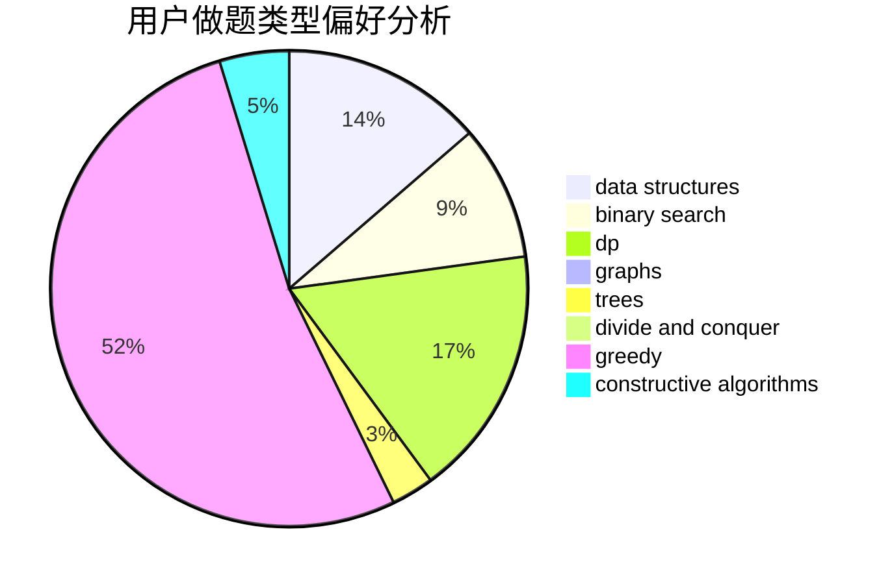

# EmmaWatson

<!-- tabs:start -->

#### **用户提交结果分析**

#### **用户做题类型偏好分析**

#### **用户错题知识点分析**

<!-- tabs:end -->
# 推荐题目
[633A](https://codeforces.com/contest/633/problem/A)		brute force,
                        math,
                        number theory		  
[818F](https://codeforces.com/contest/818/problem/F)		binary search,
                        math,
                        ternary search		  
[1335C](https://codeforces.com/contest/1335/problem/C)		binary search,
                        greedy,
                        implementation,
                        sortings		  
[761A](https://codeforces.com/contest/761/problem/A)		brute force,
                        constructive algorithms,
                        implementation,
                        math		  
[1149A](https://codeforces.com/contest/1149/problem/A)		constructive algorithms,
                        greedy,
                        math,
                        number theory		  
[723C](https://codeforces.com/contest/723/problem/C)		greedy		  
[818D](https://codeforces.com/contest/818/problem/D)		data structures,
                        implementation		  
[1088E](https://codeforces.com/contest/1088/problem/E)		dp,
                        greedy,
                        math,
                        trees		  
[41E](https://codeforces.com/contest/41/problem/E)		constructive algorithms,
                        graphs,
                        greedy		  
[616F](https://codeforces.com/contest/616/problem/F)		string suffix structures,
                        strings		  
