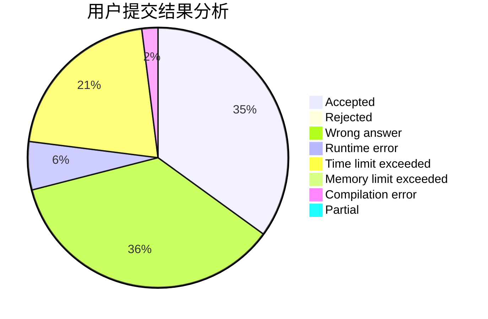
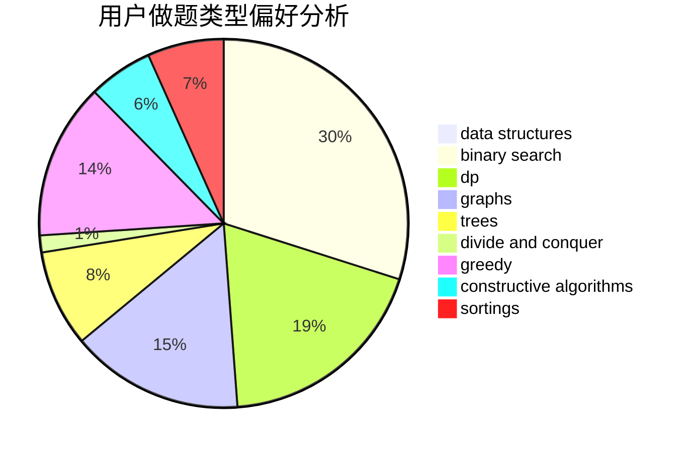
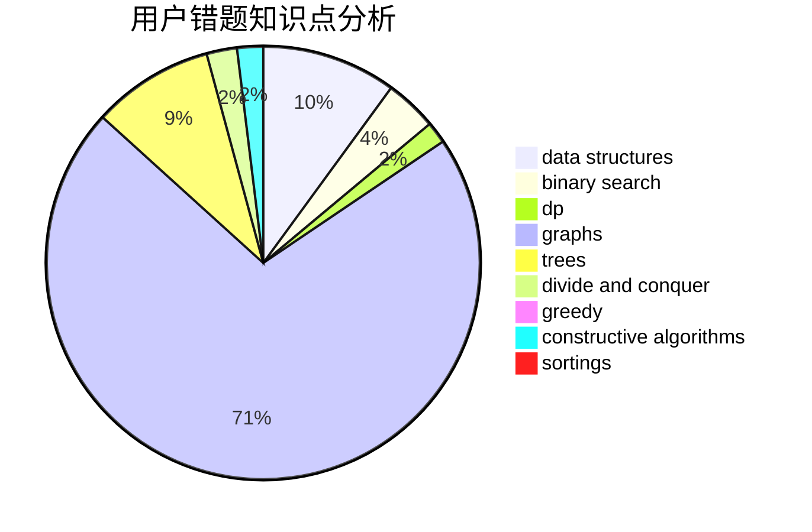

# EmptySoulist
<!-- tabs:start -->
#### **用户提交结果分析**

#### **用户做题类型偏好分析**

#### **用户错题知识点分析**

<!-- tabs:end -->
# 推荐题目
[490F](http://codeforces.com/problemset/problem/490/F)		data structures,
                        dfs and similar,
                        dp,
                        trees		  
[1012C](http://codeforces.com/problemset/problem/1012/C)		dp		  
[719A](http://codeforces.com/problemset/problem/719/A)		implementation		  
[818G](http://codeforces.com/problemset/problem/818/G)		flows,
                        graphs		  
[414C](http://codeforces.com/problemset/problem/414/C)		combinatorics,
                        divide and conquer		  
[1220C](http://codeforces.com/problemset/problem/1220/C)		games,
                        greedy,
                        strings		  
[1191F](https://codeforces.com/contest/1191/problem/F)		data structures,
                        divide and conquer,
                        sortings,
                        two pointers		  
[819A](http://codeforces.com/problemset/problem/819/A)		games,
                        greedy		  
[474D](http://codeforces.com/problemset/problem/474/D)		dp		  
[652D](http://codeforces.com/problemset/problem/652/D)		data structures,
                        sortings		  
<!-- tabs:start -->
#### **data structures**
[490F](http://codeforces.com/problemset/problem/490/F)		data structures,
                        dfs and similar,
                        dp,
                        trees		  
[1191F](https://codeforces.com/contest/1191/problem/F)		data structures,
                        divide and conquer,
                        sortings,
                        two pointers		  
[652D](http://codeforces.com/problemset/problem/652/D)		data structures,
                        sortings		  
[819B](http://codeforces.com/problemset/problem/819/B)		data structures,
                        implementation,
                        math		  
[442C](http://codeforces.com/problemset/problem/442/C)		data structures,
                        greedy		  
[1486D](http://codeforces.com/problemset/problem/1486/D)		binary search,
                        data structures,
                        dp		  
[1492C](http://codeforces.com/problemset/problem/1492/C)		binary search,
                        data structures,
                        dp,
                        greedy,
                        two pointers		  
[1490G](http://codeforces.com/problemset/problem/1490/G)		binary search,
                        data structures,
                        math		  
[1479D](http://codeforces.com/problemset/problem/1479/D)		binary search,
                        bitmasks,
                        brute force,
                        data structures,
                        probabilities,
                        trees		  
[1497A](http://codeforces.com/problemset/problem/1497/A)		brute force,
                        data structures,
                        greedy,
                        sortings		  
#### **binary search**
[801C](https://codeforces.com/contest/801/problem/C)		binary search,
                        math		  
[1178H](http://codeforces.com/problemset/problem/1178/H)		binary search,
                        flows,
                        graphs		  
[1486D](http://codeforces.com/problemset/problem/1486/D)		binary search,
                        data structures,
                        dp		  
[1492C](http://codeforces.com/problemset/problem/1492/C)		binary search,
                        data structures,
                        dp,
                        greedy,
                        two pointers		  
[1463D](http://codeforces.com/problemset/problem/1463/D)		binary search,
                        constructive algorithms,
                        greedy,
                        two pointers		  
[1490G](http://codeforces.com/problemset/problem/1490/G)		binary search,
                        data structures,
                        math		  
[1479D](http://codeforces.com/problemset/problem/1479/D)		binary search,
                        bitmasks,
                        brute force,
                        data structures,
                        probabilities,
                        trees		  
[1436E](http://codeforces.com/problemset/problem/1436/E)		binary search,
                        data structures,
                        two pointers		  
[1461D](http://codeforces.com/problemset/problem/1461/D)		binary search,
                        brute force,
                        data structures,
                        divide and conquer,
                        implementation,
                        sortings		  
[1493C](http://codeforces.com/problemset/problem/1493/C)		binary search,
                        brute force,
                        constructive algorithms,
                        greedy,
                        strings		  
#### **dp**
[490F](http://codeforces.com/problemset/problem/490/F)		data structures,
                        dfs and similar,
                        dp,
                        trees		  
[1012C](http://codeforces.com/problemset/problem/1012/C)		dp		  
[474D](http://codeforces.com/problemset/problem/474/D)		dp		  
[261E](http://codeforces.com/problemset/problem/261/E)		brute force,
                        dp,
                        two pointers		  
[643F](http://codeforces.com/problemset/problem/643/F)		dp,
                        math,
                        meet-in-the-middle		  
[1486D](http://codeforces.com/problemset/problem/1486/D)		binary search,
                        data structures,
                        dp		  
[1492C](http://codeforces.com/problemset/problem/1492/C)		binary search,
                        data structures,
                        dp,
                        greedy,
                        two pointers		  
[1457C](https://codeforces.com/contest/1457/problem/C)		brute force,
                        dp,
                        implementation		  
[1491C](http://codeforces.com/problemset/problem/1491/C)		brute force,
                        data structures,
                        dp,
                        greedy,
                        implementation		  
[1437C](http://codeforces.com/problemset/problem/1437/C)		dp,
                        flows,
                        graph matchings,
                        greedy,
                        math,
                        sortings		  
#### **graph**
[818G](http://codeforces.com/problemset/problem/818/G)		flows,
                        graphs		  
[1089M](http://codeforces.com/problemset/problem/1089/M)		constructive algorithms,
                        graphs		  
[403C](https://codeforces.com/contest/403/problem/C)		graphs,
                        math		  
[819E](http://codeforces.com/problemset/problem/819/E)		constructive algorithms,
                        graphs		  
[1178H](http://codeforces.com/problemset/problem/1178/H)		binary search,
                        flows,
                        graphs		  
[1487C](http://codeforces.com/problemset/problem/1487/C)		brute force,
                        constructive algorithms,
                        dfs and similar,
                        graphs,
                        greedy,
                        implementation,
                        math		  
[1437C](http://codeforces.com/problemset/problem/1437/C)		dp,
                        flows,
                        graph matchings,
                        greedy,
                        math,
                        sortings		  
[1470D](http://codeforces.com/problemset/problem/1470/D)		constructive algorithms,
                        dfs and similar,
                        graph matchings,
                        graphs,
                        greedy		  
[1476C](http://codeforces.com/problemset/problem/1476/C)		dp,
                        graphs,
                        greedy		  
[1304D](http://codeforces.com/problemset/problem/1304/D)		constructive algorithms,
                        graphs,
                        greedy,
                        two pointers		  
#### **trees**
[490F](http://codeforces.com/problemset/problem/490/F)		data structures,
                        dfs and similar,
                        dp,
                        trees		  
[1252F](http://codeforces.com/problemset/problem/1252/F)		hashing,
                        trees		  
[1479D](http://codeforces.com/problemset/problem/1479/D)		binary search,
                        bitmasks,
                        brute force,
                        data structures,
                        probabilities,
                        trees		  
[1511C](http://codeforces.com/problemset/problem/1511/C)		brute force,
                        data structures,
                        implementation,
                        trees		  
[1499F](http://codeforces.com/problemset/problem/1499/F)		combinatorics,
                        dfs and similar,
                        dp,
                        trees		  
[1491E](http://codeforces.com/problemset/problem/1491/E)		brute force,
                        dfs and similar,
                        divide and conquer,
                        number theory,
                        trees		  
[1466D](http://codeforces.com/problemset/problem/1466/D)		data structures,
                        greedy,
                        sortings,
                        trees		  
[1495D](http://codeforces.com/problemset/problem/1495/D)		combinatorics,
                        dfs and similar,
                        graphs,
                        math,
                        shortest paths,
                        trees		  
[1303G](http://codeforces.com/problemset/problem/1303/G)		data structures,
                        divide and conquer,
                        geometry,
                        trees		  
[1454E](http://codeforces.com/problemset/problem/1454/E)		combinatorics,
                        dfs and similar,
                        graphs,
                        trees		  
#### **divide and conquer**
[414C](http://codeforces.com/problemset/problem/414/C)		combinatorics,
                        divide and conquer		  
[1191F](https://codeforces.com/contest/1191/problem/F)		data structures,
                        divide and conquer,
                        sortings,
                        two pointers		  
[1461D](http://codeforces.com/problemset/problem/1461/D)		binary search,
                        brute force,
                        data structures,
                        divide and conquer,
                        implementation,
                        sortings		  
[1466G](http://codeforces.com/problemset/problem/1466/G)		combinatorics,
                        divide and conquer,
                        hashing,
                        math,
                        string suffix structures,
                        strings		  
[1490D](http://codeforces.com/problemset/problem/1490/D)		dfs and similar,
                        divide and conquer,
                        implementation		  
[1483C](https://codeforces.com/contest/1483/problem/C)		data structures,
                        divide and conquer,
                        dp		  
[1491E](http://codeforces.com/problemset/problem/1491/E)		brute force,
                        dfs and similar,
                        divide and conquer,
                        number theory,
                        trees		  
[1303G](http://codeforces.com/problemset/problem/1303/G)		data structures,
                        divide and conquer,
                        geometry,
                        trees		  
[1494D](http://codeforces.com/problemset/problem/1494/D)		constructive algorithms,
                        data structures,
                        dfs and similar,
                        divide and conquer,
                        dsu,
                        greedy,
                        sortings,
                        trees		  
[1482E](http://codeforces.com/problemset/problem/1482/E)		data structures,
                        divide and conquer,
                        dp		  
#### **greedy**
[1220C](http://codeforces.com/problemset/problem/1220/C)		games,
                        greedy,
                        strings		  
[819A](http://codeforces.com/problemset/problem/819/A)		games,
                        greedy		  
[81C](http://codeforces.com/problemset/problem/81/C)		greedy,
                        math,
                        sortings		  
[1011A](http://codeforces.com/problemset/problem/1011/A)		greedy,
                        implementation,
                        sortings		  
[779B](http://codeforces.com/problemset/problem/779/B)		brute force,
                        greedy		  
[246A](http://codeforces.com/problemset/problem/246/A)		constructive algorithms,
                        greedy,
                        sortings		  
[1346C](http://codeforces.com/problemset/problem/1346/C)		*special problem,
                        greedy,
                        sortings		  
[1108C](http://codeforces.com/problemset/problem/1108/C)		brute force,
                        greedy,
                        math		  
[442C](http://codeforces.com/problemset/problem/442/C)		data structures,
                        greedy		  
[1450F](http://codeforces.com/problemset/problem/1450/F)		constructive algorithms,
                        greedy		  
#### **constructive algorithms**
[1168E](http://codeforces.com/problemset/problem/1168/E)		constructive algorithms,
                        math		  
[1276E](http://codeforces.com/problemset/problem/1276/E)		constructive algorithms		  
[1089M](http://codeforces.com/problemset/problem/1089/M)		constructive algorithms,
                        graphs		  
[246A](http://codeforces.com/problemset/problem/246/A)		constructive algorithms,
                        greedy,
                        sortings		  
[819E](http://codeforces.com/problemset/problem/819/E)		constructive algorithms,
                        graphs		  
[1450F](http://codeforces.com/problemset/problem/1450/F)		constructive algorithms,
                        greedy		  
[1493A](http://codeforces.com/problemset/problem/1493/A)		constructive algorithms,
                        greedy		  
[1463D](http://codeforces.com/problemset/problem/1463/D)		binary search,
                        constructive algorithms,
                        greedy,
                        two pointers		  
[1456B](https://codeforces.com/contest/1456/problem/B)		bitmasks,
                        brute force,
                        constructive algorithms		  
[1492D](http://codeforces.com/problemset/problem/1492/D)		bitmasks,
                        constructive algorithms,
                        greedy,
                        math		  
#### **sortings**
[1191F](https://codeforces.com/contest/1191/problem/F)		data structures,
                        divide and conquer,
                        sortings,
                        two pointers		  
[652D](http://codeforces.com/problemset/problem/652/D)		data structures,
                        sortings		  
[81C](http://codeforces.com/problemset/problem/81/C)		greedy,
                        math,
                        sortings		  
[1011A](http://codeforces.com/problemset/problem/1011/A)		greedy,
                        implementation,
                        sortings		  
[246A](http://codeforces.com/problemset/problem/246/A)		constructive algorithms,
                        greedy,
                        sortings		  
[1346C](http://codeforces.com/problemset/problem/1346/C)		*special problem,
                        greedy,
                        sortings		  
[1496C](https://codeforces.com/contest/1496/problem/C)		geometry,
                        greedy,
                        math,
                        sortings		  
[1495A](http://codeforces.com/problemset/problem/1495/A)		geometry,
                        greedy,
                        math,
                        sortings		  
[1497A](http://codeforces.com/problemset/problem/1497/A)		brute force,
                        data structures,
                        greedy,
                        sortings		  
[1427A](http://codeforces.com/problemset/problem/1427/A)		math,
                        sortings		  
<!-- tabs:end -->
