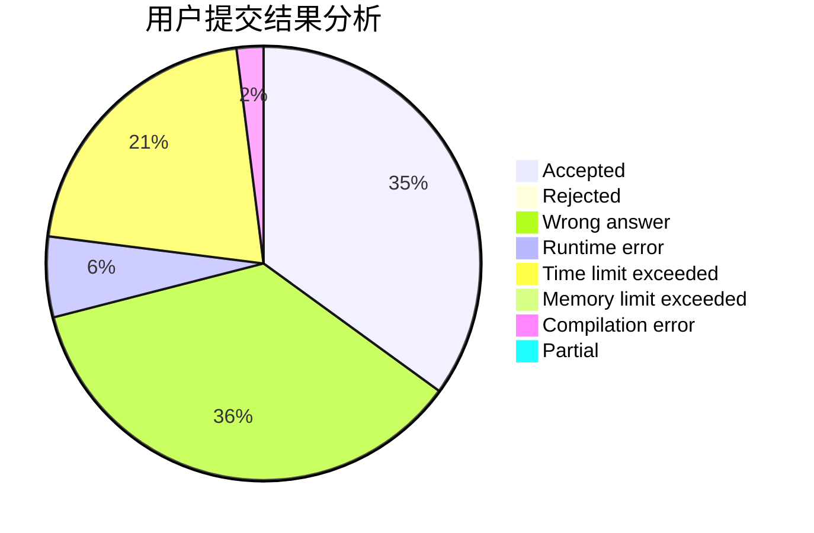
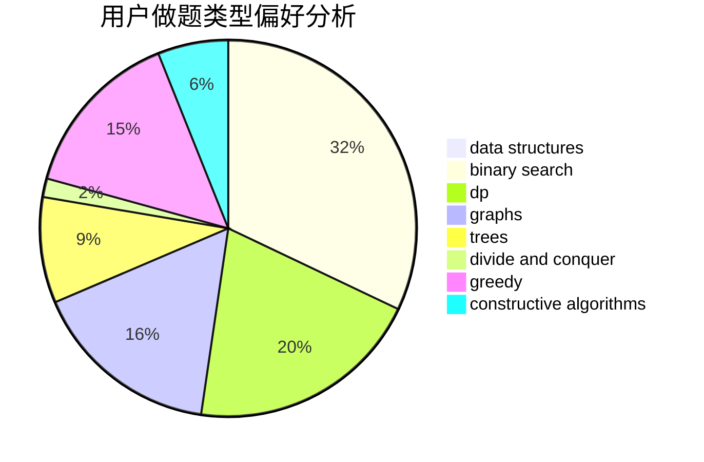
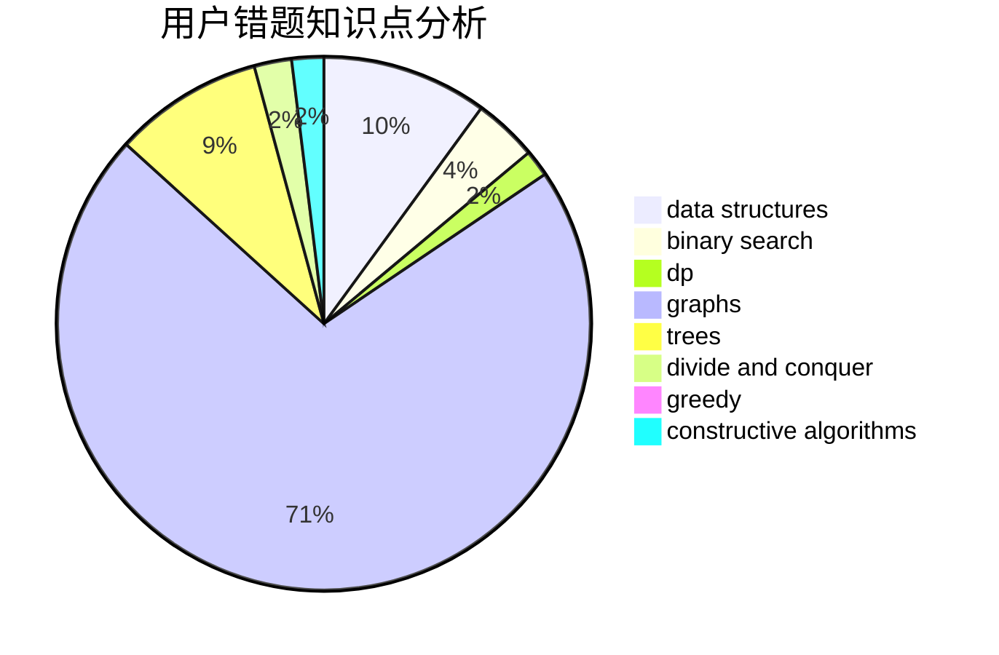

# EmptySoulist
<!-- tabs:start -->
#### **用户提交结果分析**

#### **用户做题类型偏好分析**

#### **用户错题知识点分析**

<!-- tabs:end -->
# 推荐题目
[Treeland Tour](http://codeforces.com/problemset/problem/490/F)		data structures,
                        dfs and similar,
                        dp,
                        trees		  
[Hills](http://codeforces.com/problemset/problem/1012/C)		dp		  
[Vitya in the Countryside](http://codeforces.com/problemset/problem/719/A)		implementation		  
[Four Melodies](http://codeforces.com/problemset/problem/818/G)		flows,
                        graphs		  
[Mashmokh and Reverse Operation](http://codeforces.com/problemset/problem/414/C)		combinatorics,
                        divide and conquer		  
[Substring Game in the Lesson](http://codeforces.com/problemset/problem/1220/C)		games,
                        greedy,
                        strings		  
[Tokitsukaze and Strange Rectangle](https://codeforces.com/contest/1191/problem/F)		data structures,
                        divide and conquer,
                        sortings,
                        two pointers		  
[Mister B and Boring Game](http://codeforces.com/problemset/problem/819/A)		games,
                        greedy		  
[Flowers](http://codeforces.com/problemset/problem/474/D)		dp		  
[Nested Segments](http://codeforces.com/problemset/problem/652/D)		data structures,
                        sortings		  
<!-- tabs:start -->
#### **data structures**
[Treeland Tour](http://codeforces.com/problemset/problem/490/F)		data structures,
                        dfs and similar,
                        dp,
                        trees		  
[Tokitsukaze and Strange Rectangle](https://codeforces.com/contest/1191/problem/F)		data structures,
                        divide and conquer,
                        sortings,
                        two pointers		  
[Nested Segments](http://codeforces.com/problemset/problem/652/D)		data structures,
                        sortings		  
[Mister B and PR Shifts](http://codeforces.com/problemset/problem/819/B)		data structures,
                        implementation,
                        math		  
[Artem and Array](http://codeforces.com/problemset/problem/442/C)		data structures,
                        greedy		  
[Max Median](http://codeforces.com/problemset/problem/1486/D)		binary search,
                        data structures,
                        dp		  
[Maximum width](http://codeforces.com/problemset/problem/1492/C)		binary search,
                        data structures,
                        dp,
                        greedy,
                        two pointers		  
[Old Floppy Drive](http://codeforces.com/problemset/problem/1490/G)		binary search,
                        data structures,
                        math		  
[Odd Mineral Resource](http://codeforces.com/problemset/problem/1479/D)		binary search,
                        bitmasks,
                        brute force,
                        data structures,
                        probabilities,
                        trees		  
[Meximization](http://codeforces.com/problemset/problem/1497/A)		brute force,
                        data structures,
                        greedy,
                        sortings		  
#### **binary search**
[Voltage Keepsake](https://codeforces.com/contest/801/problem/C)		binary search,
                        math		  
[Stock Exchange](http://codeforces.com/problemset/problem/1178/H)		binary search,
                        flows,
                        graphs		  
[Max Median](http://codeforces.com/problemset/problem/1486/D)		binary search,
                        data structures,
                        dp		  
[Maximum width](http://codeforces.com/problemset/problem/1492/C)		binary search,
                        data structures,
                        dp,
                        greedy,
                        two pointers		  
[Pairs](http://codeforces.com/problemset/problem/1463/D)		binary search,
                        constructive algorithms,
                        greedy,
                        two pointers		  
[Old Floppy Drive](http://codeforces.com/problemset/problem/1490/G)		binary search,
                        data structures,
                        math		  
[Odd Mineral Resource](http://codeforces.com/problemset/problem/1479/D)		binary search,
                        bitmasks,
                        brute force,
                        data structures,
                        probabilities,
                        trees		  
[Complicated Computations](http://codeforces.com/problemset/problem/1436/E)		binary search,
                        data structures,
                        two pointers		  
[Divide and Summarize](http://codeforces.com/problemset/problem/1461/D)		binary search,
                        brute force,
                        data structures,
                        divide and conquer,
                        implementation,
                        sortings		  
[K-beautiful Strings](http://codeforces.com/problemset/problem/1493/C)		binary search,
                        brute force,
                        constructive algorithms,
                        greedy,
                        strings		  
#### **dp**
[Treeland Tour](http://codeforces.com/problemset/problem/490/F)		data structures,
                        dfs and similar,
                        dp,
                        trees		  
[Hills](http://codeforces.com/problemset/problem/1012/C)		dp		  
[Flowers](http://codeforces.com/problemset/problem/474/D)		dp		  
[Maxim and Calculator](http://codeforces.com/problemset/problem/261/E)		brute force,
                        dp,
                        two pointers		  
[Bears and Juice](http://codeforces.com/problemset/problem/643/F)		dp,
                        math,
                        meet-in-the-middle		  
[Max Median](http://codeforces.com/problemset/problem/1486/D)		binary search,
                        data structures,
                        dp		  
[Maximum width](http://codeforces.com/problemset/problem/1492/C)		binary search,
                        data structures,
                        dp,
                        greedy,
                        two pointers		  
[Bouncing Ball](https://codeforces.com/contest/1457/problem/C)		brute force,
                        dp,
                        implementation		  
[Pekora and Trampoline](http://codeforces.com/problemset/problem/1491/C)		brute force,
                        data structures,
                        dp,
                        greedy,
                        implementation		  
[Chef Monocarp](http://codeforces.com/problemset/problem/1437/C)		dp,
                        flows,
                        graph matchings,
                        greedy,
                        math,
                        sortings		  
#### **graph**
[Four Melodies](http://codeforces.com/problemset/problem/818/G)		flows,
                        graphs		  
[Minegraphed](http://codeforces.com/problemset/problem/1089/M)		constructive algorithms,
                        graphs		  
[Strictly Positive Matrix](https://codeforces.com/contest/403/problem/C)		graphs,
                        math		  
[Mister B and Flight to the Moon](http://codeforces.com/problemset/problem/819/E)		constructive algorithms,
                        graphs		  
[Stock Exchange](http://codeforces.com/problemset/problem/1178/H)		binary search,
                        flows,
                        graphs		  
[Minimum Ties](http://codeforces.com/problemset/problem/1487/C)		brute force,
                        constructive algorithms,
                        dfs and similar,
                        graphs,
                        greedy,
                        implementation,
                        math		  
[Chef Monocarp](http://codeforces.com/problemset/problem/1437/C)		dp,
                        flows,
                        graph matchings,
                        greedy,
                        math,
                        sortings		  
[Strange Housing](http://codeforces.com/problemset/problem/1470/D)		constructive algorithms,
                        dfs and similar,
                        graph matchings,
                        graphs,
                        greedy		  
[Longest Simple Cycle](http://codeforces.com/problemset/problem/1476/C)		dp,
                        graphs,
                        greedy		  
[Shortest and Longest LIS](http://codeforces.com/problemset/problem/1304/D)		constructive algorithms,
                        graphs,
                        greedy,
                        two pointers		  
#### **trees**
[Treeland Tour](http://codeforces.com/problemset/problem/490/F)		data structures,
                        dfs and similar,
                        dp,
                        trees		  
[Regular Forestation](http://codeforces.com/problemset/problem/1252/F)		hashing,
                        trees		  
[Odd Mineral Resource](http://codeforces.com/problemset/problem/1479/D)		binary search,
                        bitmasks,
                        brute force,
                        data structures,
                        probabilities,
                        trees		  
[Yet Another Card Deck](http://codeforces.com/problemset/problem/1511/C)		brute force,
                        data structures,
                        implementation,
                        trees		  
[Diameter Cuts](http://codeforces.com/problemset/problem/1499/F)		combinatorics,
                        dfs and similar,
                        dp,
                        trees		  
[Fib-tree](http://codeforces.com/problemset/problem/1491/E)		brute force,
                        dfs and similar,
                        divide and conquer,
                        number theory,
                        trees		  
[13th Labour of Heracles](http://codeforces.com/problemset/problem/1466/D)		data structures,
                        greedy,
                        sortings,
                        trees		  
[BFS Trees](http://codeforces.com/problemset/problem/1495/D)		combinatorics,
                        dfs and similar,
                        graphs,
                        math,
                        shortest paths,
                        trees		  
[Sum of Prefix Sums](http://codeforces.com/problemset/problem/1303/G)		data structures,
                        divide and conquer,
                        geometry,
                        trees		  
[Number of Simple Paths](http://codeforces.com/problemset/problem/1454/E)		combinatorics,
                        dfs and similar,
                        graphs,
                        trees		  
#### **divide and conquer**
[Mashmokh and Reverse Operation](http://codeforces.com/problemset/problem/414/C)		combinatorics,
                        divide and conquer		  
[Tokitsukaze and Strange Rectangle](https://codeforces.com/contest/1191/problem/F)		data structures,
                        divide and conquer,
                        sortings,
                        two pointers		  
[Divide and Summarize](http://codeforces.com/problemset/problem/1461/D)		binary search,
                        brute force,
                        data structures,
                        divide and conquer,
                        implementation,
                        sortings		  
[Song of the Sirens](http://codeforces.com/problemset/problem/1466/G)		combinatorics,
                        divide and conquer,
                        hashing,
                        math,
                        string suffix structures,
                        strings		  
[Permutation Transformation](http://codeforces.com/problemset/problem/1490/D)		dfs and similar,
                        divide and conquer,
                        implementation		  
[Skyline Photo](https://codeforces.com/contest/1483/problem/C)		data structures,
                        divide and conquer,
                        dp		  
[Fib-tree](http://codeforces.com/problemset/problem/1491/E)		brute force,
                        dfs and similar,
                        divide and conquer,
                        number theory,
                        trees		  
[Sum of Prefix Sums](http://codeforces.com/problemset/problem/1303/G)		data structures,
                        divide and conquer,
                        geometry,
                        trees		  
[Dogeforces](http://codeforces.com/problemset/problem/1494/D)		constructive algorithms,
                        data structures,
                        dfs and similar,
                        divide and conquer,
                        dsu,
                        greedy,
                        sortings,
                        trees		  
[Skyline Photo](http://codeforces.com/problemset/problem/1482/E)		data structures,
                        divide and conquer,
                        dp		  
#### **greedy**
[Substring Game in the Lesson](http://codeforces.com/problemset/problem/1220/C)		games,
                        greedy,
                        strings		  
[Mister B and Boring Game](http://codeforces.com/problemset/problem/819/A)		games,
                        greedy		  
[Average Score](http://codeforces.com/problemset/problem/81/C)		greedy,
                        math,
                        sortings		  
[Stages](http://codeforces.com/problemset/problem/1011/A)		greedy,
                        implementation,
                        sortings		  
[Weird Rounding](http://codeforces.com/problemset/problem/779/B)		brute force,
                        greedy		  
[Buggy Sorting](http://codeforces.com/problemset/problem/246/A)		constructive algorithms,
                        greedy,
                        sortings		  
[Spring Cleaning](http://codeforces.com/problemset/problem/1346/C)		*special problem,
                        greedy,
                        sortings		  
[Nice Garland](http://codeforces.com/problemset/problem/1108/C)		brute force,
                        greedy,
                        math		  
[Artem and Array](http://codeforces.com/problemset/problem/442/C)		data structures,
                        greedy		  
[The Struggling Contestant](http://codeforces.com/problemset/problem/1450/F)		constructive algorithms,
                        greedy		  
#### **constructive algorithms**
[Xor Permutations](http://codeforces.com/problemset/problem/1168/E)		constructive algorithms,
                        math		  
[Four Stones](http://codeforces.com/problemset/problem/1276/E)		constructive algorithms		  
[Minegraphed](http://codeforces.com/problemset/problem/1089/M)		constructive algorithms,
                        graphs		  
[Buggy Sorting](http://codeforces.com/problemset/problem/246/A)		constructive algorithms,
                        greedy,
                        sortings		  
[Mister B and Flight to the Moon](http://codeforces.com/problemset/problem/819/E)		constructive algorithms,
                        graphs		  
[The Struggling Contestant](http://codeforces.com/problemset/problem/1450/F)		constructive algorithms,
                        greedy		  
[Anti-knapsack](http://codeforces.com/problemset/problem/1493/A)		constructive algorithms,
                        greedy		  
[Pairs](http://codeforces.com/problemset/problem/1463/D)		binary search,
                        constructive algorithms,
                        greedy,
                        two pointers		  
[XOR-gun](https://codeforces.com/contest/1456/problem/B)		bitmasks,
                        brute force,
                        constructive algorithms		  
[Genius's Gambit](http://codeforces.com/problemset/problem/1492/D)		bitmasks,
                        constructive algorithms,
                        greedy,
                        math		  
#### **sortings**
[Tokitsukaze and Strange Rectangle](https://codeforces.com/contest/1191/problem/F)		data structures,
                        divide and conquer,
                        sortings,
                        two pointers		  
[Nested Segments](http://codeforces.com/problemset/problem/652/D)		data structures,
                        sortings		  
[Average Score](http://codeforces.com/problemset/problem/81/C)		greedy,
                        math,
                        sortings		  
[Stages](http://codeforces.com/problemset/problem/1011/A)		greedy,
                        implementation,
                        sortings		  
[Buggy Sorting](http://codeforces.com/problemset/problem/246/A)		constructive algorithms,
                        greedy,
                        sortings		  
[Spring Cleaning](http://codeforces.com/problemset/problem/1346/C)		*special problem,
                        greedy,
                        sortings		  
[Diamond Miner](https://codeforces.com/contest/1496/problem/C)		geometry,
                        greedy,
                        math,
                        sortings		  
[Diamond Miner](http://codeforces.com/problemset/problem/1495/A)		geometry,
                        greedy,
                        math,
                        sortings		  
[Meximization](http://codeforces.com/problemset/problem/1497/A)		brute force,
                        data structures,
                        greedy,
                        sortings		  
[Avoiding Zero](http://codeforces.com/problemset/problem/1427/A)		math,
                        sortings		  
<!-- tabs:end -->
