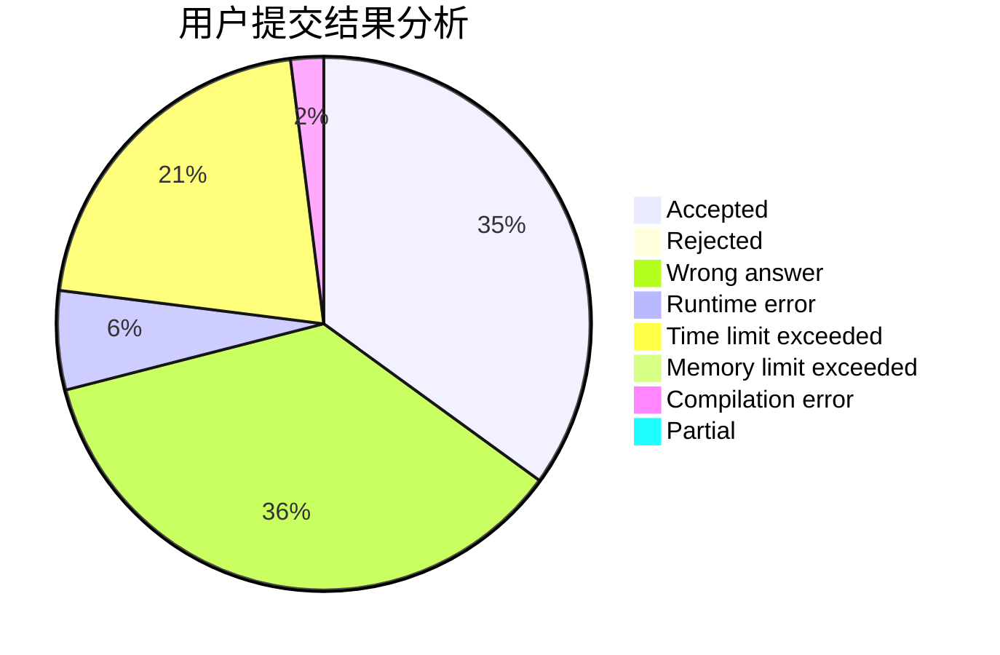
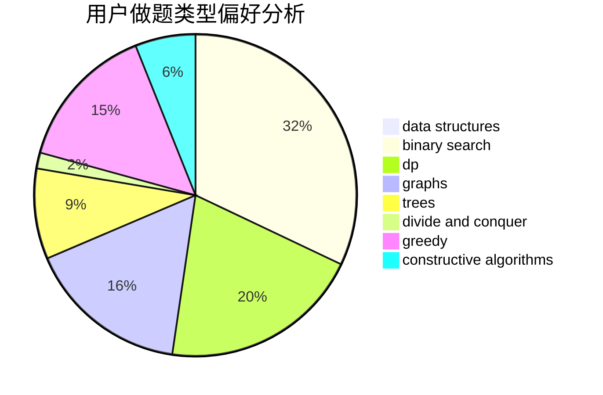
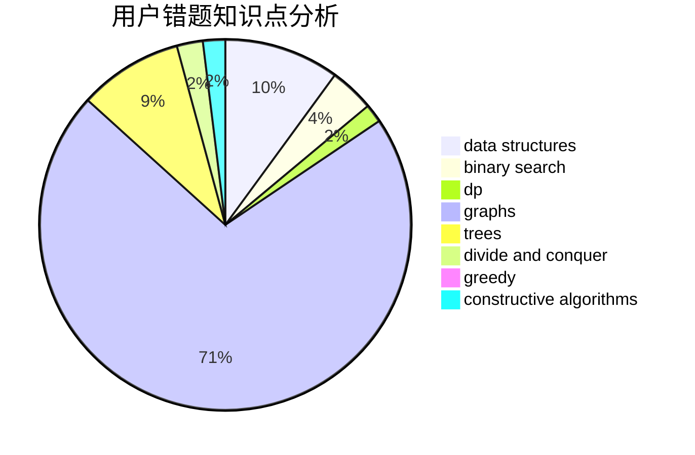

# EmptySoulist

<!-- tabs:start -->

#### **用户提交结果分析**

#### **用户做题类型偏好分析**

#### **用户错题知识点分析**

<!-- tabs:end -->
# 推荐题目
[719A](https://codeforces.com/contest/719/problem/A)		implementation		  
[818G](https://codeforces.com/contest/818/problem/G)		flows,
                        graphs		  
[25A](https://codeforces.com/contest/25/problem/A)		brute force		  
[312B](https://codeforces.com/contest/312/problem/B)		math,
                        probabilities		  
[490F](https://codeforces.com/contest/490/problem/F)		data structures,
                        dfs and similar,
                        dp,
                        trees		  
[1220C](https://codeforces.com/contest/1220/problem/C)		games,
                        greedy,
                        strings		  
[1012C](https://codeforces.com/contest/1012/problem/C)		dp		  
[652D](https://codeforces.com/contest/652/problem/D)		data structures,
                        sortings		  
[819B](https://codeforces.com/contest/819/problem/B)		data structures,
                        implementation,
                        math		  
[819A](https://codeforces.com/contest/819/problem/A)		games,
                        greedy		  
