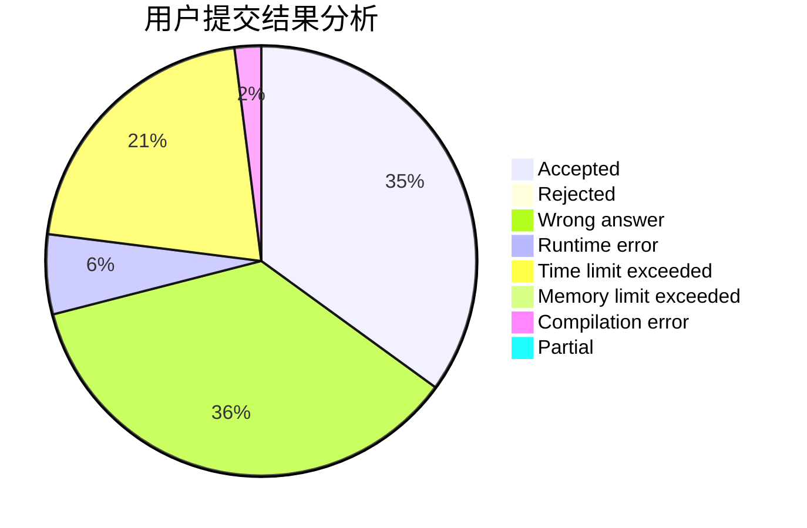
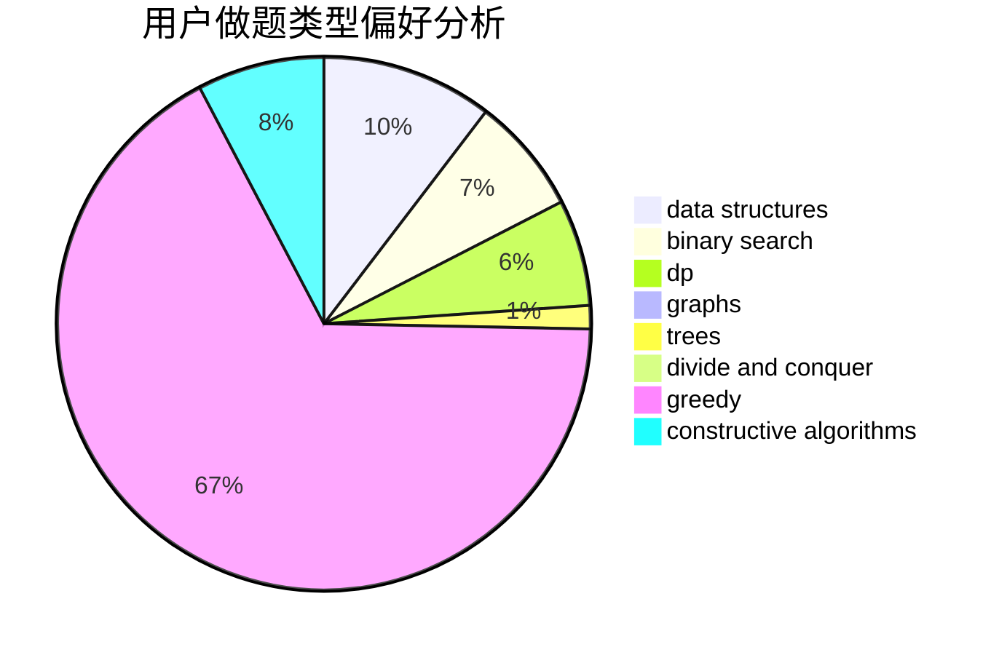

# EmptySoulist

<!-- tabs:start -->

#### **用户提交结果分析**

#### **用户做题类型偏好分析**

#### **用户错题知识点分析**

<!-- tabs:end -->
# 推荐题目
[736B](https://codeforces.com/contest/736/problem/B)		dsu,graphs,sortings,trees		  
[838F](https://codeforces.com/contest/838/problem/F)		nan		  
[277A](https://codeforces.com/contest/277/problem/A)		dfs and similar,
                        dsu		  
[337A](https://codeforces.com/contest/337/problem/A)		greedy		  
[510E](https://codeforces.com/contest/510/problem/E)		flows		  
[1228C](https://codeforces.com/contest/1228/problem/C)		math,
                        number theory		  
[1013A](https://codeforces.com/contest/1013/problem/A)		math		  
[676C](https://codeforces.com/contest/676/problem/C)		binary search,
                        dp,
                        strings,
                        two pointers		  
[839B](https://codeforces.com/contest/839/problem/B)		brute force,
                        greedy,
                        implementation		  
[839A](https://codeforces.com/contest/839/problem/A)		implementation		  
