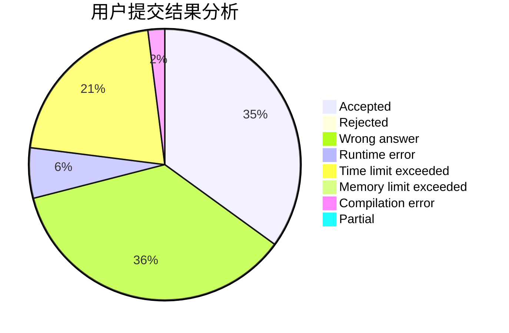
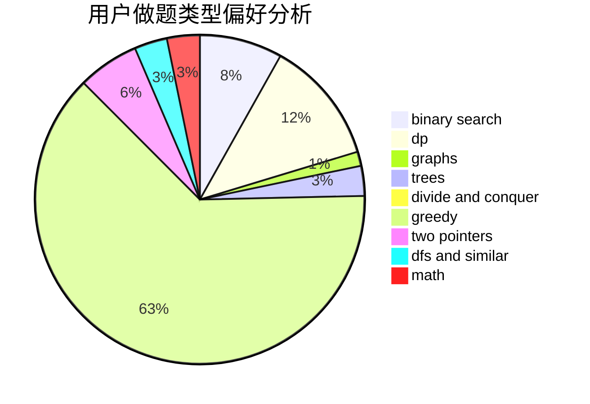

# EmptySoulist

<!-- tabs:start -->

#### **用户提交结果分析**

#### **用户做题类型偏好分析**

<!-- tabs:end -->
# 推荐题目
[736B](https://codeforces.com/contest/736/problem/B)
[838F](https://codeforces.com/contest/838/problem/F)
[277A](https://codeforces.com/contest/277/problem/A)
[337A](https://codeforces.com/contest/337/problem/A)
[510E](https://codeforces.com/contest/510/problem/E)
[1228C](https://codeforces.com/contest/1228/problem/C)
[1013A](https://codeforces.com/contest/1013/problem/A)
[676C](https://codeforces.com/contest/676/problem/C)
[839B](https://codeforces.com/contest/839/problem/B)
[839A](https://codeforces.com/contest/839/problem/A)
