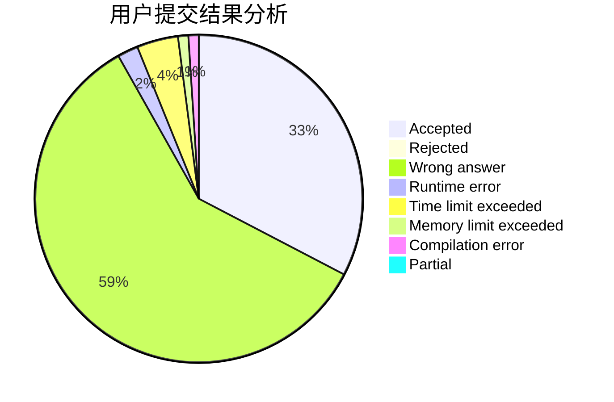
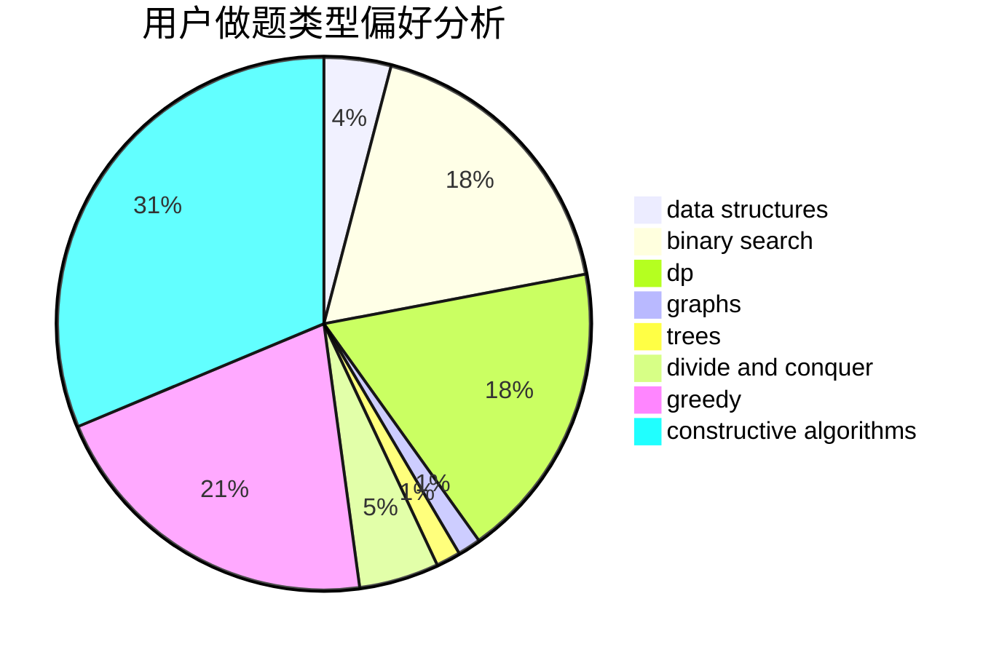
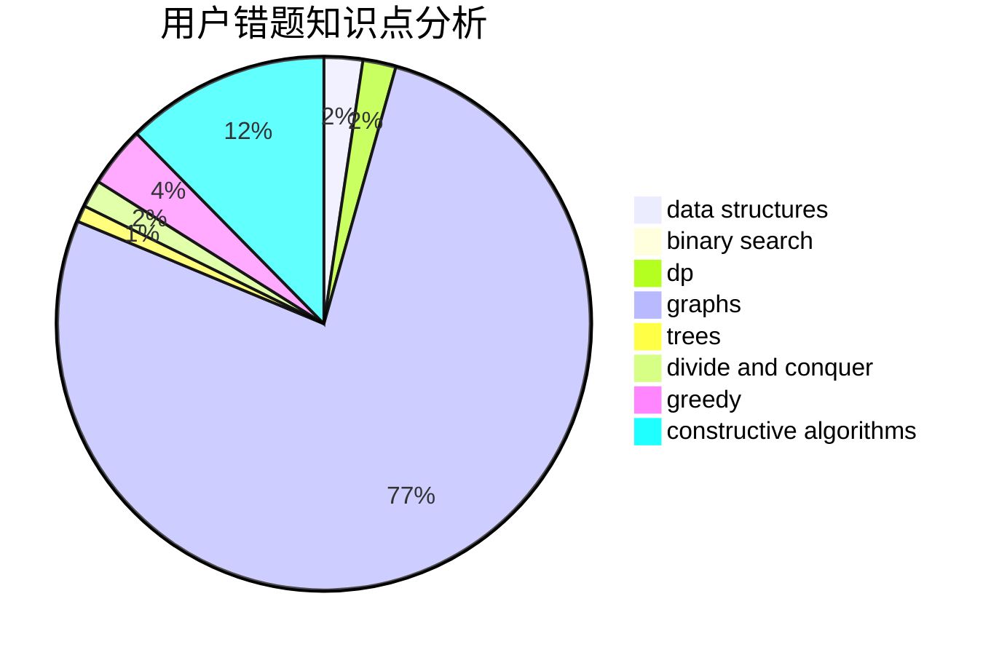

# Ender_zzm

<!-- tabs:start -->

#### **用户提交结果分析**

#### **用户做题类型偏好分析**

#### **用户错题知识点分析**

<!-- tabs:end -->
# 推荐题目
[1277B](https://codeforces.com/contest/1277/problem/B)		greedy,
                        number theory		  
[1285D](https://codeforces.com/contest/1285/problem/D)		bitmasks,
                        brute force,
                        dfs and similar,
                        divide and conquer,
                        dp,
                        greedy,
                        strings,
                        trees		  
[1445B](https://codeforces.com/contest/1445/problem/B)		greedy,
                        math		  
[616E](https://codeforces.com/contest/616/problem/E)		implementation,
                        math,
                        number theory		  
[490F](https://codeforces.com/contest/490/problem/F)		data structures,
                        dfs and similar,
                        dp,
                        trees		  
[1379D](https://codeforces.com/contest/1379/problem/D)		binary search,
                        brute force,
                        data structures,
                        sortings,
                        two pointers		  
[163E](https://codeforces.com/contest/163/problem/E)		data structures,
                        dfs and similar,
                        dp,
                        strings,
                        trees		  
[1301D](https://codeforces.com/contest/1301/problem/D)		constructive algorithms,
                        graphs,
                        implementation		  
[820A](https://codeforces.com/contest/820/problem/A)		implementation		  
[750A](https://codeforces.com/contest/750/problem/A)		binary search,
                        brute force,
                        implementation,
                        math		  
