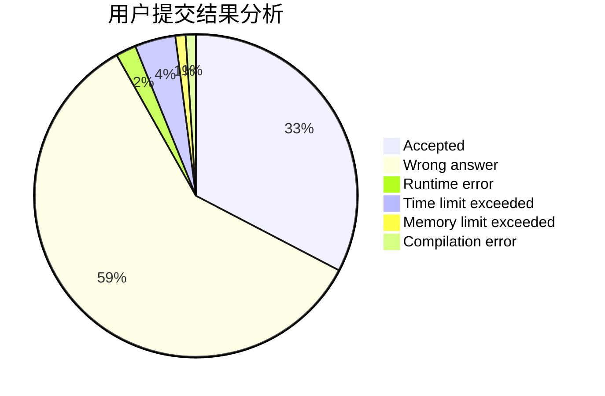
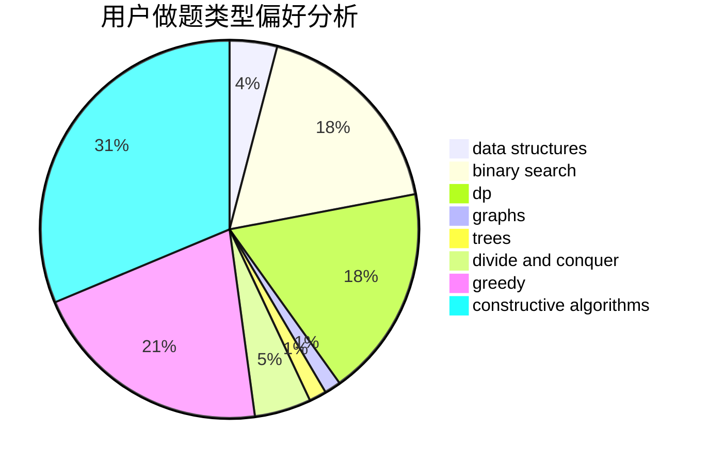
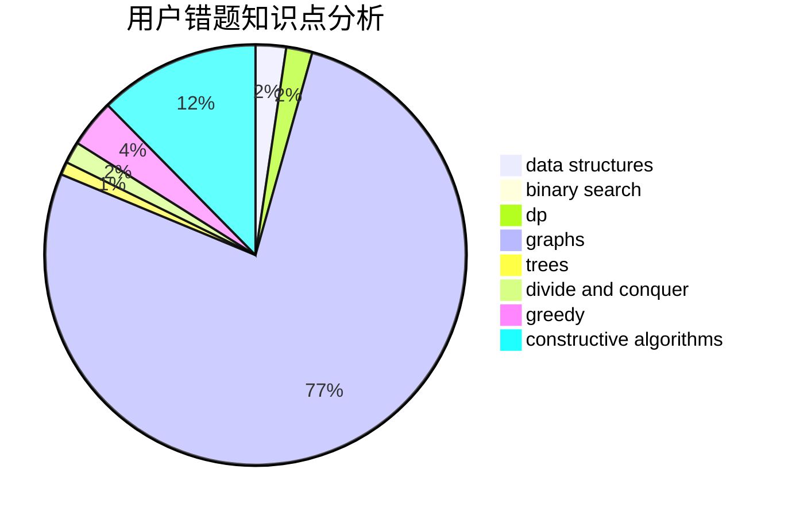

# Ender_zzm
<!-- tabs:start -->
#### **用户提交结果分析**

#### **用户做题类型偏好分析**

#### **用户错题知识点分析**

<!-- tabs:end -->
# 推荐题目
[New Passenger Trams](http://codeforces.com/problemset/problem/1379/D)		binary search,
                        brute force,
                        data structures,
                        sortings,
                        two pointers		  
[Maximum Distributed Tree](http://codeforces.com/problemset/problem/1401/D)		dfs and similar,
                        dp,
                        greedy,
                        implementation,
                        math,
                        number theory,
                        sortings,
                        trees		  
[Treeland Tour](http://codeforces.com/problemset/problem/490/F)		data structures,
                        dfs and similar,
                        dp,
                        trees		  
[White Sheet](http://codeforces.com/problemset/problem/1216/C)		geometry,
                        math		  
[Megacity](http://codeforces.com/problemset/problem/424/B)		binary search,
                        greedy,
                        implementation,
                        sortings		  
[Make Them Odd](http://codeforces.com/problemset/problem/1277/B)		greedy,
                        number theory		  
[Mister B and PR Shifts](https://codeforces.com/contest/820/problem/D)		data structures,
                        implementation,
                        math		  
[Ants](https://codeforces.com/contest/318/problem/D)		2-sat,
                        data structures,
                        trees		  
[Sum of Remainders](http://codeforces.com/problemset/problem/616/E)		implementation,
                        math,
                        number theory		  
[Time to Run](http://codeforces.com/problemset/problem/1301/D)		constructive algorithms,
                        graphs,
                        implementation		  
<!-- tabs:start -->
#### **data structures**
[New Passenger Trams](http://codeforces.com/problemset/problem/1379/D)		binary search,
                        brute force,
                        data structures,
                        sortings,
                        two pointers		  
[Treeland Tour](http://codeforces.com/problemset/problem/490/F)		data structures,
                        dfs and similar,
                        dp,
                        trees		  
[Mister B and PR Shifts](https://codeforces.com/contest/820/problem/D)		data structures,
                        implementation,
                        math		  
[Ants](https://codeforces.com/contest/318/problem/D)		2-sat,
                        data structures,
                        trees		  
[e-Government](http://codeforces.com/problemset/problem/163/E)		data structures,
                        dfs and similar,
                        dp,
                        strings,
                        trees		  
[Valeriy and Deque](https://codeforces.com/contest/1180/problem/C)		data structures,
                        implementation		  
[Forced Online Queries Problem](http://codeforces.com/problemset/problem/1217/F)		data structures,
                        divide and conquer,
                        dsu,
                        graphs,
                        trees		  
[MEX Queries](http://codeforces.com/problemset/problem/817/F)		binary search,
                        data structures,
                        trees		  
[Stack of Presents](http://codeforces.com/problemset/problem/1279/C)		data structures,
                        implementation		  
[XOR on Segment](http://codeforces.com/problemset/problem/242/E)		bitmasks,
                        data structures		  
#### **binary search**
[New Passenger Trams](http://codeforces.com/problemset/problem/1379/D)		binary search,
                        brute force,
                        data structures,
                        sortings,
                        two pointers		  
[Megacity](http://codeforces.com/problemset/problem/424/B)		binary search,
                        greedy,
                        implementation,
                        sortings		  
[New Year and Hurry](http://codeforces.com/problemset/problem/750/A)		binary search,
                        brute force,
                        implementation,
                        math		  
[MEX Queries](http://codeforces.com/problemset/problem/817/F)		binary search,
                        data structures,
                        trees		  
[Lanterns](http://codeforces.com/problemset/problem/1476/F)		binary search,
                        data structures,
                        dp		  
[Present](http://codeforces.com/problemset/problem/460/C)		binary search,
                        data structures,
                        greedy		  
[Maximum width](http://codeforces.com/problemset/problem/1492/C)		binary search,
                        data structures,
                        dp,
                        greedy,
                        two pointers		  
[Pairs](http://codeforces.com/problemset/problem/1463/D)		binary search,
                        constructive algorithms,
                        greedy,
                        two pointers		  
[Old Floppy Drive](http://codeforces.com/problemset/problem/1490/G)		binary search,
                        data structures,
                        math		  
[Odd Mineral Resource](http://codeforces.com/problemset/problem/1479/D)		binary search,
                        bitmasks,
                        brute force,
                        data structures,
                        probabilities,
                        trees		  
#### **dp**
[Maximum Distributed Tree](http://codeforces.com/problemset/problem/1401/D)		dfs and similar,
                        dp,
                        greedy,
                        implementation,
                        math,
                        number theory,
                        sortings,
                        trees		  
[Treeland Tour](http://codeforces.com/problemset/problem/490/F)		data structures,
                        dfs and similar,
                        dp,
                        trees		  
[e-Government](http://codeforces.com/problemset/problem/163/E)		data structures,
                        dfs and similar,
                        dp,
                        strings,
                        trees		  
[Short Colorful Strip](http://codeforces.com/problemset/problem/1178/F1)		combinatorics,
                        dfs and similar,
                        dp		  
[Send the Fool Further! (hard)](http://codeforces.com/problemset/problem/802/L)		dfs and similar,
                        dp,
                        math,
                        trees		  
[Logo Turtle](http://codeforces.com/problemset/problem/132/C)		dp		  
[Dr. Evil Underscores](http://codeforces.com/problemset/problem/1285/D)		bitmasks,
                        brute force,
                        dfs and similar,
                        divide and conquer,
                        dp,
                        greedy,
                        strings,
                        trees		  
[Pairs](http://codeforces.com/problemset/problem/81/E)		dfs and similar,
                        dp,
                        dsu,
                        graphs,
                        implementation,
                        trees		  
[Maxim and Increasing Subsequence](http://codeforces.com/problemset/problem/261/D)		dp		  
[Lanterns](http://codeforces.com/problemset/problem/1476/F)		binary search,
                        data structures,
                        dp		  
#### **graph**
[Time to Run](http://codeforces.com/problemset/problem/1301/D)		constructive algorithms,
                        graphs,
                        implementation		  
[Forced Online Queries Problem](http://codeforces.com/problemset/problem/1217/F)		data structures,
                        divide and conquer,
                        dsu,
                        graphs,
                        trees		  
[Pairs](http://codeforces.com/problemset/problem/81/E)		dfs and similar,
                        dp,
                        dsu,
                        graphs,
                        implementation,
                        trees		  
[Minimum Ties](http://codeforces.com/problemset/problem/1487/C)		brute force,
                        constructive algorithms,
                        dfs and similar,
                        graphs,
                        greedy,
                        implementation,
                        math		  
[Chef Monocarp](http://codeforces.com/problemset/problem/1437/C)		dp,
                        flows,
                        graph matchings,
                        greedy,
                        math,
                        sortings		  
[Strange Housing](http://codeforces.com/problemset/problem/1470/D)		constructive algorithms,
                        dfs and similar,
                        graph matchings,
                        graphs,
                        greedy		  
[Longest Simple Cycle](http://codeforces.com/problemset/problem/1476/C)		dp,
                        graphs,
                        greedy		  
[Shortest and Longest LIS](http://codeforces.com/problemset/problem/1304/D)		constructive algorithms,
                        graphs,
                        greedy,
                        two pointers		  
[Ball in Berland](http://codeforces.com/problemset/problem/1475/C)		combinatorics,
                        graphs,
                        math		  
[Kyoya and Train](http://codeforces.com/problemset/problem/553/E)		dp,
                        fft,
                        graphs,
                        math,
                        probabilities		  
#### **trees**
[Maximum Distributed Tree](http://codeforces.com/problemset/problem/1401/D)		dfs and similar,
                        dp,
                        greedy,
                        implementation,
                        math,
                        number theory,
                        sortings,
                        trees		  
[Treeland Tour](http://codeforces.com/problemset/problem/490/F)		data structures,
                        dfs and similar,
                        dp,
                        trees		  
[Ants](https://codeforces.com/contest/318/problem/D)		2-sat,
                        data structures,
                        trees		  
[e-Government](http://codeforces.com/problemset/problem/163/E)		data structures,
                        dfs and similar,
                        dp,
                        strings,
                        trees		  
[Send the Fool Further! (hard)](http://codeforces.com/problemset/problem/802/L)		dfs and similar,
                        dp,
                        math,
                        trees		  
[Forced Online Queries Problem](http://codeforces.com/problemset/problem/1217/F)		data structures,
                        divide and conquer,
                        dsu,
                        graphs,
                        trees		  
[Dr. Evil Underscores](http://codeforces.com/problemset/problem/1285/D)		bitmasks,
                        brute force,
                        dfs and similar,
                        divide and conquer,
                        dp,
                        greedy,
                        strings,
                        trees		  
[MEX Queries](http://codeforces.com/problemset/problem/817/F)		binary search,
                        data structures,
                        trees		  
[Pairs](http://codeforces.com/problemset/problem/81/E)		dfs and similar,
                        dp,
                        dsu,
                        graphs,
                        implementation,
                        trees		  
[Odd Mineral Resource](http://codeforces.com/problemset/problem/1479/D)		binary search,
                        bitmasks,
                        brute force,
                        data structures,
                        probabilities,
                        trees		  
#### **divide and conquer**
[Forced Online Queries Problem](http://codeforces.com/problemset/problem/1217/F)		data structures,
                        divide and conquer,
                        dsu,
                        graphs,
                        trees		  
[Dr. Evil Underscores](http://codeforces.com/problemset/problem/1285/D)		bitmasks,
                        brute force,
                        dfs and similar,
                        divide and conquer,
                        dp,
                        greedy,
                        strings,
                        trees		  
[Divide and Summarize](http://codeforces.com/problemset/problem/1461/D)		binary search,
                        brute force,
                        data structures,
                        divide and conquer,
                        implementation,
                        sortings		  
[Song of the Sirens](http://codeforces.com/problemset/problem/1466/G)		combinatorics,
                        divide and conquer,
                        hashing,
                        math,
                        string suffix structures,
                        strings		  
[Permutation Transformation](http://codeforces.com/problemset/problem/1490/D)		dfs and similar,
                        divide and conquer,
                        implementation		  
[Skyline Photo](https://codeforces.com/contest/1483/problem/C)		data structures,
                        divide and conquer,
                        dp		  
[Fib-tree](http://codeforces.com/problemset/problem/1491/E)		brute force,
                        dfs and similar,
                        divide and conquer,
                        number theory,
                        trees		  
[Sum of Prefix Sums](http://codeforces.com/problemset/problem/1303/G)		data structures,
                        divide and conquer,
                        geometry,
                        trees		  
[Dogeforces](http://codeforces.com/problemset/problem/1494/D)		constructive algorithms,
                        data structures,
                        dfs and similar,
                        divide and conquer,
                        dsu,
                        greedy,
                        sortings,
                        trees		  
[Logistical Questions](http://codeforces.com/problemset/problem/566/C)		dfs and similar,
                        divide and conquer,
                        trees		  
#### **greedy**
[Maximum Distributed Tree](http://codeforces.com/problemset/problem/1401/D)		dfs and similar,
                        dp,
                        greedy,
                        implementation,
                        math,
                        number theory,
                        sortings,
                        trees		  
[Megacity](http://codeforces.com/problemset/problem/424/B)		binary search,
                        greedy,
                        implementation,
                        sortings		  
[Make Them Odd](http://codeforces.com/problemset/problem/1277/B)		greedy,
                        number theory		  
[Mister B and Boring Game](https://codeforces.com/contest/820/problem/C)		games,
                        greedy		  
[Dr. Evil Underscores](http://codeforces.com/problemset/problem/1285/D)		bitmasks,
                        brute force,
                        dfs and similar,
                        divide and conquer,
                        dp,
                        greedy,
                        strings,
                        trees		  
[Orac and Medians](http://codeforces.com/problemset/problem/1349/B)		constructive algorithms,
                        greedy,
                        math		  
[Elimination](http://codeforces.com/problemset/problem/1445/B)		greedy,
                        math		  
[Deletion of Repeats](http://codeforces.com/problemset/problem/19/C)		greedy,
                        hashing,
                        string suffix structures		  
[Anti-knapsack](http://codeforces.com/problemset/problem/1493/A)		constructive algorithms,
                        greedy		  
[Present](http://codeforces.com/problemset/problem/460/C)		binary search,
                        data structures,
                        greedy		  
#### **constructive algorithms**
[Time to Run](http://codeforces.com/problemset/problem/1301/D)		constructive algorithms,
                        graphs,
                        implementation		  
[Restore a Number](http://codeforces.com/problemset/problem/670/F)		brute force,
                        constructive algorithms,
                        strings		  
[Ehab and another another xor problem](http://codeforces.com/problemset/problem/1088/D)		bitmasks,
                        constructive algorithms,
                        implementation,
                        interactive		  
[Mister B and Angle in Polygon](http://codeforces.com/problemset/problem/820/B)		constructive algorithms,
                        geometry,
                        math		  
[Orac and Medians](http://codeforces.com/problemset/problem/1349/B)		constructive algorithms,
                        greedy,
                        math		  
[Number into Sequence](http://codeforces.com/problemset/problem/1454/D)		constructive algorithms,
                        math,
                        number theory		  
[Anti-knapsack](http://codeforces.com/problemset/problem/1493/A)		constructive algorithms,
                        greedy		  
[Knapsack](http://codeforces.com/problemset/problem/1446/A)		constructive algorithms,
                        greedy,
                        sortings		  
[Pairs](http://codeforces.com/problemset/problem/1463/D)		binary search,
                        constructive algorithms,
                        greedy,
                        two pointers		  
[XOR-gun](https://codeforces.com/contest/1456/problem/B)		bitmasks,
                        brute force,
                        constructive algorithms		  
#### **sortings**
[New Passenger Trams](http://codeforces.com/problemset/problem/1379/D)		binary search,
                        brute force,
                        data structures,
                        sortings,
                        two pointers		  
[Maximum Distributed Tree](http://codeforces.com/problemset/problem/1401/D)		dfs and similar,
                        dp,
                        greedy,
                        implementation,
                        math,
                        number theory,
                        sortings,
                        trees		  
[Megacity](http://codeforces.com/problemset/problem/424/B)		binary search,
                        greedy,
                        implementation,
                        sortings		  
[Knapsack](http://codeforces.com/problemset/problem/1446/A)		constructive algorithms,
                        greedy,
                        sortings		  
[Diamond Miner](https://codeforces.com/contest/1496/problem/C)		geometry,
                        greedy,
                        math,
                        sortings		  
[Meximization](http://codeforces.com/problemset/problem/1497/A)		brute force,
                        data structures,
                        greedy,
                        sortings		  
[Avoiding Zero](http://codeforces.com/problemset/problem/1427/A)		math,
                        sortings		  
[Divide and Summarize](http://codeforces.com/problemset/problem/1461/D)		binary search,
                        brute force,
                        data structures,
                        divide and conquer,
                        implementation,
                        sortings		  
[Chef Monocarp](http://codeforces.com/problemset/problem/1437/C)		dp,
                        flows,
                        graph matchings,
                        greedy,
                        math,
                        sortings		  
[Replacing Elements](http://codeforces.com/problemset/problem/1473/A)		greedy,
                        implementation,
                        math,
                        sortings		  
<!-- tabs:end -->
