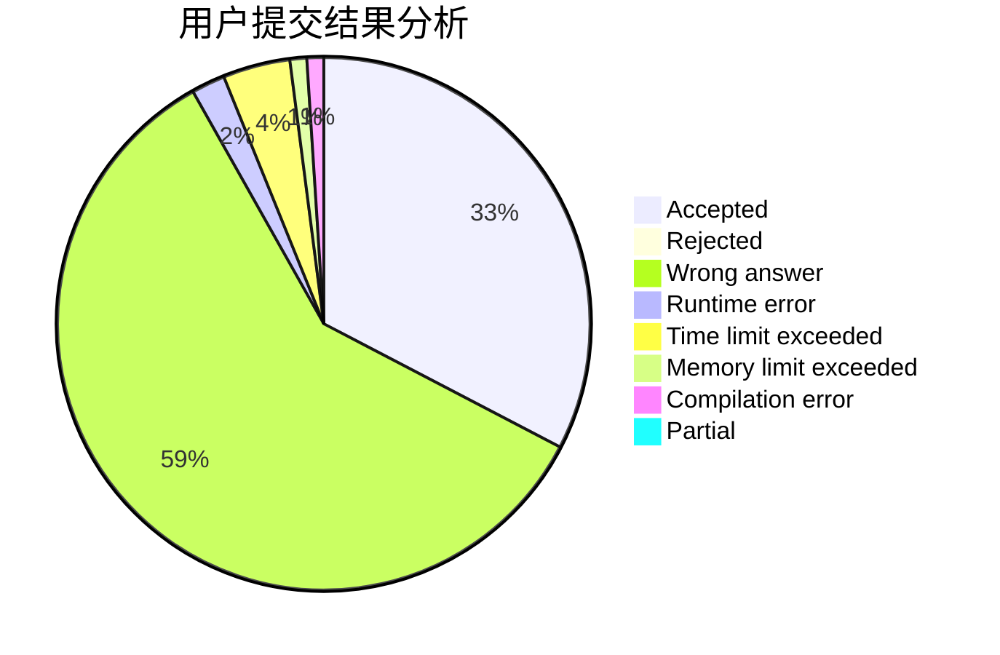
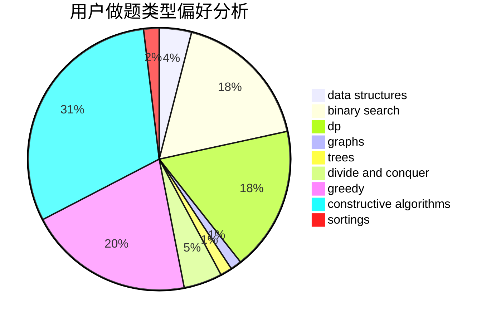
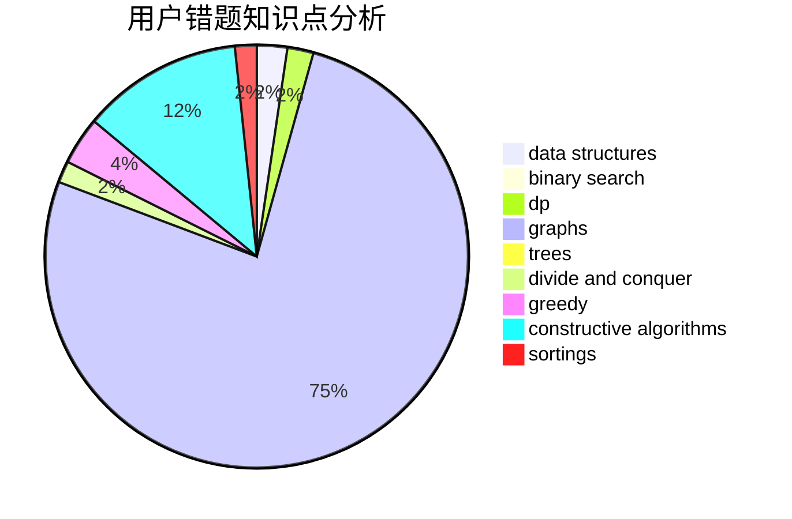

# Ender_zzm
<!-- tabs:start -->
#### **用户提交结果分析**

#### **用户做题类型偏好分析**

#### **用户错题知识点分析**

<!-- tabs:end -->
# 推荐题目
[1379D](http://codeforces.com/problemset/problem/1379/D)		binary search,
                        brute force,
                        data structures,
                        sortings,
                        two pointers		  
[1401D](http://codeforces.com/problemset/problem/1401/D)		dfs and similar,
                        dp,
                        greedy,
                        implementation,
                        math,
                        number theory,
                        sortings,
                        trees		  
[490F](http://codeforces.com/problemset/problem/490/F)		data structures,
                        dfs and similar,
                        dp,
                        trees		  
[1216C](http://codeforces.com/problemset/problem/1216/C)		geometry,
                        math		  
[424B](http://codeforces.com/problemset/problem/424/B)		binary search,
                        greedy,
                        implementation,
                        sortings		  
[1277B](http://codeforces.com/problemset/problem/1277/B)		greedy,
                        number theory		  
[820D](https://codeforces.com/contest/820/problem/D)		data structures,
                        implementation,
                        math		  
[318D](https://codeforces.com/contest/318/problem/D)		2-sat,
                        data structures,
                        trees		  
[616E](http://codeforces.com/problemset/problem/616/E)		implementation,
                        math,
                        number theory		  
[1301D](http://codeforces.com/problemset/problem/1301/D)		constructive algorithms,
                        graphs,
                        implementation		  
<!-- tabs:start -->
#### **data structures**
[1379D](http://codeforces.com/problemset/problem/1379/D)		binary search,
                        brute force,
                        data structures,
                        sortings,
                        two pointers		  
[490F](http://codeforces.com/problemset/problem/490/F)		data structures,
                        dfs and similar,
                        dp,
                        trees		  
[820D](https://codeforces.com/contest/820/problem/D)		data structures,
                        implementation,
                        math		  
[318D](https://codeforces.com/contest/318/problem/D)		2-sat,
                        data structures,
                        trees		  
[163E](http://codeforces.com/problemset/problem/163/E)		data structures,
                        dfs and similar,
                        dp,
                        strings,
                        trees		  
[1180C](https://codeforces.com/contest/1180/problem/C)		data structures,
                        implementation		  
[1217F](http://codeforces.com/problemset/problem/1217/F)		data structures,
                        divide and conquer,
                        dsu,
                        graphs,
                        trees		  
[817F](http://codeforces.com/problemset/problem/817/F)		binary search,
                        data structures,
                        trees		  
[1279C](http://codeforces.com/problemset/problem/1279/C)		data structures,
                        implementation		  
[242E](http://codeforces.com/problemset/problem/242/E)		bitmasks,
                        data structures		  
#### **binary search**
[1379D](http://codeforces.com/problemset/problem/1379/D)		binary search,
                        brute force,
                        data structures,
                        sortings,
                        two pointers		  
[424B](http://codeforces.com/problemset/problem/424/B)		binary search,
                        greedy,
                        implementation,
                        sortings		  
[750A](http://codeforces.com/problemset/problem/750/A)		binary search,
                        brute force,
                        implementation,
                        math		  
[817F](http://codeforces.com/problemset/problem/817/F)		binary search,
                        data structures,
                        trees		  
[1476F](http://codeforces.com/problemset/problem/1476/F)		binary search,
                        data structures,
                        dp		  
[460C](http://codeforces.com/problemset/problem/460/C)		binary search,
                        data structures,
                        greedy		  
[1492C](http://codeforces.com/problemset/problem/1492/C)		binary search,
                        data structures,
                        dp,
                        greedy,
                        two pointers		  
[1463D](http://codeforces.com/problemset/problem/1463/D)		binary search,
                        constructive algorithms,
                        greedy,
                        two pointers		  
[1490G](http://codeforces.com/problemset/problem/1490/G)		binary search,
                        data structures,
                        math		  
[1479D](http://codeforces.com/problemset/problem/1479/D)		binary search,
                        bitmasks,
                        brute force,
                        data structures,
                        probabilities,
                        trees		  
#### **dp**
[1401D](http://codeforces.com/problemset/problem/1401/D)		dfs and similar,
                        dp,
                        greedy,
                        implementation,
                        math,
                        number theory,
                        sortings,
                        trees		  
[490F](http://codeforces.com/problemset/problem/490/F)		data structures,
                        dfs and similar,
                        dp,
                        trees		  
[163E](http://codeforces.com/problemset/problem/163/E)		data structures,
                        dfs and similar,
                        dp,
                        strings,
                        trees		  
[1178F1](http://codeforces.com/problemset/problem/1178/F1)		combinatorics,
                        dfs and similar,
                        dp		  
[802L](http://codeforces.com/problemset/problem/802/L)		dfs and similar,
                        dp,
                        math,
                        trees		  
[132C](http://codeforces.com/problemset/problem/132/C)		dp		  
[1285D](http://codeforces.com/problemset/problem/1285/D)		bitmasks,
                        brute force,
                        dfs and similar,
                        divide and conquer,
                        dp,
                        greedy,
                        strings,
                        trees		  
[81E](http://codeforces.com/problemset/problem/81/E)		dfs and similar,
                        dp,
                        dsu,
                        graphs,
                        implementation,
                        trees		  
[261D](http://codeforces.com/problemset/problem/261/D)		dp		  
[1476F](http://codeforces.com/problemset/problem/1476/F)		binary search,
                        data structures,
                        dp		  
#### **graph**
[1301D](http://codeforces.com/problemset/problem/1301/D)		constructive algorithms,
                        graphs,
                        implementation		  
[1217F](http://codeforces.com/problemset/problem/1217/F)		data structures,
                        divide and conquer,
                        dsu,
                        graphs,
                        trees		  
[81E](http://codeforces.com/problemset/problem/81/E)		dfs and similar,
                        dp,
                        dsu,
                        graphs,
                        implementation,
                        trees		  
[1487C](http://codeforces.com/problemset/problem/1487/C)		brute force,
                        constructive algorithms,
                        dfs and similar,
                        graphs,
                        greedy,
                        implementation,
                        math		  
[1437C](http://codeforces.com/problemset/problem/1437/C)		dp,
                        flows,
                        graph matchings,
                        greedy,
                        math,
                        sortings		  
[1470D](http://codeforces.com/problemset/problem/1470/D)		constructive algorithms,
                        dfs and similar,
                        graph matchings,
                        graphs,
                        greedy		  
[1476C](http://codeforces.com/problemset/problem/1476/C)		dp,
                        graphs,
                        greedy		  
[1304D](http://codeforces.com/problemset/problem/1304/D)		constructive algorithms,
                        graphs,
                        greedy,
                        two pointers		  
[1475C](http://codeforces.com/problemset/problem/1475/C)		combinatorics,
                        graphs,
                        math		  
[553E](http://codeforces.com/problemset/problem/553/E)		dp,
                        fft,
                        graphs,
                        math,
                        probabilities		  
#### **trees**
[1401D](http://codeforces.com/problemset/problem/1401/D)		dfs and similar,
                        dp,
                        greedy,
                        implementation,
                        math,
                        number theory,
                        sortings,
                        trees		  
[490F](http://codeforces.com/problemset/problem/490/F)		data structures,
                        dfs and similar,
                        dp,
                        trees		  
[318D](https://codeforces.com/contest/318/problem/D)		2-sat,
                        data structures,
                        trees		  
[163E](http://codeforces.com/problemset/problem/163/E)		data structures,
                        dfs and similar,
                        dp,
                        strings,
                        trees		  
[802L](http://codeforces.com/problemset/problem/802/L)		dfs and similar,
                        dp,
                        math,
                        trees		  
[1217F](http://codeforces.com/problemset/problem/1217/F)		data structures,
                        divide and conquer,
                        dsu,
                        graphs,
                        trees		  
[1285D](http://codeforces.com/problemset/problem/1285/D)		bitmasks,
                        brute force,
                        dfs and similar,
                        divide and conquer,
                        dp,
                        greedy,
                        strings,
                        trees		  
[817F](http://codeforces.com/problemset/problem/817/F)		binary search,
                        data structures,
                        trees		  
[81E](http://codeforces.com/problemset/problem/81/E)		dfs and similar,
                        dp,
                        dsu,
                        graphs,
                        implementation,
                        trees		  
[1479D](http://codeforces.com/problemset/problem/1479/D)		binary search,
                        bitmasks,
                        brute force,
                        data structures,
                        probabilities,
                        trees		  
#### **divide and conquer**
[1217F](http://codeforces.com/problemset/problem/1217/F)		data structures,
                        divide and conquer,
                        dsu,
                        graphs,
                        trees		  
[1285D](http://codeforces.com/problemset/problem/1285/D)		bitmasks,
                        brute force,
                        dfs and similar,
                        divide and conquer,
                        dp,
                        greedy,
                        strings,
                        trees		  
[1461D](http://codeforces.com/problemset/problem/1461/D)		binary search,
                        brute force,
                        data structures,
                        divide and conquer,
                        implementation,
                        sortings		  
[1466G](http://codeforces.com/problemset/problem/1466/G)		combinatorics,
                        divide and conquer,
                        hashing,
                        math,
                        string suffix structures,
                        strings		  
[1490D](http://codeforces.com/problemset/problem/1490/D)		dfs and similar,
                        divide and conquer,
                        implementation		  
[1483C](https://codeforces.com/contest/1483/problem/C)		data structures,
                        divide and conquer,
                        dp		  
[1491E](http://codeforces.com/problemset/problem/1491/E)		brute force,
                        dfs and similar,
                        divide and conquer,
                        number theory,
                        trees		  
[1303G](http://codeforces.com/problemset/problem/1303/G)		data structures,
                        divide and conquer,
                        geometry,
                        trees		  
[1494D](http://codeforces.com/problemset/problem/1494/D)		constructive algorithms,
                        data structures,
                        dfs and similar,
                        divide and conquer,
                        dsu,
                        greedy,
                        sortings,
                        trees		  
[1482E](http://codeforces.com/problemset/problem/1482/E)		data structures,
                        divide and conquer,
                        dp		  
#### **greedy**
[1401D](http://codeforces.com/problemset/problem/1401/D)		dfs and similar,
                        dp,
                        greedy,
                        implementation,
                        math,
                        number theory,
                        sortings,
                        trees		  
[424B](http://codeforces.com/problemset/problem/424/B)		binary search,
                        greedy,
                        implementation,
                        sortings		  
[1277B](http://codeforces.com/problemset/problem/1277/B)		greedy,
                        number theory		  
[820C](https://codeforces.com/contest/820/problem/C)		games,
                        greedy		  
[1285D](http://codeforces.com/problemset/problem/1285/D)		bitmasks,
                        brute force,
                        dfs and similar,
                        divide and conquer,
                        dp,
                        greedy,
                        strings,
                        trees		  
[1349B](http://codeforces.com/problemset/problem/1349/B)		constructive algorithms,
                        greedy,
                        math		  
[1445B](http://codeforces.com/problemset/problem/1445/B)		greedy,
                        math		  
[19C](http://codeforces.com/problemset/problem/19/C)		greedy,
                        hashing,
                        string suffix structures		  
[1493A](http://codeforces.com/problemset/problem/1493/A)		constructive algorithms,
                        greedy		  
[460C](http://codeforces.com/problemset/problem/460/C)		binary search,
                        data structures,
                        greedy		  
#### **constructive algorithms**
[1301D](http://codeforces.com/problemset/problem/1301/D)		constructive algorithms,
                        graphs,
                        implementation		  
[670F](http://codeforces.com/problemset/problem/670/F)		brute force,
                        constructive algorithms,
                        strings		  
[1088D](http://codeforces.com/problemset/problem/1088/D)		bitmasks,
                        constructive algorithms,
                        implementation,
                        interactive		  
[820B](http://codeforces.com/problemset/problem/820/B)		constructive algorithms,
                        geometry,
                        math		  
[1349B](http://codeforces.com/problemset/problem/1349/B)		constructive algorithms,
                        greedy,
                        math		  
[1454D](http://codeforces.com/problemset/problem/1454/D)		constructive algorithms,
                        math,
                        number theory		  
[1493A](http://codeforces.com/problemset/problem/1493/A)		constructive algorithms,
                        greedy		  
[1446A](http://codeforces.com/problemset/problem/1446/A)		constructive algorithms,
                        greedy,
                        sortings		  
[1493A](http://codeforces.com/problemset/problem/1493/A)		constructive algorithms,
                        greedy		  
[1463D](http://codeforces.com/problemset/problem/1463/D)		binary search,
                        constructive algorithms,
                        greedy,
                        two pointers		  
#### **sortings**
[1379D](http://codeforces.com/problemset/problem/1379/D)		binary search,
                        brute force,
                        data structures,
                        sortings,
                        two pointers		  
[1401D](http://codeforces.com/problemset/problem/1401/D)		dfs and similar,
                        dp,
                        greedy,
                        implementation,
                        math,
                        number theory,
                        sortings,
                        trees		  
[424B](http://codeforces.com/problemset/problem/424/B)		binary search,
                        greedy,
                        implementation,
                        sortings		  
[1446A](http://codeforces.com/problemset/problem/1446/A)		constructive algorithms,
                        greedy,
                        sortings		  
[1496C](https://codeforces.com/contest/1496/problem/C)		geometry,
                        greedy,
                        math,
                        sortings		  
[1495A](http://codeforces.com/problemset/problem/1495/A)		geometry,
                        greedy,
                        math,
                        sortings		  
[1497A](http://codeforces.com/problemset/problem/1497/A)		brute force,
                        data structures,
                        greedy,
                        sortings		  
[1427A](http://codeforces.com/problemset/problem/1427/A)		math,
                        sortings		  
[1461D](http://codeforces.com/problemset/problem/1461/D)		binary search,
                        brute force,
                        data structures,
                        divide and conquer,
                        implementation,
                        sortings		  
[1437C](http://codeforces.com/problemset/problem/1437/C)		dp,
                        flows,
                        graph matchings,
                        greedy,
                        math,
                        sortings		  
<!-- tabs:end -->
