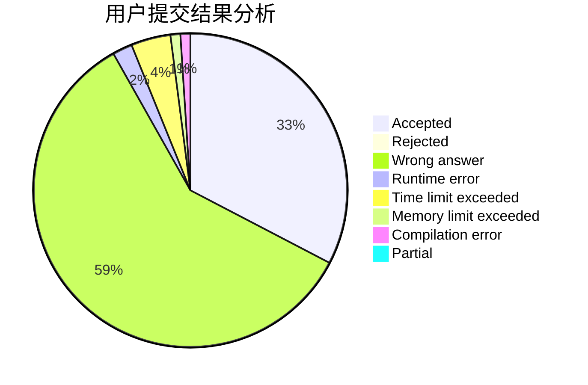
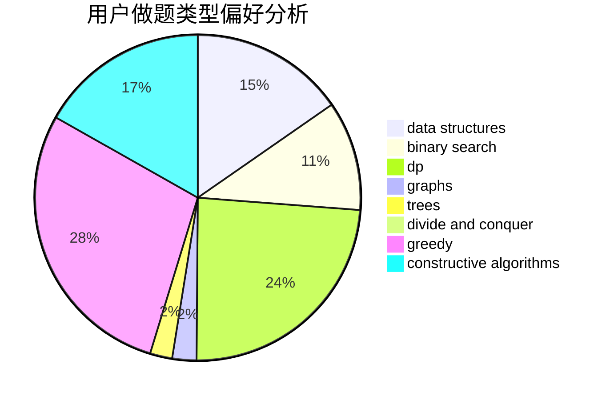
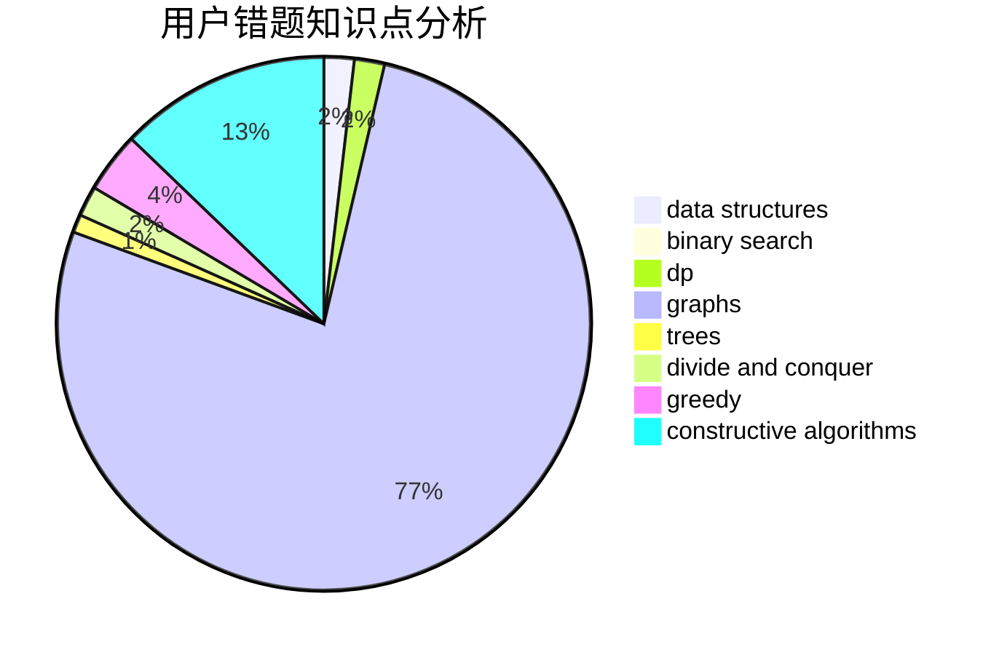

# Ender_zzm

<!-- tabs:start -->

#### **用户提交结果分析**

#### **用户做题类型偏好分析**

#### **用户错题知识点分析**

<!-- tabs:end -->
# 推荐题目
[1283D](https://codeforces.com/contest/1283/problem/D)		graphs,
                        greedy,
                        shortest paths		  
[1292E](https://codeforces.com/contest/1292/problem/E)		constructive algorithms,
                        greedy,
                        interactive,
                        math		  
[1454E](https://codeforces.com/contest/1454/problem/E)		combinatorics,
                        dfs and similar,
                        graphs,
                        trees		  
[634B](https://codeforces.com/contest/634/problem/B)		dsu,graphs,sortings,trees		  
[510E](https://codeforces.com/contest/510/problem/E)		flows		  
[1388D](https://codeforces.com/contest/1388/problem/D)		data structures,
                        dfs and similar,
                        graphs,
                        greedy,
                        implementation,
                        trees		  
[189E](https://codeforces.com/contest/189/problem/E)		dsu,graphs,sortings,trees		  
[1311A](https://codeforces.com/contest/1311/problem/A)		greedy,
                        implementation,
                        math		  
[840A](https://codeforces.com/contest/840/problem/A)		combinatorics,
                        greedy,
                        math,
                        number theory,
                        sortings		  
[76A](https://codeforces.com/contest/76/problem/A)		dsu,
                        graphs,
                        sortings,
                        trees		  
