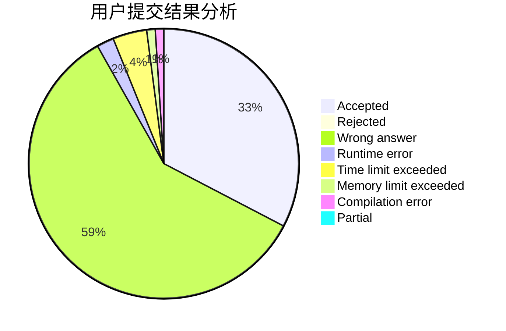
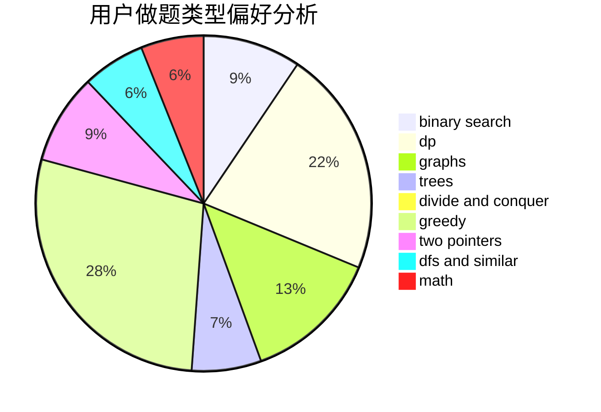

# Ender_zzm

<!-- tabs:start -->

#### **用户提交结果分析**

#### **用户做题类型偏好分析**

<!-- tabs:end -->
# 推荐题目
[1283D](https://codeforces.com/contest/1283/problem/D)
[1292E](https://codeforces.com/contest/1292/problem/E)
[1454E](https://codeforces.com/contest/1454/problem/E)
[634B](https://codeforces.com/contest/634/problem/B)
[510E](https://codeforces.com/contest/510/problem/E)
[1388D](https://codeforces.com/contest/1388/problem/D)
[189E](https://codeforces.com/contest/189/problem/E)
[1311A](https://codeforces.com/contest/1311/problem/A)
[840A](https://codeforces.com/contest/840/problem/A)
[76A](https://codeforces.com/contest/76/problem/A)
