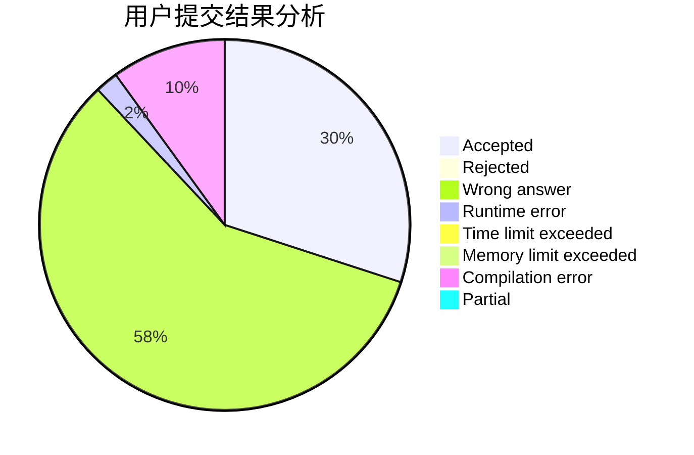
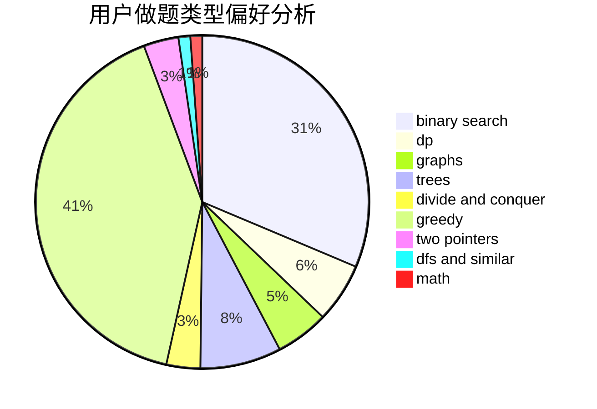

# Enderwitherzjdl

<!-- tabs:start -->

#### **用户提交结果分析**

#### **用户做题类型偏好分析**

<!-- tabs:end -->
# 推荐题目
[1397D](https://codeforces.com/contest/1397/problem/D)
[1341C](https://codeforces.com/contest/1341/problem/C)
[1296F](https://codeforces.com/contest/1296/problem/F)
[750F](https://codeforces.com/contest/750/problem/F)
[1150C](https://codeforces.com/contest/1150/problem/C)
[634D](https://codeforces.com/contest/634/problem/D)
[1181D](https://codeforces.com/contest/1181/problem/D)
[197D](https://codeforces.com/contest/197/problem/D)
[1005A](https://codeforces.com/contest/1005/problem/A)
[1113A](https://codeforces.com/contest/1113/problem/A)
