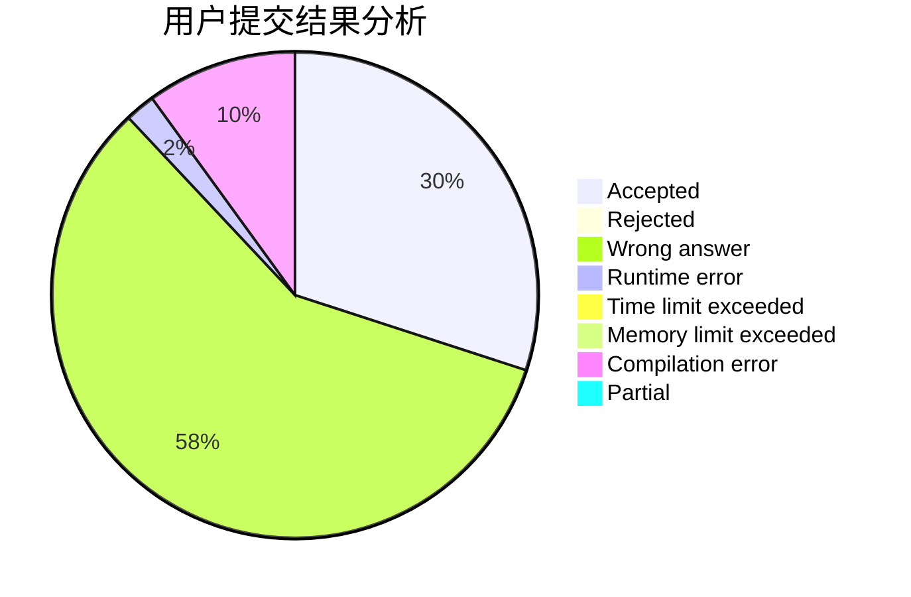
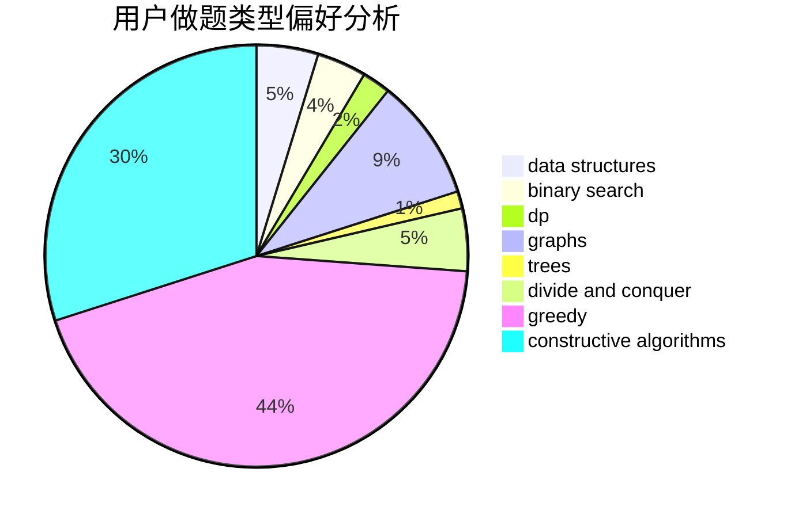

# Enderwitherzjdl

<!-- tabs:start -->

#### **用户提交结果分析**

#### **用户做题类型偏好分析**

#### **用户错题知识点分析**

<!-- tabs:end -->
# 推荐题目
[1388A](https://codeforces.com/contest/1388/problem/A)		brute force,
                        greedy,
                        math,
                        number theory		  
[1334D](https://codeforces.com/contest/1334/problem/D)		constructive algorithms,
                        graphs,
                        greedy,
                        implementation		  
[1290C](https://codeforces.com/contest/1290/problem/C)		dfs and similar,
                        dsu,
                        graphs		  
[733A](https://codeforces.com/contest/733/problem/A)		implementation		  
[1148H](https://codeforces.com/contest/1148/problem/H)		data structures		  
[616F](https://codeforces.com/contest/616/problem/F)		string suffix structures,
                        strings		  
[1179A](https://codeforces.com/contest/1179/problem/A)		data structures,
                        implementation		  
[171A](https://codeforces.com/contest/171/problem/A)		*special problem,
                        constructive algorithms		  
[1004F](https://codeforces.com/contest/1004/problem/F)		bitmasks,
                        data structures,
                        divide and conquer		  
[1111B](https://codeforces.com/contest/1111/problem/B)		brute force,
                        implementation,
                        math		  
