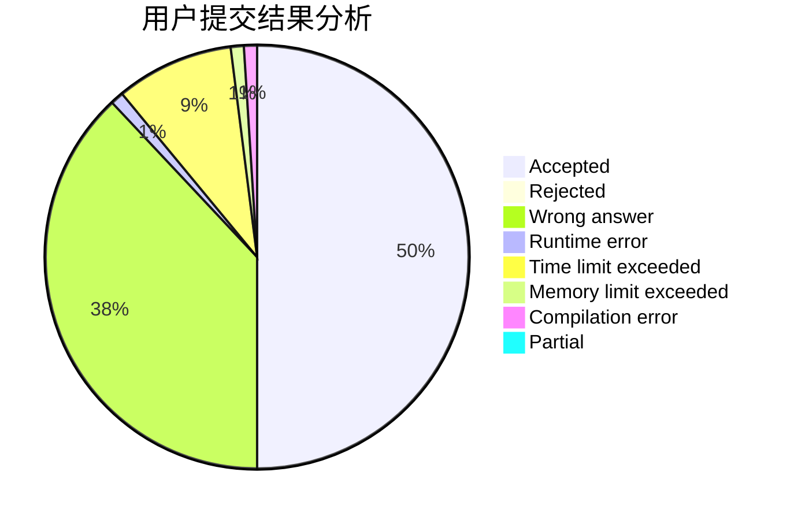
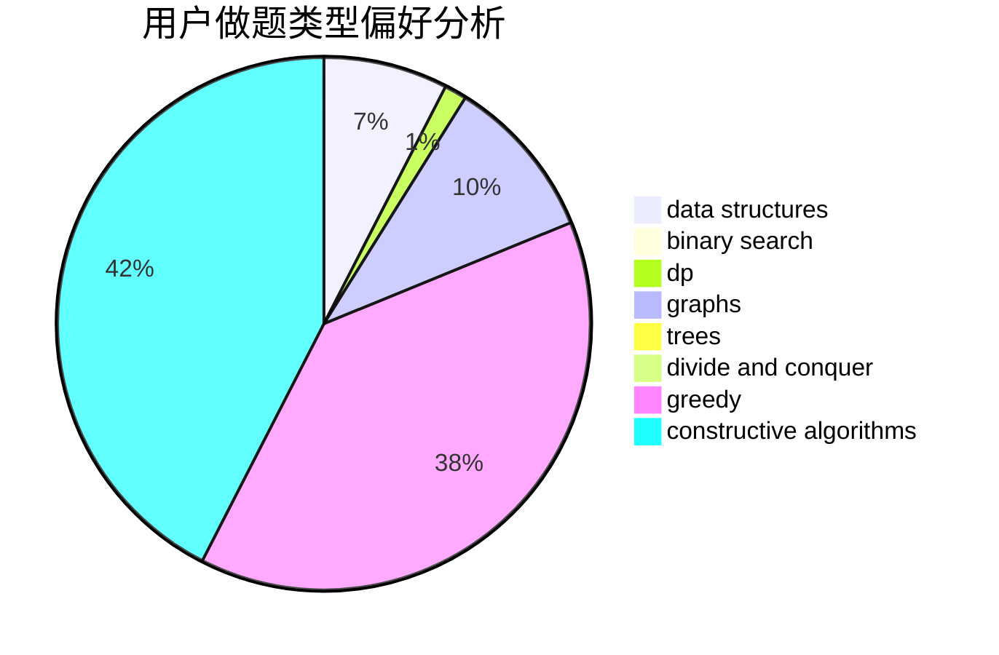

# EndlessK
<!-- tabs:start -->
#### **用户提交结果分析**

#### **用户做题类型偏好分析**

#### **用户错题知识点分析**

<!-- tabs:end -->
# 推荐题目
[Kuroni and the Punishment](http://codeforces.com/problemset/problem/1305/F)		math,
                        number theory,
                        probabilities		  
[Speckled Band](http://codeforces.com/problemset/problem/1043/G)		data structures,
                        divide and conquer,
                        hashing,
                        string suffix structures,
                        strings		  
[Queue](http://codeforces.com/problemset/problem/545/D)		greedy,
                        implementation,
                        sortings		  
[On Changing Tree](http://codeforces.com/problemset/problem/396/C)		data structures,
                        graphs,
                        trees		  
[Bank Hacking](http://codeforces.com/problemset/problem/796/C)		constructive algorithms,
                        data structures,
                        dp,
                        trees		  
[Two Tables](http://codeforces.com/problemset/problem/228/B)		brute force,
                        implementation		  
[Devu and his Brother](http://codeforces.com/problemset/problem/439/D)		binary search,
                        sortings,
                        ternary search,
                        two pointers		  
[Indian Summer](http://codeforces.com/problemset/problem/44/A)		implementation		  
[Good Substrings](http://codeforces.com/problemset/problem/271/D)		data structures,
                        strings		  
[Pavel and barbecue](http://codeforces.com/problemset/problem/756/A)		constructive algorithms,
                        dfs and similar		  
<!-- tabs:start -->
#### **data structures**
[Speckled Band](http://codeforces.com/problemset/problem/1043/G)		data structures,
                        divide and conquer,
                        hashing,
                        string suffix structures,
                        strings		  
[On Changing Tree](http://codeforces.com/problemset/problem/396/C)		data structures,
                        graphs,
                        trees		  
[Bank Hacking](http://codeforces.com/problemset/problem/796/C)		constructive algorithms,
                        data structures,
                        dp,
                        trees		  
[Good Substrings](http://codeforces.com/problemset/problem/271/D)		data structures,
                        strings		  
[Maximum width](http://codeforces.com/problemset/problem/1492/C)		binary search,
                        data structures,
                        dp,
                        greedy,
                        two pointers		  
[Old Floppy Drive](http://codeforces.com/problemset/problem/1490/G)		binary search,
                        data structures,
                        math		  
[Odd Mineral Resource](http://codeforces.com/problemset/problem/1479/D)		binary search,
                        bitmasks,
                        brute force,
                        data structures,
                        probabilities,
                        trees		  
[Meximization](http://codeforces.com/problemset/problem/1497/A)		brute force,
                        data structures,
                        greedy,
                        sortings		  
[Pekora and Trampoline](http://codeforces.com/problemset/problem/1491/C)		brute force,
                        data structures,
                        dp,
                        greedy,
                        implementation		  
[Card Deck](http://codeforces.com/problemset/problem/1492/B)		data structures,
                        greedy,
                        math		  
#### **binary search**
[Devu and his Brother](http://codeforces.com/problemset/problem/439/D)		binary search,
                        sortings,
                        ternary search,
                        two pointers		  
[Maximum width](http://codeforces.com/problemset/problem/1492/C)		binary search,
                        data structures,
                        dp,
                        greedy,
                        two pointers		  
[Pairs](http://codeforces.com/problemset/problem/1463/D)		binary search,
                        constructive algorithms,
                        greedy,
                        two pointers		  
[Old Floppy Drive](http://codeforces.com/problemset/problem/1490/G)		binary search,
                        data structures,
                        math		  
[Odd Mineral Resource](http://codeforces.com/problemset/problem/1479/D)		binary search,
                        bitmasks,
                        brute force,
                        data structures,
                        probabilities,
                        trees		  
[Complicated Computations](http://codeforces.com/problemset/problem/1436/E)		binary search,
                        data structures,
                        two pointers		  
[Divide and Summarize](http://codeforces.com/problemset/problem/1461/D)		binary search,
                        brute force,
                        data structures,
                        divide and conquer,
                        implementation,
                        sortings		  
[K-beautiful Strings](http://codeforces.com/problemset/problem/1493/C)		binary search,
                        brute force,
                        constructive algorithms,
                        greedy,
                        strings		  
[Pythagorean Triples](http://codeforces.com/problemset/problem/1487/D)		binary search,
                        brute force,
                        math,
                        number theory		  
[Eastern Exhibition](http://codeforces.com/problemset/problem/1486/B)		binary search,
                        geometry,
                        shortest paths,
                        sortings		  
#### **dp**
[Bank Hacking](http://codeforces.com/problemset/problem/796/C)		constructive algorithms,
                        data structures,
                        dp,
                        trees		  
[Logo Turtle](http://codeforces.com/problemset/problem/132/C)		dp		  
[Hills](https://codeforces.com/contest/1013/problem/E)		dp		  
[Destroy it!](http://codeforces.com/problemset/problem/1176/F)		dp,
                        implementation,
                        sortings		  
[Mahmoud and a Message](http://codeforces.com/problemset/problem/766/C)		brute force,
                        dp,
                        greedy,
                        strings		  
[Tree with Maximum Cost](http://codeforces.com/problemset/problem/1092/F)		dfs and similar,
                        dp,
                        trees		  
[Civilization](http://codeforces.com/problemset/problem/455/C)		dfs and similar,
                        dp,
                        dsu,
                        ternary search,
                        trees		  
[Tree Elimination](http://codeforces.com/problemset/problem/1276/D)		dp,
                        trees		  
[Maximum width](http://codeforces.com/problemset/problem/1492/C)		binary search,
                        data structures,
                        dp,
                        greedy,
                        two pointers		  
[Bouncing Ball](https://codeforces.com/contest/1457/problem/C)		brute force,
                        dp,
                        implementation		  
#### **graph**
[On Changing Tree](http://codeforces.com/problemset/problem/396/C)		data structures,
                        graphs,
                        trees		  
[Online Courses In BSU](http://codeforces.com/problemset/problem/770/C)		*special problem,
                        dfs and similar,
                        graphs,
                        implementation		  
[Matvey's Birthday](http://codeforces.com/problemset/problem/718/E)		bitmasks,
                        graphs		  
[Minimum Ties](http://codeforces.com/problemset/problem/1487/C)		brute force,
                        constructive algorithms,
                        dfs and similar,
                        graphs,
                        greedy,
                        implementation,
                        math		  
[Chef Monocarp](http://codeforces.com/problemset/problem/1437/C)		dp,
                        flows,
                        graph matchings,
                        greedy,
                        math,
                        sortings		  
[Strange Housing](http://codeforces.com/problemset/problem/1470/D)		constructive algorithms,
                        dfs and similar,
                        graph matchings,
                        graphs,
                        greedy		  
[Longest Simple Cycle](http://codeforces.com/problemset/problem/1476/C)		dp,
                        graphs,
                        greedy		  
[Shortest and Longest LIS](http://codeforces.com/problemset/problem/1304/D)		constructive algorithms,
                        graphs,
                        greedy,
                        two pointers		  
[Ball in Berland](http://codeforces.com/problemset/problem/1475/C)		combinatorics,
                        graphs,
                        math		  
[Kyoya and Train](http://codeforces.com/problemset/problem/553/E)		dp,
                        fft,
                        graphs,
                        math,
                        probabilities		  
#### **trees**
[On Changing Tree](http://codeforces.com/problemset/problem/396/C)		data structures,
                        graphs,
                        trees		  
[Bank Hacking](http://codeforces.com/problemset/problem/796/C)		constructive algorithms,
                        data structures,
                        dp,
                        trees		  
[Tree with Maximum Cost](http://codeforces.com/problemset/problem/1092/F)		dfs and similar,
                        dp,
                        trees		  
[Civilization](http://codeforces.com/problemset/problem/455/C)		dfs and similar,
                        dp,
                        dsu,
                        ternary search,
                        trees		  
[Tree Elimination](http://codeforces.com/problemset/problem/1276/D)		dp,
                        trees		  
[Odd Mineral Resource](http://codeforces.com/problemset/problem/1479/D)		binary search,
                        bitmasks,
                        brute force,
                        data structures,
                        probabilities,
                        trees		  
[Yet Another Card Deck](http://codeforces.com/problemset/problem/1511/C)		brute force,
                        data structures,
                        implementation,
                        trees		  
[Diameter Cuts](http://codeforces.com/problemset/problem/1499/F)		combinatorics,
                        dfs and similar,
                        dp,
                        trees		  
[Fib-tree](http://codeforces.com/problemset/problem/1491/E)		brute force,
                        dfs and similar,
                        divide and conquer,
                        number theory,
                        trees		  
[13th Labour of Heracles](http://codeforces.com/problemset/problem/1466/D)		data structures,
                        greedy,
                        sortings,
                        trees		  
#### **divide and conquer**
[Speckled Band](http://codeforces.com/problemset/problem/1043/G)		data structures,
                        divide and conquer,
                        hashing,
                        string suffix structures,
                        strings		  
[Divide and Summarize](http://codeforces.com/problemset/problem/1461/D)		binary search,
                        brute force,
                        data structures,
                        divide and conquer,
                        implementation,
                        sortings		  
[Song of the Sirens](http://codeforces.com/problemset/problem/1466/G)		combinatorics,
                        divide and conquer,
                        hashing,
                        math,
                        string suffix structures,
                        strings		  
[Permutation Transformation](http://codeforces.com/problemset/problem/1490/D)		dfs and similar,
                        divide and conquer,
                        implementation		  
[Skyline Photo](https://codeforces.com/contest/1483/problem/C)		data structures,
                        divide and conquer,
                        dp		  
[Fib-tree](http://codeforces.com/problemset/problem/1491/E)		brute force,
                        dfs and similar,
                        divide and conquer,
                        number theory,
                        trees		  
[Sum of Prefix Sums](http://codeforces.com/problemset/problem/1303/G)		data structures,
                        divide and conquer,
                        geometry,
                        trees		  
[Dogeforces](http://codeforces.com/problemset/problem/1494/D)		constructive algorithms,
                        data structures,
                        dfs and similar,
                        divide and conquer,
                        dsu,
                        greedy,
                        sortings,
                        trees		  
[Logistical Questions](http://codeforces.com/problemset/problem/566/C)		dfs and similar,
                        divide and conquer,
                        trees		  
[Fruit Sequences](http://codeforces.com/problemset/problem/1428/F)		binary search,
                        data structures,
                        divide and conquer,
                        dp,
                        two pointers		  
#### **greedy**
[Queue](http://codeforces.com/problemset/problem/545/D)		greedy,
                        implementation,
                        sortings		  
[Mahmoud and a Message](http://codeforces.com/problemset/problem/766/C)		brute force,
                        dp,
                        greedy,
                        strings		  
[Duff and Weight Lifting](https://codeforces.com/contest/588/problem/C)		greedy		  
[Prime Graph](http://codeforces.com/problemset/problem/1178/D)		constructive algorithms,
                        greedy,
                        math,
                        number theory		  
[Maximum width](http://codeforces.com/problemset/problem/1492/C)		binary search,
                        data structures,
                        dp,
                        greedy,
                        two pointers		  
[Diamond Miner](https://codeforces.com/contest/1496/problem/C)		geometry,
                        greedy,
                        math,
                        sortings		  
[Anti-knapsack](http://codeforces.com/problemset/problem/1493/A)		constructive algorithms,
                        greedy		  
[Pairs](http://codeforces.com/problemset/problem/1463/D)		binary search,
                        constructive algorithms,
                        greedy,
                        two pointers		  
[Unique Number](http://codeforces.com/problemset/problem/1462/C)		brute force,
                        greedy,
                        math		  
[Berland Crossword](http://codeforces.com/problemset/problem/1494/B)		bitmasks,
                        brute force,
                        greedy,
                        implementation		  
#### **constructive algorithms**
[Bank Hacking](http://codeforces.com/problemset/problem/796/C)		constructive algorithms,
                        data structures,
                        dp,
                        trees		  
[Pavel and barbecue](http://codeforces.com/problemset/problem/756/A)		constructive algorithms,
                        dfs and similar		  
[Prime Graph](http://codeforces.com/problemset/problem/1178/D)		constructive algorithms,
                        greedy,
                        math,
                        number theory		  
[Anti-knapsack](http://codeforces.com/problemset/problem/1493/A)		constructive algorithms,
                        greedy		  
[Pairs](http://codeforces.com/problemset/problem/1463/D)		binary search,
                        constructive algorithms,
                        greedy,
                        two pointers		  
[XOR-gun](https://codeforces.com/contest/1456/problem/B)		bitmasks,
                        brute force,
                        constructive algorithms		  
[Genius's Gambit](http://codeforces.com/problemset/problem/1492/D)		bitmasks,
                        constructive algorithms,
                        greedy,
                        math		  
[3-Coloring](https://codeforces.com/contest/1504/problem/D)		constructive algorithms,
                        games,
                        interactive		  
[Basic Diplomacy](https://codeforces.com/contest/1483/problem/A)		brute force,
                        constructive algorithms,
                        greedy,
                        implementation		  
[Array and Peaks](http://codeforces.com/problemset/problem/1513/A)		constructive algorithms,
                        implementation		  
#### **sortings**
[Queue](http://codeforces.com/problemset/problem/545/D)		greedy,
                        implementation,
                        sortings		  
[Devu and his Brother](http://codeforces.com/problemset/problem/439/D)		binary search,
                        sortings,
                        ternary search,
                        two pointers		  
[Destroy it!](http://codeforces.com/problemset/problem/1176/F)		dp,
                        implementation,
                        sortings		  
[Vladik and Complicated Book](http://codeforces.com/problemset/problem/811/B)		implementation,
                        sortings		  
[Diamond Miner](https://codeforces.com/contest/1496/problem/C)		geometry,
                        greedy,
                        math,
                        sortings		  
[Meximization](http://codeforces.com/problemset/problem/1497/A)		brute force,
                        data structures,
                        greedy,
                        sortings		  
[Avoiding Zero](http://codeforces.com/problemset/problem/1427/A)		math,
                        sortings		  
[Divide and Summarize](http://codeforces.com/problemset/problem/1461/D)		binary search,
                        brute force,
                        data structures,
                        divide and conquer,
                        implementation,
                        sortings		  
[Chef Monocarp](http://codeforces.com/problemset/problem/1437/C)		dp,
                        flows,
                        graph matchings,
                        greedy,
                        math,
                        sortings		  
[Replacing Elements](http://codeforces.com/problemset/problem/1473/A)		greedy,
                        implementation,
                        math,
                        sortings		  
<!-- tabs:end -->
