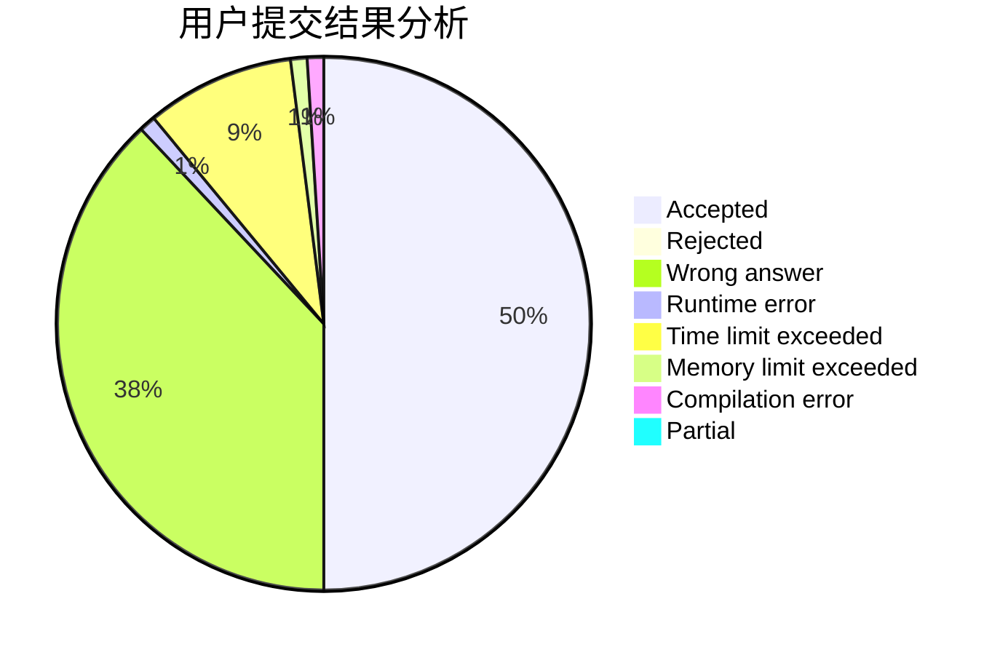
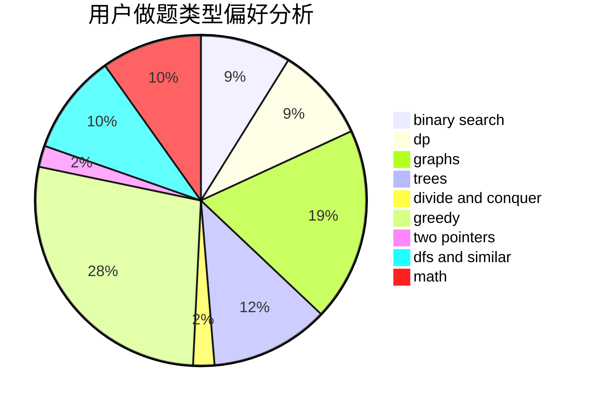

# EndlessK

<!-- tabs:start -->

#### **用户提交结果分析**

#### **用户做题类型偏好分析**

<!-- tabs:end -->
# 推荐题目
[1314E](https://codeforces.com/contest/1314/problem/E)
[1044D](https://codeforces.com/contest/1044/problem/D)
[810D](https://codeforces.com/contest/810/problem/D)
[460E](https://codeforces.com/contest/460/problem/E)
[1180C](https://codeforces.com/contest/1180/problem/C)
[424B](https://codeforces.com/contest/424/problem/B)
[570A](https://codeforces.com/contest/570/problem/A)
[246C](https://codeforces.com/contest/246/problem/C)
[1501F](https://codeforces.com/contest/1501/problem/F)
[477B](https://codeforces.com/contest/477/problem/B)
