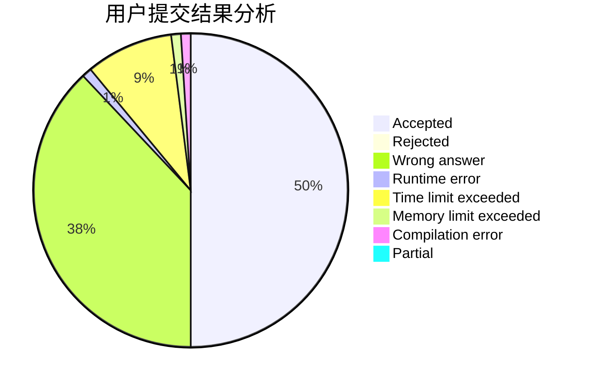
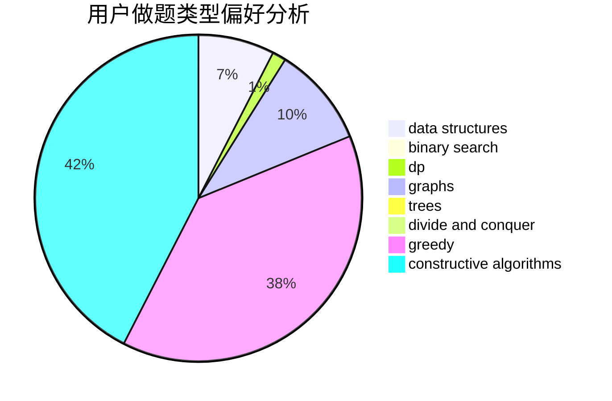

# EndlessK

<!-- tabs:start -->

#### **用户提交结果分析**

#### **用户做题类型偏好分析**

#### **用户错题知识点分析**

<!-- tabs:end -->
# 推荐题目
[1305F](https://codeforces.com/contest/1305/problem/F)		math,
                        number theory,
                        probabilities		  
[1043G](https://codeforces.com/contest/1043/problem/G)		data structures,
                        divide and conquer,
                        hashing,
                        string suffix structures,
                        strings		  
[796C](https://codeforces.com/contest/796/problem/C)		constructive algorithms,
                        data structures,
                        dp,
                        trees		  
[439D](https://codeforces.com/contest/439/problem/D)		binary search,
                        sortings,
                        ternary search,
                        two pointers		  
[1178D](https://codeforces.com/contest/1178/problem/D)		constructive algorithms,
                        greedy,
                        math,
                        number theory		  
[396C](https://codeforces.com/contest/396/problem/C)		data structures,
                        graphs,
                        trees		  
[545D](https://codeforces.com/contest/545/problem/D)		greedy,
                        implementation,
                        sortings		  
[228B](https://codeforces.com/contest/228/problem/B)		brute force,
                        implementation		  
[1493F](https://codeforces.com/contest/1493/problem/F)		bitmasks,
                        interactive,
                        number theory		  
[456B](https://codeforces.com/contest/456/problem/B)		math,
                        number theory		  
