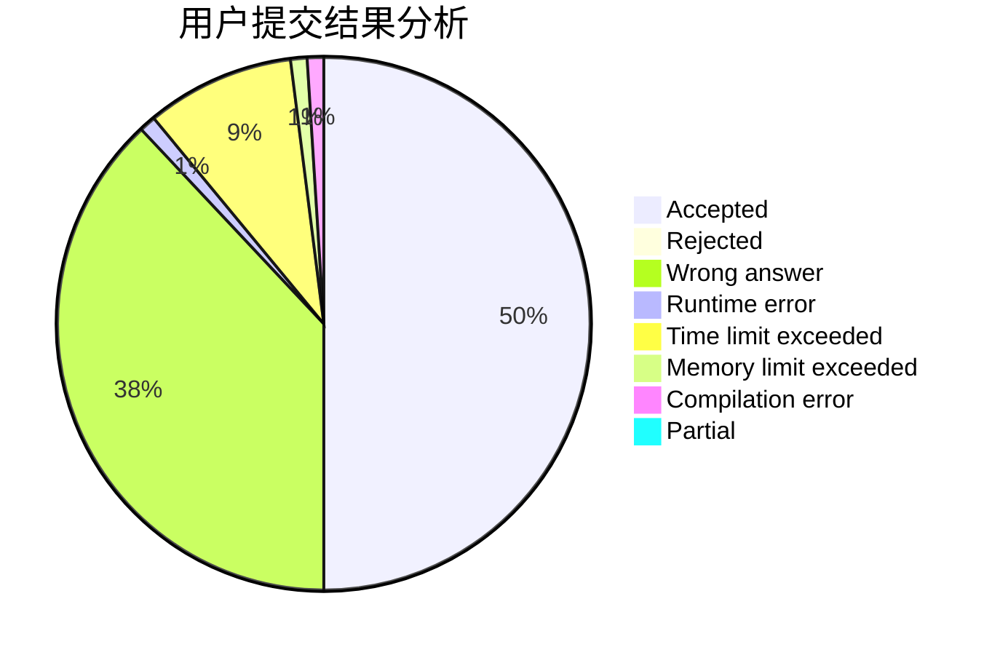
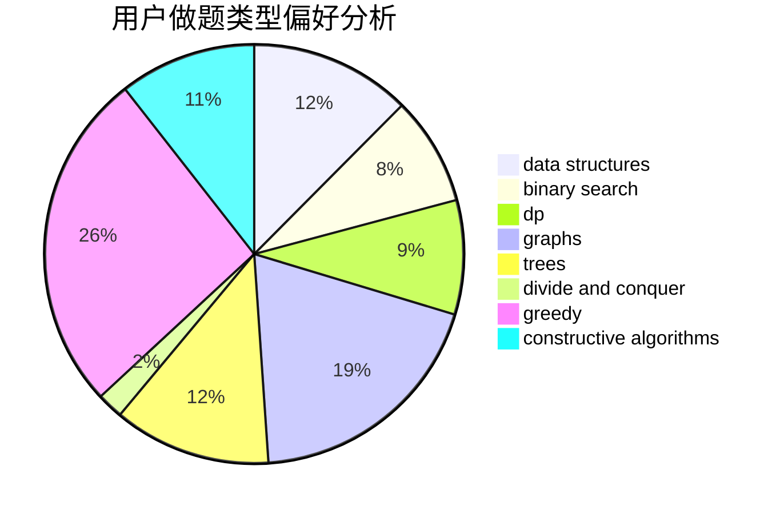

# EndlessK

<!-- tabs:start -->

#### **用户提交结果分析**

#### **用户做题类型偏好分析**

#### **用户错题知识点分析**

<!-- tabs:end -->
# 推荐题目
[1314E](https://codeforces.com/contest/1314/problem/E)		dsu,graphs,sortings,trees		  
[1044D](https://codeforces.com/contest/1044/problem/D)		data structures,
                        dsu		  
[810D](https://codeforces.com/contest/810/problem/D)		dsu,graphs,sortings,trees		  
[460E](https://codeforces.com/contest/460/problem/E)		brute force,
                        geometry,
                        math,
                        sortings		  
[1180C](https://codeforces.com/contest/1180/problem/C)		dsu,graphs,sortings,trees		  
[424B](https://codeforces.com/contest/424/problem/B)		binary search,
                        greedy,
                        implementation,
                        sortings		  
[570A](https://codeforces.com/contest/570/problem/A)		implementation		  
[246C](https://codeforces.com/contest/246/problem/C)		brute force,
                        constructive algorithms,
                        greedy		  
[1501F](https://codeforces.com/contest/1501/problem/F)		dsu,graphs,sortings,trees		  
[477B](https://codeforces.com/contest/477/problem/B)		dsu,graphs,sortings,trees		  
