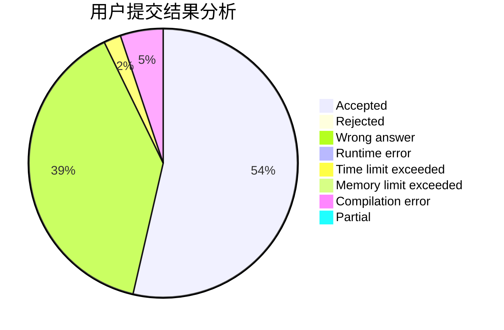
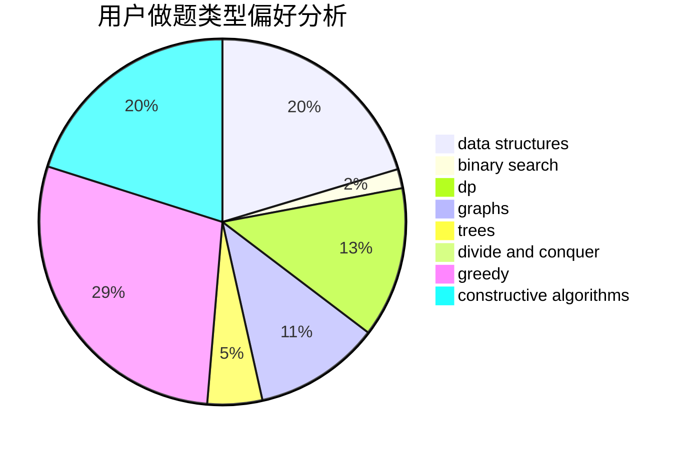
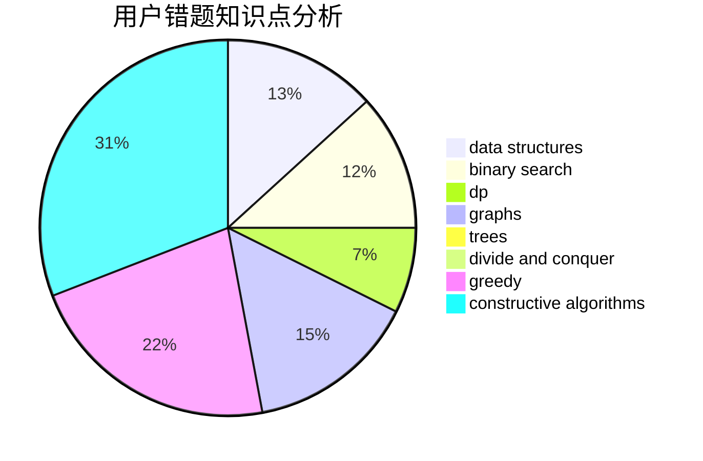

# EnjoyCallen

<!-- tabs:start -->

#### **用户提交结果分析**

#### **用户做题类型偏好分析**

#### **用户错题知识点分析**

<!-- tabs:end -->
# 推荐题目
[827A](https://codeforces.com/contest/827/problem/A)		data structures,
                        greedy,
                        sortings,
                        strings		  
[796A](https://codeforces.com/contest/796/problem/A)		brute force,
                        implementation		  
[580B](https://codeforces.com/contest/580/problem/B)		binary search,
                        sortings,
                        two pointers		  
[842C](https://codeforces.com/contest/842/problem/C)		dfs and similar,
                        graphs,
                        math,
                        number theory,
                        trees		  
[1384E](https://codeforces.com/contest/1384/problem/E)		dsu,graphs,sortings,trees		  
[659B](https://codeforces.com/contest/659/problem/B)		constructive algorithms,
                        sortings		  
[418B](https://codeforces.com/contest/418/problem/B)		dsu,graphs,sortings,trees		  
[622A](https://codeforces.com/contest/622/problem/A)		implementation,
                        math		  
[612F](https://codeforces.com/contest/612/problem/F)		dp		  
[594E](https://codeforces.com/contest/594/problem/E)		string suffix structures,
                        strings		  
