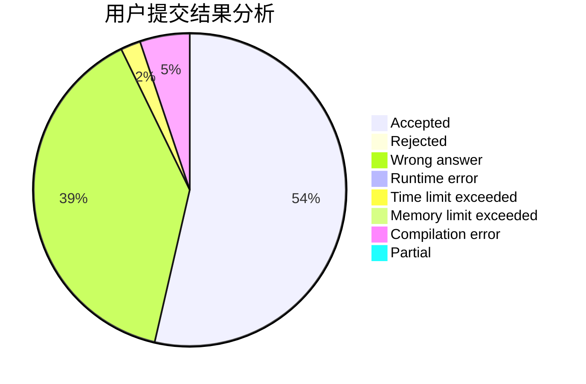
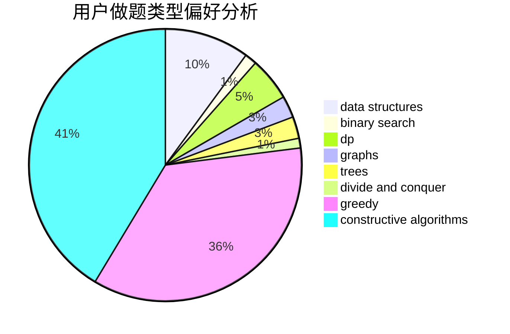
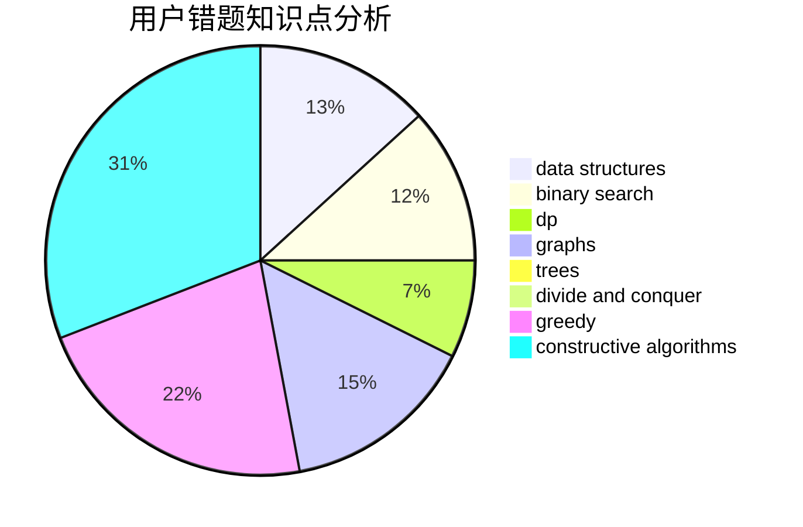

# EnjoyCallen

<!-- tabs:start -->

#### **用户提交结果分析**

#### **用户做题类型偏好分析**

#### **用户错题知识点分析**

<!-- tabs:end -->
# 推荐题目
[809B](https://codeforces.com/contest/809/problem/B)		binary search,
                        interactive		  
[777D](https://codeforces.com/contest/777/problem/D)		binary search,
                        greedy,
                        implementation,
                        strings		  
[555E](https://codeforces.com/contest/555/problem/E)		dfs and similar,
                        graphs,
                        trees		  
[822D](https://codeforces.com/contest/822/problem/D)		brute force,
                        dp,
                        greedy,
                        math,
                        number theory		  
[1375F](https://codeforces.com/contest/1375/problem/F)		constructive algorithms,
                        games,
                        interactive,
                        math		  
[629C](https://codeforces.com/contest/629/problem/C)		dp,
                        strings		  
[388E](https://codeforces.com/contest/388/problem/E)		geometry		  
[603C](https://codeforces.com/contest/603/problem/C)		games,
                        math		  
[594E](https://codeforces.com/contest/594/problem/E)		string suffix structures,
                        strings		  
[574D](https://codeforces.com/contest/574/problem/D)		dsu,graphs,sortings,trees		  
