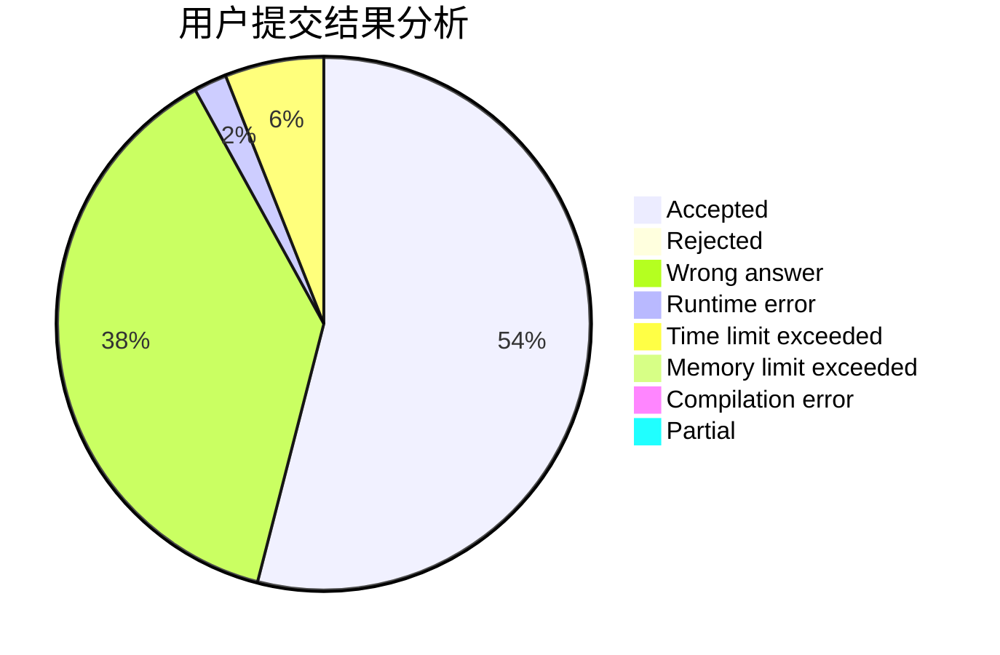
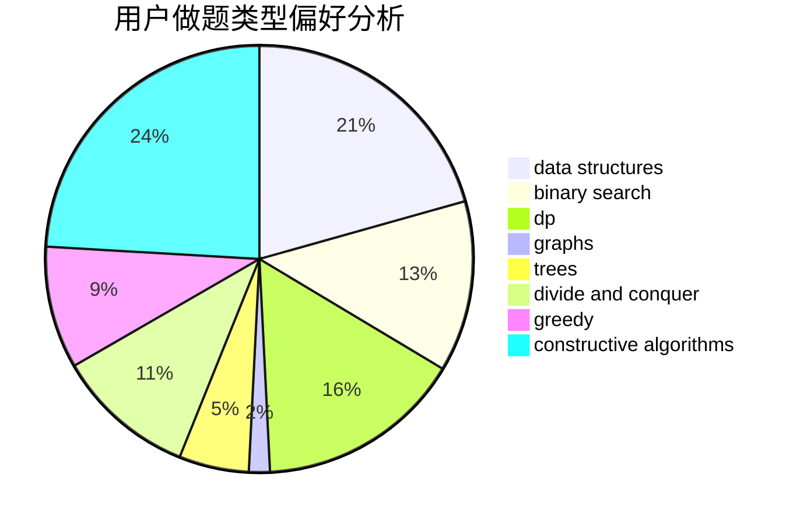

# Enter_

<!-- tabs:start -->

#### **用户提交结果分析**

#### **用户做题类型偏好分析**

#### **用户错题知识点分析**

<!-- tabs:end -->
# 推荐题目
[1058C](https://codeforces.com/contest/1058/problem/C)		dsu,graphs,sortings,trees		  
[10C](https://codeforces.com/contest/10/problem/C)		number theory		  
[825A](https://codeforces.com/contest/825/problem/A)		implementation		  
[331C3](https://codeforces.com/contest/331C/problem/3)		dp		  
[516C](https://codeforces.com/contest/516/problem/C)		dsu,graphs,sortings,trees		  
[800D](https://codeforces.com/contest/800/problem/D)		dsu,graphs,sortings,trees		  
[472C](https://codeforces.com/contest/472/problem/C)		greedy		  
[1385E](https://codeforces.com/contest/1385/problem/E)		constructive algorithms,
                        dfs and similar,
                        graphs		  
[609E](https://codeforces.com/contest/609/problem/E)		data structures,
                        dfs and similar,
                        dsu,
                        graphs,
                        trees		  
[19A](https://codeforces.com/contest/19/problem/A)		implementation		  
