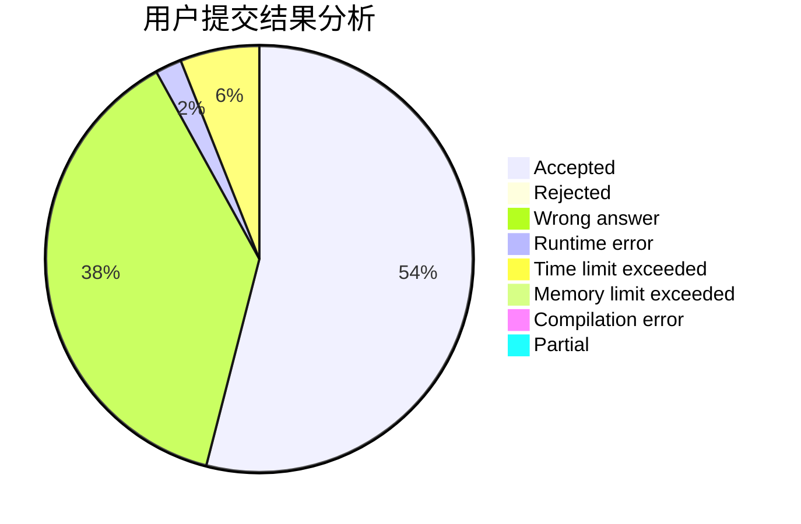
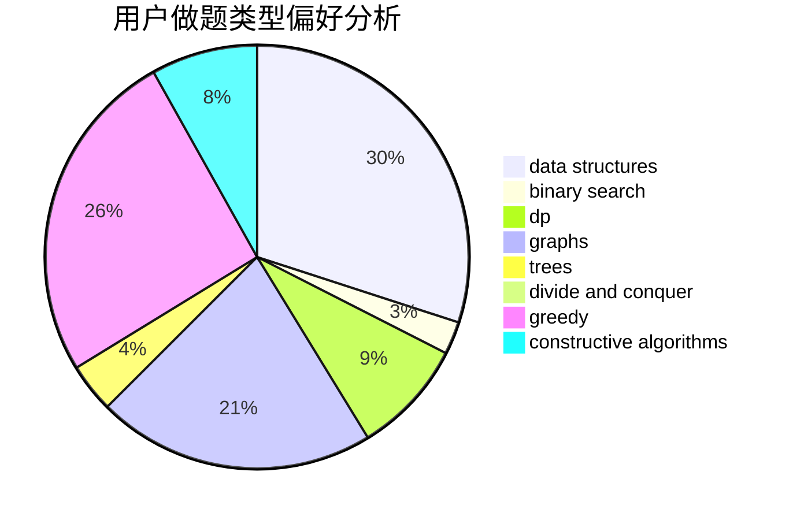

# Enter_

<!-- tabs:start -->

#### **用户提交结果分析**

#### **用户做题类型偏好分析**

#### **用户错题知识点分析**

<!-- tabs:end -->
# 推荐题目
[1059A](https://codeforces.com/contest/1059/problem/A)		implementation		  
[1100A](https://codeforces.com/contest/1100/problem/A)		implementation		  
[843A](https://codeforces.com/contest/843/problem/A)		dfs and similar,
                        dsu,
                        implementation,
                        math,
                        sortings		  
[359C](https://codeforces.com/contest/359/problem/C)		math,
                        number theory		  
[543C](https://codeforces.com/contest/543/problem/C)		bitmasks,
                        dp		  
[815E](https://codeforces.com/contest/815/problem/E)		binary search,
                        constructive algorithms,
                        implementation		  
[490F](https://codeforces.com/contest/490/problem/F)		data structures,
                        dfs and similar,
                        dp,
                        trees		  
[1395E](https://codeforces.com/contest/1395/problem/E)		dsu,graphs,sortings,trees		  
[628F](https://codeforces.com/contest/628/problem/F)		flows		  
[221B](https://codeforces.com/contest/221/problem/B)		implementation		  
