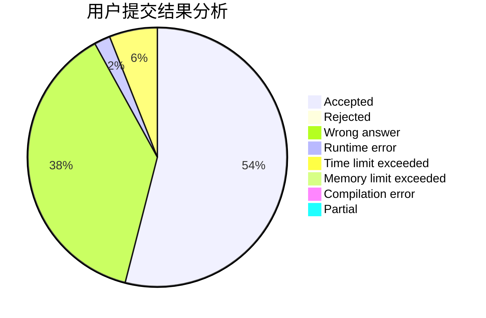
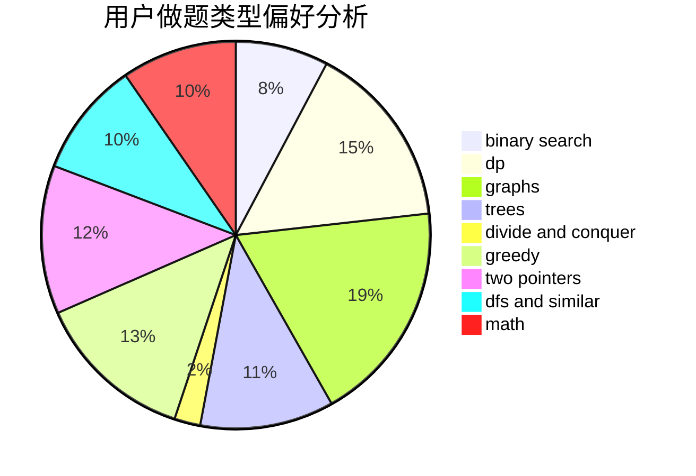

# Enter_

<!-- tabs:start -->

#### **用户提交结果分析**

#### **用户做题类型偏好分析**

<!-- tabs:end -->
# 推荐题目
[1059A](https://codeforces.com/contest/1059/problem/A)
[1100A](https://codeforces.com/contest/1100/problem/A)
[843A](https://codeforces.com/contest/843/problem/A)
[359C](https://codeforces.com/contest/359/problem/C)
[543C](https://codeforces.com/contest/543/problem/C)
[815E](https://codeforces.com/contest/815/problem/E)
[490F](https://codeforces.com/contest/490/problem/F)
[1395E](https://codeforces.com/contest/1395/problem/E)
[628F](https://codeforces.com/contest/628/problem/F)
[221B](https://codeforces.com/contest/221/problem/B)
